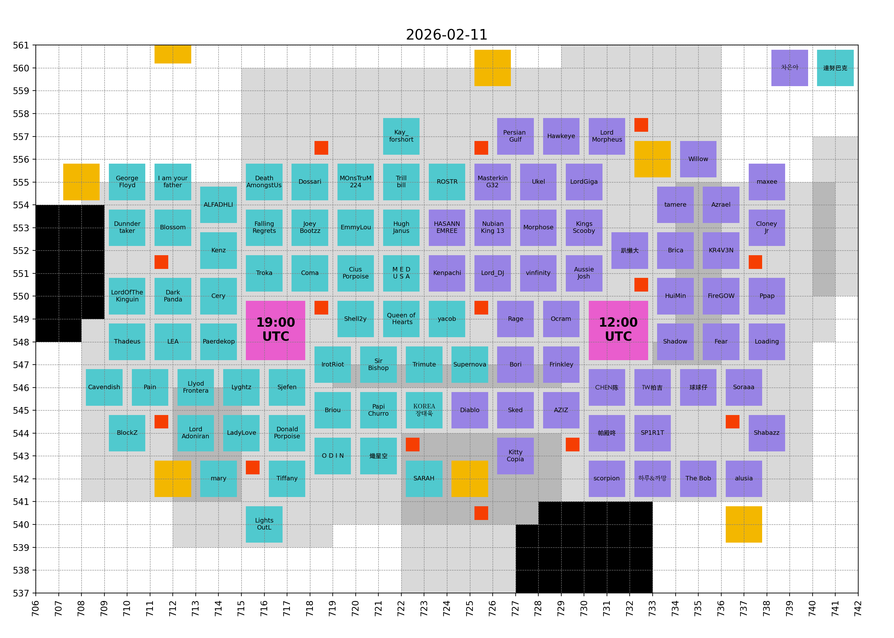

# ExE

- [Hive](hive/README.md)
- [Bear Hunt](bear_hunt/README.md)
- [Timeline](#timeline)

## Hive

<!-- [[[cog
# Display the latest hive map
import re
from pathlib import Path
pattern = re.compile(r"(\d{4}-\d{2}-\d{2})_hive\.png")
imgs_dir = Path("hive", "images")
hive_map_fpath = sorted(
  [fpath for fpath in imgs_dir.iterdir() if pattern.match(fpath.name)]
)[-1]
print(f"")
]]] -->

<!-- [[[end]]] -->

## Timeline

<!-- [[[cog
from timeline import make_timeline
timeline = make_timeline()
for line in timeline:
    print(line)
]]] -->

- Mon 07 Jul - Server launch (Day 1)
- Mon 06 Oct - ⚔ KvK I (Day 92)
- Mon 27 Oct - ✨ Gen 3 Heroes (Day 113)
- Mon 27 Oct - 🐶 Gen 3 Pets (Day 113)
- Mon 03 Nov - ⚔ KvK II (Day 120)
- Mon 01 Dec - ⚔ KvK III (Day 148)
- Mon 08 Dec - 📦 True Gold 5 (Day 155)
- Mon 22 Dec - 🎭 Season 4 (Day 169)
- Mon 29 Dec - ⚔ KvK IV (Day 176)
- Mon 19 Jan - ✨ Gen 4 Heroes (Day 197)
- Mon 19 Jan - 🐶 Gen 4 Pets (Day 197)
- Mon 26 Jan - ⚔ KvK V (Day 204)

______________________________________________________________________

- Wed 11 Feb - Today (Day 220)

______________________________________________________________________

- Sat 14 Feb - 🏰 Castle Fight (Day 223)
- Mon 16 Feb - 🎭 Season 5 (Day 225)
- Mon 16 Feb - 🏫 War Academy (Day 225)
- Mon 23 Feb - ⚔ KvK VI (Day 232)
- Tue 24 Feb - 🍀 Roulette #3 (Day 233)
- Sat 28 Feb - 🏰 Castle Fight (Day 237)
- Sun 01 Mar - 🔄 Transfer #2 (Day 238)
- Mon 09 Mar - 🏆 Strongest Governor VI (Day 246)
- Tue 10 Mar - 🍀 Roulette #4 (Day 247)
- Mon 23 Mar - ⚔ KvK VII (Day 260)
- Tue 24 Mar - 🍀 Roulette #5 (Day 261)
- Tue 07 Apr - 🍀 Roulette #6 (Day 275)
- Mon 13 Apr - ✨ Gen 5 Heroes (Day 281)
- Mon 13 Apr - 🐶 Gen 5 Pets (Day 281)
- Mon 20 Apr - ⚔ KvK VIII (Day 288)
- Mon 18 May - ⚔ KvK IX (Day 316)

<!-- [[[end]]] -->
