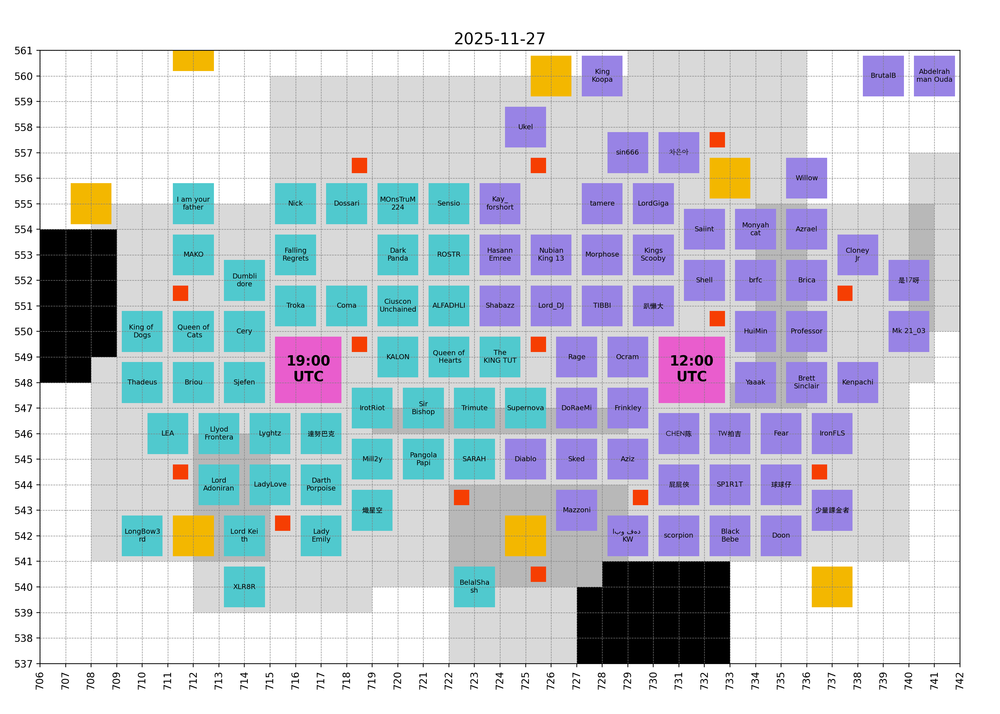

# ExE

- [Hive](hive/README.md)
- [Bear Hunt](bear_hunt/README.md)
- [Timeline](#timeline)

## Hive

<!-- [[[cog
# Display the latest hive map
import re
from pathlib import Path
pattern = re.compile(r"(\d{4}-\d{2}-\d{2})_hive\.png")
imgs_dir = Path("hive", "images")
hive_map_fpath = sorted(
  [fpath for fpath in imgs_dir.iterdir() if pattern.match(fpath.name)]
)[-1]
print(f"")
]]] -->

<!-- [[[end]]] -->

## Timeline

<!-- [[[cog
from timeline import make_timeline
timeline = make_timeline()
for line in timeline:
    print(line)
]]] -->

- Mon 07 Jul - Server launch (Day 1)
- Mon 06 Oct - ⚔ KvK I (Day 92)
- Mon 27 Oct - ✨ Gen 3 Heroes (Day 113)
- Mon 27 Oct - 🐶 Gen 3 Pets (Day 113)
- Mon 03 Nov - ⚔ KvK II (Day 120)

______________________________________________________________________

- Thu 27 Nov - Today (Day 144)

______________________________________________________________________

- Mon 01 Dec - ⚔ KvK III (Day 148)
- Sat 06 Dec - 🏰 Castle Fight (Day 153)
- Mon 08 Dec - 📦 True Gold 5 (Day 155)
- Mon 15 Dec - 🏆 Strongest Governor III (Day 162)
- Sat 20 Dec - 🏰 Castle Fight (Day 167)
- Mon 29 Dec - ⚔ KvK IV (Day 176)
- Mon 19 Jan - ✨ Gen 4 Heroes (Day 197)
- Mon 19 Jan - 🐶 Gen 4 Pets (Day 197)
- Mon 26 Jan - ⚔ KvK V (Day 204)
- Mon 16 Feb - 🏫 War Academy (Day 225)
- Mon 23 Feb - ⚔ KvK VI (Day 232)

<!-- [[[end]]] -->
