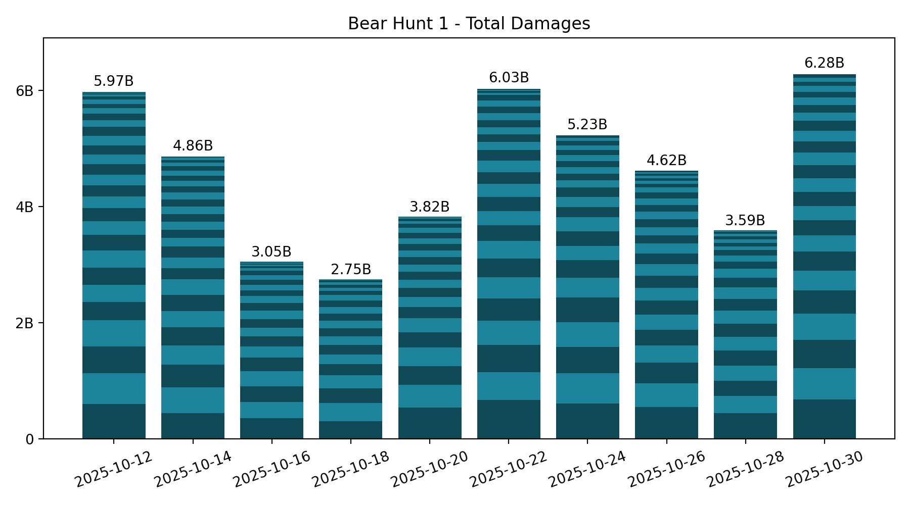
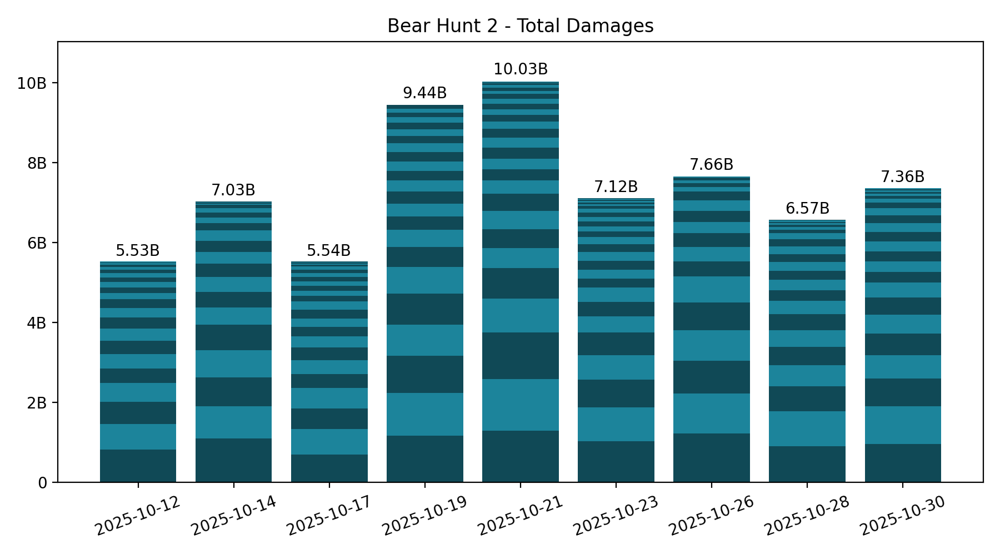

# 🐻 Bear Hunt

Keeping only the last 7 records, which is the number of bear hunts in between two Castle Battles.

## Summary

**Bear 1:**

<!-- [[[cog
from analysis import summary, as_markdown_table
print(
  as_markdown_table(
    summary(bear=1),
    columns=["Date", "# Players", "Total score"],
    justifys=["left", "right", "right"],
  )
)
]]] -->
| Date | # Players | Total score |
| :--- | ---: | ---: |
| 2025-10-12 | 30 | 5.97B |
| 2025-10-14 | 27 | 4.86B |
| 2025-10-16 | 24 | 3.05B |
| 2025-10-18 | 20 | 2.75B |
| 2025-10-20 | 23 | 3.82B |
| 2025-10-22 | 28 | 6.03B |
| 2025-10-24 | 23 | 5.23B |
| 2025-10-26 | 27 | 4.62B |
| 2025-10-28 | 23 | 3.59B |
<!-- [[[end]]] -->

<!-- [[[cog
# Display the latest bear damages bar graph
import re
from pathlib import Path
pattern = re.compile(r"(\d{4}-\d{2}-\d{2})_bear1_damages\.png")
imgs_dir = Path("bear_hunt", "images")
graph_fpath = sorted(
  [fpath for fpath in imgs_dir.iterdir() if pattern.match(fpath.name)]
)[-1]
print(f" / graph_fpath.name})")
]]] -->

<!-- [[[end]]] -->

**Bear 2:**

<!-- [[[cog
from analysis import summary, as_markdown_table
print(
  as_markdown_table(
    summary(bear=2),
    columns=["Date", "# Players", "Total score"],
    justifys=["left", "right", "right"],
  )
)
]]] -->
| Date | # Players | Total score |
| :--- | ---: | ---: |
| 2025-10-12 | 22 | 5.53B |
| 2025-10-14 | 24 | 7.03B |
| 2025-10-17 | 25 | 5.54B |
| 2025-10-19 | 23 | 9.44B |
| 2025-10-21 | 28 | 10.03B |
| 2025-10-23 | 28 | 7.12B |
| 2025-10-26 | 18 | 7.66B |
| 2025-10-28 | 24 | 6.57B |
<!-- [[[end]]] -->

<!-- [[[cog
# Display the latest bear damages bar graph
import re
from pathlib import Path
pattern = re.compile(r"(\d{4}-\d{2}-\d{2})_bear2_damages\.png")
imgs_dir = Path("bear_hunt", "images")
graph_fpath = sorted(
  [fpath for fpath in imgs_dir.iterdir() if pattern.match(fpath.name)]
)[-1]
print(f" / graph_fpath.name})")
]]] -->

<!-- [[[end]]] -->

## Bear 1 - Top Players over last 7 hunts

<!-- [[[cog
from analysis import players_records, as_markdown_table
print(
  as_markdown_table(
    players_records(bear=1, n_lasts=7),
    columns=["#", "Player", "Score", "# Hunts"],
    justifys=["right", "left", "right", "right"],
  )
)
]]] -->
| # | Player | Score | # Hunts |
| ---: | :--- | ---: | ---: |
| 1 | 達努巴克 | 3.17B | 7 |
| 2 | Coma | 2.42B | 7 |
| 3 | IrotRiot | 1.87B | 7 |
| 4 | Sjefen | 1.84B | 7 |
| 5 | Troka | 1.82B | 7 |
| 6 | Lyghtz | 1.76B | 4 |
| 7 | Lloyd Frontera | 1.55B | 7 |
| 8 | FallingRegrets | 1.45B | 7 |
| 9 | Briou | 1.21B | 7 |
| 10 | LadyLove | 1.12B | 6 |
| 11 | Cery | 820.86M | 2 |
| 12 | Monkey D Ciuscon | 758.67M | 6 |
| 13 | Dossari | 744.76M | 3 |
| 14 | Lord_DJ | 743.44M | 5 |
| 15 | Brett Sinclair | 573.37M | 5 |
| 16 | Sir Bishop | 572.74M | 7 |
| 17 | DarthPorpoise | 565.86M | 4 |
| 18 | BlackBebe | 541.88M | 3 |
| 19 | DarkPanda | 498.53M | 4 |
| 20 | MOnsTruM224 | 457.79M | 5 |
| 21 | rice baby | 420.57M | 4 |
| 22 | Mill2y | 418.13M | 1 |
| 23 | Lord Adoniran | 308.09M | 2 |
| 24 | Queen of Cats | 286.31M | 2 |
| 25 | LEA | 274.83M | 7 |
| 26 | Aziz | 241.11M | 1 |
| 27 | sin6969 | 196.32M | 1 |
| 28 | Darth Porpoise | 195.76M | 2 |
| 29 | Queen of Hearts | 187.87M | 2 |
| 30 | Thadeus | 182.90M | 2 |
| 31 | 熾星空 | 165.92M | 1 |
| 32 | ROSTR | 164.15M | 2 |
| 33 | 少量課金者 | 128.02M | 1 |
| 34 | Cloney Jr | 127.40M | 1 |
| 35 | Kings Scooby | 116.87M | 1 |
| 36 | RainbowMonkey | 110.06M | 2 |
| 37 | Trimute | 102.02M | 2 |
| 38 | 趴懶大 | 99.74M | 3 |
| 39 | TheGuardiaN | 94.62M | 1 |
| 40 | Sked | 91.34M | 1 |
| 41 | HasannEmree | 90.72M | 1 |
| 42 | DoRaeMi | 73.78M | 1 |
| 43 | BelalShash | 64.59M | 2 |
| 44 | Morphose | 59.26M | 1 |
| 45 | Dumblidore | 56.27M | 2 |
| 46 | EL MACHO | 55.38M | 1 |
| 47 | MAKO | 55.11M | 2 |
| 48 | Forsaken | 54.23M | 1 |
| 49 | KW | 48.90M | 1 |
| 50 | PangolaPapi | 31.09M | 1 |
| 51 | ALFADHLI | 30.23M | 2 |
| 52 | Sensio | 25.85M | 1 |
| 53 | Montanas | 21.88M | 1 |
| 54 | Nubian King 13 | 9.21M | 1 |
| 55 | 球球仔 | 2.65M | 1 |
<!-- [[[end]]] -->

## Bear 2 - Top Players over last 7 hunts

<!-- [[[cog
from analysis import players_records, as_markdown_table
print(
  as_markdown_table(
    players_records(bear=2, n_lasts=7),
    columns=["#", "Player", "Score", "# Hunts"],
    justifys=["right", "left", "right", "right"],
  )
)
]]] -->
| # | Player | Score | # Hunts |
| ---: | :--- | ---: | ---: |
| 1 | Frinkley | 7.07B | 7 |
| 2 | Chen | 6.60B | 7 |
| 3 | Ocram | 5.48B | 7 |
| 4 | Yaaak | 4.65B | 7 |
| 5 | Aziz | 3.61B | 6 |
| 6 | TW | 2.90B | 6 |
| 7 | Fear | 2.44B | 6 |
| 8 | brfc | 1.56B | 5 |
| 9 | Rage | 1.56B | 7 |
| 10 | Shell | 1.55B | 6 |
| 11 | HuiMin | 1.38B | 6 |
| 12 | Lyghtz | 1.30B | 2 |
| 13 | Azrael | 1.12B | 6 |
| 14 | SP1R1T | 978.06M | 5 |
| 15 | TIBBI | 840.41M | 2 |
| 16 | 趴懶大 | 801.57M | 3 |
| 17 | TheGuardiaN | 732.23M | 4 |
| 18 | Kings Scooby | 728.34M | 3 |
| 19 | 少量課金者 | 724.45M | 3 |
| 20 | Dazzl | 610.20M | 2 |
| 21 | BlackBebe | 590.43M | 2 |
| 22 | 屁屁俠 | 572.21M | 5 |
| 23 | DoRaeMi | 536.91M | 4 |
| 24 | Sked | 432.02M | 3 |
| 25 | 球球仔 | 431.08M | 3 |
| 26 | Shabazz | 360.68M | 3 |
| 27 | Queen of Hearts | 354.00M | 2 |
| 28 | Professor | 344.51M | 1 |
| 29 | Cloney Jr | 307.09M | 2 |
| 30 | Antonio | 287.54M | 4 |
| 31 | LordGiga | 272.38M | 4 |
| 32 | Willow | 241.82M | 2 |
| 33 | scorpion | 240.99M | 6 |
| 34 | Mill2y | 232.29M | 1 |
| 35 | DarkPanda | 196.80M | 2 |
| 36 | Only you | 183.98M | 1 |
| 37 | tamere | 177.77M | 1 |
| 38 | Queen of Cats | 139.38M | 1 |
| 39 | Supernova | 137.10M | 1 |
| 40 | Ukel | 125.29M | 4 |
| 41 | LauRa Che | 121.83M | 1 |
| 42 | HasannEmree | 96.55M | 1 |
| 43 | Nightmare Lune | 69.79M | 1 |
| 44 | King Koopa | 66.11M | 3 |
| 45 | Lady Emily | 52.38M | 1 |
| 46 | Kenpachi | 48.37M | 1 |
| 47 | Mazzoni | 39.38M | 1 |
| 48 | supernova | 37.08M | 1 |
| 49 | SARAH | 17.79M | 1 |
| 50 | ROSTR | 15.22M | 1 |
| 51 | 차은아 | 13.72M | 1 |
| 52 | PangolaPapi | 11.26M | 1 |
| 53 | ALFADHLI | 4.22M | 1 |
| 54 | Nubian King 13 | 3.68M | 1 |
| 55 | Morphose | 1.02M | 1 |
| 56 | LEA | 580.49K | 1 |
<!-- [[[end]]] -->
