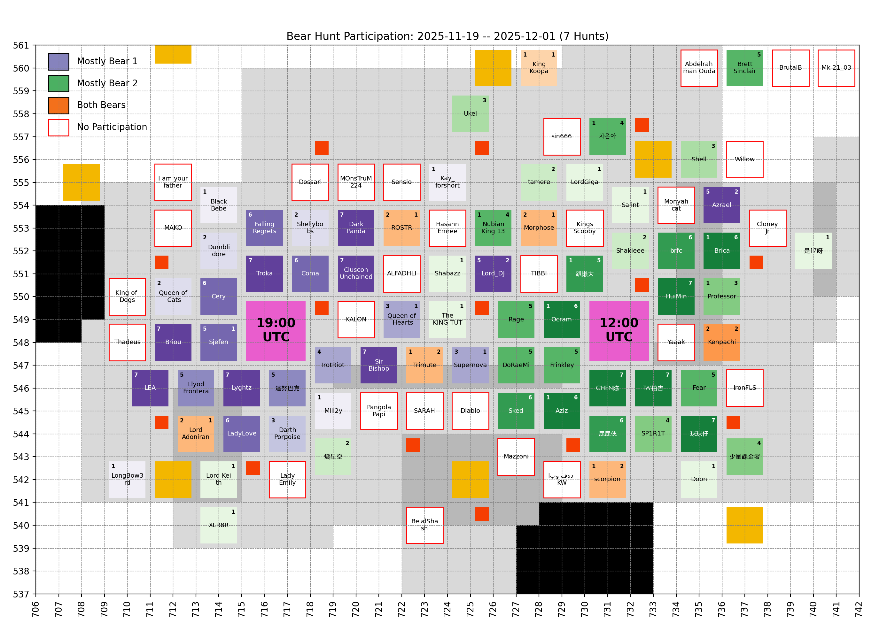
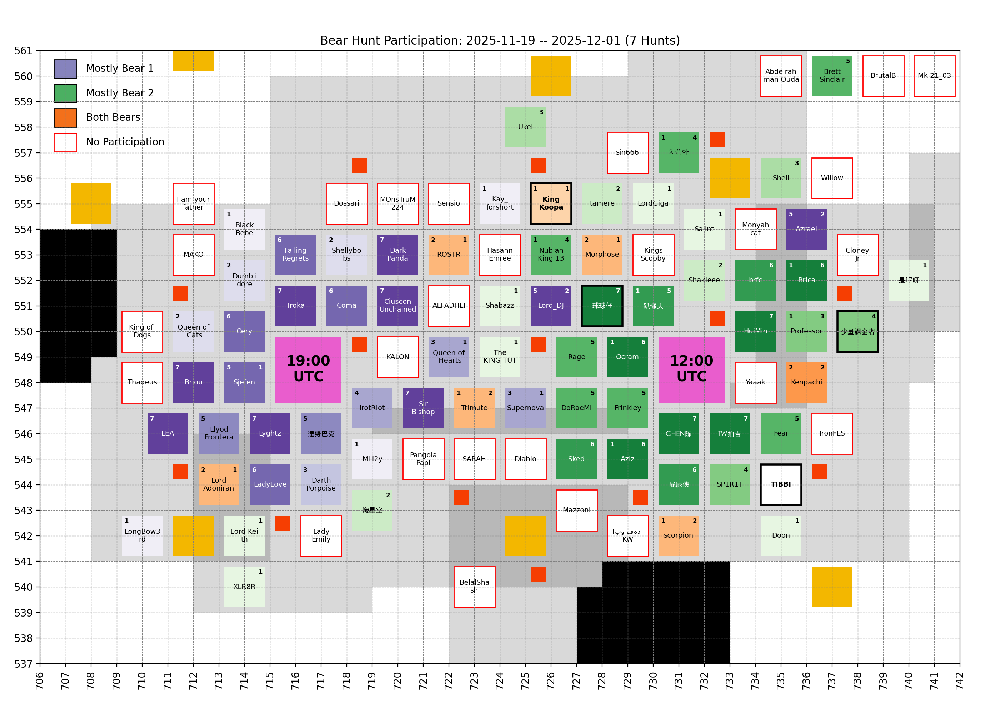
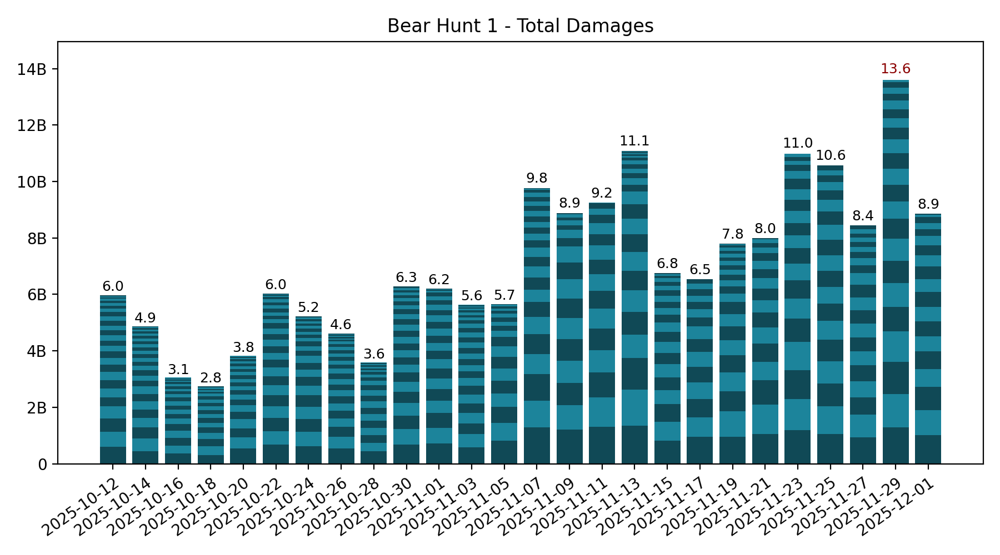
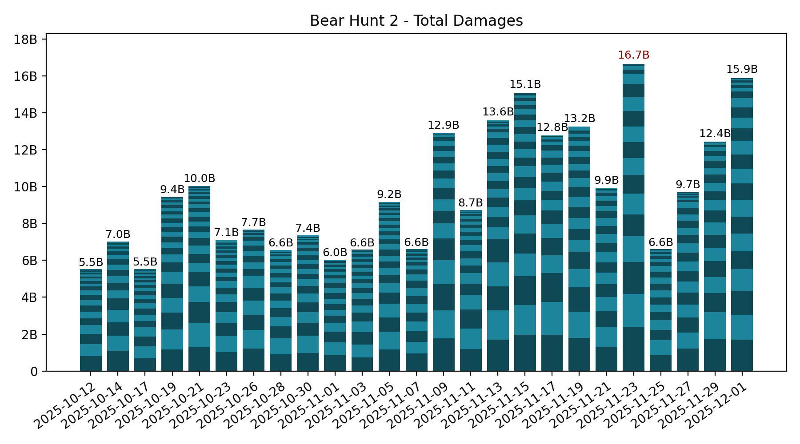

# 🐻 Bear Hunt

Keeping only the last 7 records, which is the number of bear hunts in between two Castle Battles.

## Participation

<!-- [[[cog
# Display the latest hive participation map
import re
from pathlib import Path
pattern = re.compile(r"(\d{4}-\d{2}-\d{2})_hive_participation\.png")
imgs_dir = Path("bear_hunt", "images")
map_fpath = sorted(
  [fpath for fpath in imgs_dir.iterdir() if pattern.match(fpath.name)]
)[-1]
print(f" / map_fpath.name})")
]]] -->

<!-- [[[end]]] -->

<!-- [[[cog
# Display the future hive participation map once cities start moving
import re
from pathlib import Path
import yaml

MOVING = yaml.safe_load(Path("hive", "locations_moving.yml").open("r"))
if MOVING["bear_1"] or MOVING["bear_2"]: # Else, no moving cities, skip
  pattern = re.compile(r"(\d{4}-\d{2}-\d{2})_hive_participation_moving\.png")
  imgs_dir = Path("bear_hunt", "images")
  map_fpath = sorted(
    [fpath for fpath in imgs_dir.iterdir() if pattern.match(fpath.name)]
  )[-1]

  print("\n## Future hive\n")
  print(f" / map_fpath.name})")
  print()
]]] -->

## Future hive

<!-- [[[end]]] -->

## Bear 1

<!-- [[[cog
# Display the latest bear damages bar graph
import re
from pathlib import Path
pattern = re.compile(r"(\d{4}-\d{2}-\d{2})_bear1_damages\.png")
imgs_dir = Path("bear_hunt", "images")
map_fpath = sorted(
  [fpath for fpath in imgs_dir.iterdir() if pattern.match(fpath.name)]
)[-1]
print(f" / map_fpath.name})")
]]] -->

<!-- [[[end]]] -->

Table

<!-- [[[cog
from analysis import summary, as_markdown_table
print()
print(
  as_markdown_table(
    summary(bear=1),
    columns=["Date", "# Players", "Total score"],
    justifys=["left", "right", "right"],
  )
)
]]] -->

| Date       | # Players | Total score |
| :--------- | --------: | ----------: |
| 2025-10-12 |        30 |       5.97B |
| 2025-10-14 |        27 |       4.86B |
| 2025-10-16 |        24 |       3.05B |
| 2025-10-18 |        20 |       2.75B |
| 2025-10-20 |        23 |       3.82B |
| 2025-10-22 |        28 |       6.03B |
| 2025-10-24 |        23 |       5.23B |
| 2025-10-26 |        27 |       4.62B |
| 2025-10-28 |        23 |       3.59B |
| 2025-10-30 |        25 |       6.28B |
| 2025-11-01 |        23 |       6.21B |
| 2025-11-03 |        29 |       5.64B |
| 2025-11-05 |        19 |       5.65B |
| 2025-11-07 |        25 |       9.76B |
| 2025-11-09 |        17 |       8.88B |
| 2025-11-11 |        16 |       9.25B |
| 2025-11-13 |        25 |      11.07B |
| 2025-11-15 |        21 |       6.76B |
| 2025-11-17 |        15 |       6.54B |
| 2025-11-19 |        23 |       7.79B |
| 2025-11-21 |        19 |       7.99B |
| 2025-11-23 |        21 |      10.99B |
| 2025-11-25 |        19 |      10.57B |
| 2025-11-27 |        21 |       8.44B |
| 2025-11-29 |        22 |      13.60B |
| 2025-12-01 |        19 |       8.85B |

<!-- [[[end]]] -->

Top Players over last 7 hunts

<!-- [[[cog
from analysis import players_records, as_markdown_table
print()
print(
  as_markdown_table(
    players_records(bear=1, n_lasts=7),
    columns=["#", "Player", "Score", "# Hunts"],
    justifys=["right", "left", "right", "right"],
  )
)
]]] -->

|   # | Player           |   Score | # Hunts |
| --: | :--------------- | ------: | ------: |
|   1 | Lyghtz           |   7.02B |       7 |
|   2 | Cery             |   5.84B |       6 |
|   3 | Coma             |   5.07B |       6 |
|   4 | 達努巴克         |   4.53B |       5 |
|   5 | Troka            |   4.06B |       7 |
|   6 | Briou            |   4.06B |       7 |
|   7 | CiusconUnchained |   3.52B |       7 |
|   8 | LadyLove         |   3.11B |       6 |
|   9 | Llyod Frontera   |   3.04B |       5 |
|  10 | Sjefen           |   2.89B |       5 |
|  11 | FallingRegrets   |   2.82B |       6 |
|  12 | Azrael           |   2.64B |       5 |
|  13 | IrotRiot         |   2.40B |       4 |
|  14 | DarkPanda        |   2.05B |       7 |
|  15 | LEA              |   1.87B |       7 |
|  16 | Lord_DJ          |   1.76B |       5 |
|  17 | Queen of Hearts  |   1.42B |       3 |
|  18 | Lllyod Frontera  |   1.38B |       2 |
|  19 | Sir Bishop       |   1.21B |       7 |
|  20 | Shellybobs       |   1.10B |       2 |
|  21 | Ocram            | 968.51M |       1 |
|  22 | Darth Porpoise   | 634.43M |       3 |
|  23 | Queen of Cats    | 617.09M |       2 |
|  24 | MOnsTrUM224      | 492.44M |       3 |
|  25 | Kenpachi         | 438.28M |       2 |
|  26 | Brica            | 435.64M |       1 |
|  27 | Aziz             | 430.38M |       1 |
|  28 | Lord Adoniran    | 350.70M |       2 |
|  29 | Morphose         | 346.59M |       2 |
|  30 | Dumblidore       | 263.21M |       2 |
|  31 | Supernova        | 256.82M |       3 |
|  32 | BlackBebe        | 200.25M |       1 |
|  33 | Mill2y           | 179.38M |       1 |
|  34 | scorpion         | 170.06M |       1 |
|  35 | Professor        | 158.13M |       1 |
|  36 | 趴懶大           | 145.03M |       1 |
|  37 | Kay_forshort     | 115.21M |       1 |
|  38 | LongBow3rd       |  83.81M |       1 |
|  39 | Trimute          |  82.57M |       1 |
|  40 | Nubian King 13   |  39.41M |       1 |
|  41 | 차은아           |  21.18M |       1 |
|  42 | King Koopa       |  21.10M |       1 |
|  43 | ROSTR            |  19.94M |       2 |

<!-- [[[end]]] -->

## Bear 2

<!-- [[[cog
# Display the latest bear damages bar graph
import re
from pathlib import Path
pattern = re.compile(r"(\d{4}-\d{2}-\d{2})_bear2_damages\.png")
imgs_dir = Path("bear_hunt", "images")
graph_fpath = sorted(
  [fpath for fpath in imgs_dir.iterdir() if pattern.match(fpath.name)]
)[-1]
print(f" / graph_fpath.name})")
]]] -->

<!-- [[[end]]] -->

Table

<!-- [[[cog
from analysis import summary, as_markdown_table
print()
print(
  as_markdown_table(
    summary(bear=2),
    columns=["Date", "# Players", "Total score"],
    justifys=["left", "right", "right"],
  )
)
]]] -->

| Date       | # Players | Total score |
| :--------- | --------: | ----------: |
| 2025-10-12 |        22 |       5.53B |
| 2025-10-14 |        24 |       7.03B |
| 2025-10-17 |        25 |       5.54B |
| 2025-10-19 |        23 |       9.44B |
| 2025-10-21 |        28 |      10.03B |
| 2025-10-23 |        28 |       7.12B |
| 2025-10-26 |        18 |       7.66B |
| 2025-10-28 |        24 |       6.57B |
| 2025-10-30 |        24 |       7.36B |
| 2025-11-01 |        22 |       6.04B |
| 2025-11-03 |        23 |       6.58B |
| 2025-11-05 |        32 |       9.16B |
| 2025-11-07 |        21 |       6.61B |
| 2025-11-09 |        20 |      12.90B |
| 2025-11-11 |        25 |       8.72B |
| 2025-11-13 |        27 |      13.60B |
| 2025-11-15 |        28 |      15.08B |
| 2025-11-17 |        21 |      12.78B |
| 2025-11-19 |        24 |      13.25B |
| 2025-11-21 |        22 |       9.94B |
| 2025-11-23 |        20 |      16.66B |
| 2025-11-25 |        21 |       6.60B |
| 2025-11-27 |        23 |       9.68B |
| 2025-11-29 |        21 |      12.44B |
| 2025-12-01 |        23 |      15.88B |

<!-- [[[end]]] -->

Top Players over last 7 hunts

<!-- [[[cog
from analysis import players_records, as_markdown_table
print()
print(
  as_markdown_table(
    players_records(bear=2, n_lasts=7),
    columns=["#", "Player", "Score", "# Hunts"],
    justifys=["right", "left", "right", "right"],
  )
)
]]] -->

|   # | Player           |   Score | # Hunts |
| --: | :--------------- | ------: | ------: |
|   1 | CHEN陈           |  10.07B |       7 |
|   2 | Frinkley         |   7.13B |       5 |
|   3 | Ocram            |   7.00B |       6 |
|   4 | TW拍吉           |   5.58B |       7 |
|   5 | Aziz             |   5.29B |       6 |
|   6 | brfc             |   4.16B |       6 |
|   7 | HuiMin           |   4.14B |       7 |
|   8 | Fear             |   3.85B |       5 |
|   9 | Brett Sinclair   |   3.62B |       5 |
|  10 | DoRaeMi          |   3.31B |       5 |
|  11 | Rage             |   3.24B |       5 |
|  12 | 球球仔           |   2.95B |       7 |
|  13 | Brica            |   2.93B |       6 |
|  14 | 屁屁俠           |   2.12B |       6 |
|  15 | Professor        |   2.10B |       3 |
|  16 | 少量課金者       |   2.02B |       4 |
|  17 | Sked             |   1.96B |       6 |
|  18 | Scorpion         |   1.55B |       2 |
|  19 | SP1R1T           |   1.53B |       4 |
|  20 | Shakieee         |   1.21B |       2 |
|  21 | 趴懶大           |   1.18B |       5 |
|  22 | scorpion         | 968.71M |       2 |
|  23 | Lord_DJ          | 832.62M |       2 |
|  24 | Azrael           | 758.04M |       2 |
|  25 | Shell            | 754.20M |       3 |
|  26 | tamere           | 622.31M |       2 |
|  27 | Nubian King 13   | 535.12M |       4 |
|  28 | Kenpachi         | 522.41M |       2 |
|  29 | ROSTR            | 376.28M |       1 |
|  30 | Ukel             | 359.07M |       3 |
|  31 | 차은아           | 292.50M |       4 |
|  32 | Shabazz          | 188.31M |       1 |
|  33 | Saiint           | 184.71M |       1 |
|  34 | Queen of Hearts  | 176.24M |       1 |
|  35 | Trimute          | 144.26M |       2 |
|  36 | Supernova        | 117.70M |       1 |
|  37 | Doon             | 113.71M |       1 |
|  38 | The KING TUTEvil | 112.93M |       1 |
|  39 | Morphose         |  87.11M |       1 |
|  40 | King Koopa       |  82.05M |       1 |
|  41 | LordGiga         |  74.51M |       1 |
|  42 | ĎiäbLo           |  73.10M |       1 |
|  43 | 熾星空           |  30.90M |       2 |
|  44 | The KING TUT     |  26.03M |       1 |
|  45 | Lord Adoniran    |  21.39M |       1 |
|  46 | 是17呀           |  17.06M |       1 |
|  47 | Sjefen           |  13.85M |       1 |
|  48 | Lord Keith       |  11.59M |       1 |
|  49 | XLR8R            |   7.05M |       1 |

<!-- [[[end]]] -->

