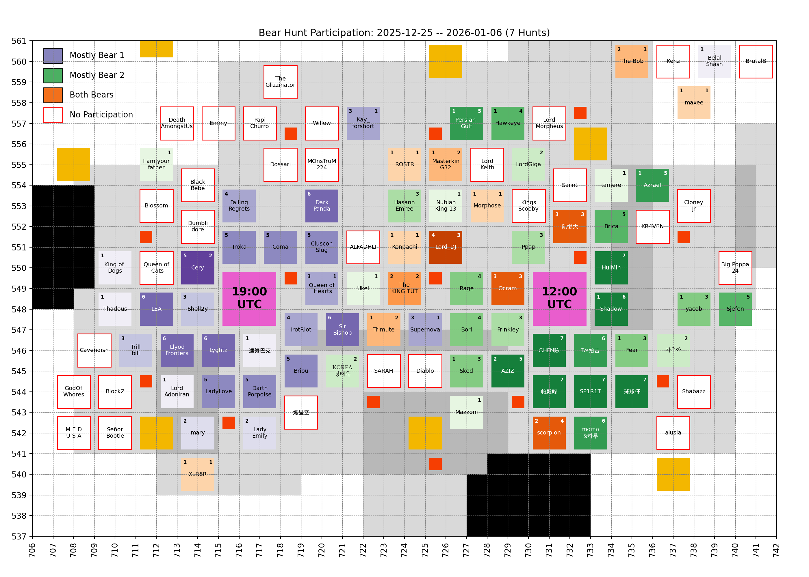
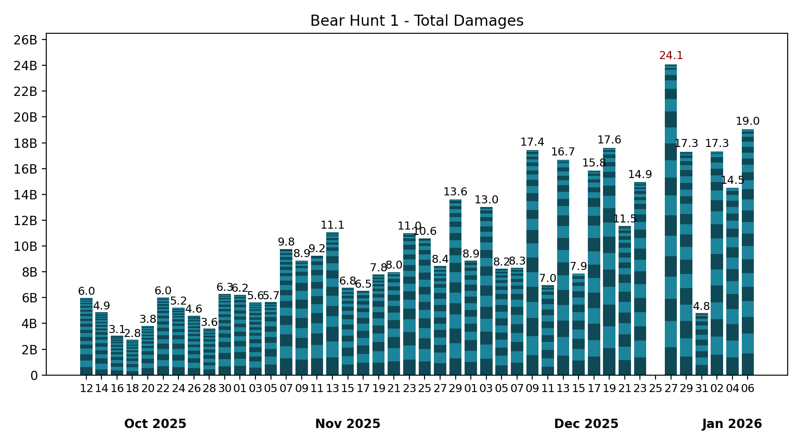

# 🐻 Bear Hunt

Keeping only the last 7 records, which is the number of bear hunts in between two Castle Battles.

## Participation

<!-- [[[cog
# Display the latest hive participation map
import re
from pathlib import Path
pattern = re.compile(r"(\d{4}-\d{2}-\d{2})_hive_participation\.png")
imgs_dir = Path("bear_hunt", "images")
map_fpath = sorted(
  [fpath for fpath in imgs_dir.iterdir() if pattern.match(fpath.name)]
)[-1]
print(f" / map_fpath.name})")
]]] -->

<!-- [[[end]]] -->

<!-- [[[cog
# Display the future hive participation map once cities start moving
import re
from pathlib import Path
import yaml

MOVING = yaml.safe_load(Path("hive", "locations_moving.yml").read_text())
if MOVING["bear_1"] or MOVING["bear_2"]: # Else, no moving cities, skip
  pattern = re.compile(r"(\d{4}-\d{2}-\d{2})_hive_participation_moving\.png")
  imgs_dir = Path("bear_hunt", "images")
  map_fpath = sorted(
    [fpath for fpath in imgs_dir.iterdir() if pattern.match(fpath.name)]
  )[-1]

  print("\n## Future hive\n")
  print(f" / map_fpath.name})")
  print()
]]] -->

<!-- [[[end]]] -->

## Bear 1

<!-- [[[cog
# Display the latest bear damages bar graph
import re
from pathlib import Path
pattern = re.compile(r"(\d{4}-\d{2}-\d{2})_bear1_damages\.png")
imgs_dir = Path("bear_hunt", "images")
map_fpath = sorted(
  [fpath for fpath in imgs_dir.iterdir() if pattern.match(fpath.name)]
)[-1]
print(f" / map_fpath.name})")
]]] -->

<!-- [[[end]]] -->

Table

<!-- [[[cog
from analysis import summary, as_markdown_table
print()
print(
  as_markdown_table(
    summary(bear=1),
    columns=["Date", "# Players", "Total score"],
    justifys=["left", "right", "right"],
  )
)
]]] -->

| Date       | # Players | Total score |
| :--------- | --------: | ----------: |
| 2025-10-12 |        30 |       5.97B |
| 2025-10-14 |        27 |       4.86B |
| 2025-10-16 |        24 |       3.05B |
| 2025-10-18 |        20 |       2.75B |
| 2025-10-20 |        23 |       3.82B |
| 2025-10-22 |        28 |       6.03B |
| 2025-10-24 |        23 |       5.23B |
| 2025-10-26 |        27 |       4.62B |
| 2025-10-28 |        23 |       3.59B |
| 2025-10-30 |        25 |       6.28B |
| 2025-11-01 |        23 |       6.21B |
| 2025-11-03 |        29 |       5.64B |
| 2025-11-05 |        19 |       5.65B |
| 2025-11-07 |        25 |       9.76B |
| 2025-11-09 |        17 |       8.88B |
| 2025-11-11 |        16 |       9.25B |
| 2025-11-13 |        25 |      11.07B |
| 2025-11-15 |        21 |       6.76B |
| 2025-11-17 |        15 |       6.54B |
| 2025-11-19 |        23 |       7.79B |
| 2025-11-21 |        19 |       7.99B |
| 2025-11-23 |        21 |      10.99B |
| 2025-11-25 |        19 |      10.57B |
| 2025-11-27 |        21 |       8.44B |
| 2025-11-29 |        22 |      13.60B |
| 2025-12-01 |        19 |       8.85B |
| 2025-12-03 |        22 |      13.01B |
| 2025-12-05 |        23 |       8.24B |
| 2025-12-07 |        21 |       8.31B |
| 2025-12-09 |        25 |      17.45B |
| 2025-12-11 |        19 |       6.97B |
| 2025-12-13 |        23 |      16.67B |
| 2025-12-15 |        14 |       7.89B |
| 2025-12-17 |        22 |      15.84B |
| 2025-12-19 |        22 |      17.60B |
| 2025-12-21 |        25 |      11.54B |
| 2025-12-23 |        26 |      14.94B |
| 2025-12-25 |         1 |           0 |
| 2025-12-27 |        24 |      24.08B |
| 2025-12-29 |        27 |      17.31B |
| 2025-12-31 |        15 |       4.81B |
| 2026-01-02 |        20 |      17.32B |
| 2026-01-04 |        19 |      14.51B |
| 2026-01-06 |        25 |      19.03B |

<!-- [[[end]]] -->

Top Players over last 7 hunts

<!-- [[[cog
from analysis import players_records, as_markdown_table
print()
print(
  as_markdown_table(
    players_records(bear=1, n_lasts=7),
    columns=["#", "Player", "Score", "# Hunts"],
    justifys=["right", "left", "right", "right"],
  )
)
]]] -->

|   # | Player          |   Score | # Hunts |
| --: | :-------------- | ------: | ------: |
|   1 | Lyghtz          |   7.18B |       6 |
|   2 | Coma            |   6.84B |       5 |
|   3 | Llyod Frontera  |   6.66B |       6 |
|   4 | Cery            |   6.63B |       5 |
|   5 | Troka           |   6.05B |       5 |
|   6 | LadyLove        |   5.43B |       5 |
|   7 | Ocram           |   5.11B |       3 |
|   8 | Briou           |   4.86B |       5 |
|   9 | IrotRiot        |   4.42B |       4 |
|  10 | CiusconSlug     |   4.14B |       5 |
|  11 | FallingRegrets  |   3.52B |       4 |
|  12 | DarkPanda       |   3.41B |       6 |
|  13 | Shell2y         |   3.25B |       3 |
|  14 | Darth Porpoise  |   3.09B |       5 |
|  15 | LEA             |   2.99B |       6 |
|  16 | Sir Bishop      |   2.54B |       6 |
|  17 | AZIZ            |   2.42B |       2 |
|  18 | Lord_DJ         |   1.88B |       4 |
|  19 | The Bob         |   1.80B |       2 |
|  20 | Queen of Hearts |   1.71B |       3 |
|  21 | Mill2y          |   1.57B |       1 |
|  22 | 達努巴克        |   1.55B |       1 |
|  23 | Shadow          |   1.30B |       1 |
|  24 | Kay_forshort    |   1.23B |       3 |
|  25 | Kenpachi        | 888.64M |       1 |
|  26 | mary            | 888.19M |       2 |
|  27 | Trillbill       | 863.08M |       3 |
|  28 | scorpion        | 781.10M |       2 |
|  29 | Morphose        | 534.70M |       1 |
|  30 | Sked            | 523.71M |       1 |
|  31 | Azrael          | 481.44M |       1 |
|  32 | MasterkinG32    | 418.44M |       1 |
|  33 | Supernova       | 400.65M |       3 |
|  34 | Persian Gulf    | 335.71M |       1 |
|  35 | Lady Emily      | 261.85M |       2 |
|  36 | 趴懶大          | 220.48M |       3 |
|  37 | The KING TUT    | 200.99M |       2 |
|  38 | ROSTR           | 153.07M |       1 |
|  39 | Lord Adoniran   | 130.91M |       1 |
|  40 | Hawkeye         | 107.35M |       1 |
|  41 | yacob           |  80.81M |       1 |
|  42 | Thadeus         |  50.89M |       1 |
|  43 | BelalShash      |  47.41M |       1 |
|  44 | King of Dogs    |  38.30M |       1 |
|  45 | Trimute         |  36.51M |       1 |
|  46 | XLR8R           |  27.03M |       1 |
|  47 | Fear            |   7.92M |       1 |
|  48 | maxee           |   6.59M |       1 |
|  49 | MissingData     |       0 |       1 |

<!-- [[[end]]] -->

## Bear 2

<!-- [[[cog
# Display the latest bear damages bar graph
import re
from pathlib import Path
pattern = re.compile(r"(\d{4}-\d{2}-\d{2})_bear2_damages\.png")
imgs_dir = Path("bear_hunt", "images")
graph_fpath = sorted(
  [fpath for fpath in imgs_dir.iterdir() if pattern.match(fpath.name)]
)[-1]
print(f" / graph_fpath.name})")
]]] -->

<!-- [[[end]]] -->

Table

<!-- [[[cog
from analysis import summary, as_markdown_table
print()
print(
  as_markdown_table(
    summary(bear=2),
    columns=["Date", "# Players", "Total score"],
    justifys=["left", "right", "right"],
  )
)
]]] -->

| Date       | # Players | Total score |
| :--------- | --------: | ----------: |
| 2025-10-12 |        22 |       5.53B |
| 2025-10-14 |        24 |       7.03B |
| 2025-10-17 |        25 |       5.54B |
| 2025-10-19 |        23 |       9.44B |
| 2025-10-21 |        28 |      10.03B |
| 2025-10-23 |        28 |       7.12B |
| 2025-10-26 |        18 |       7.66B |
| 2025-10-28 |        24 |       6.57B |
| 2025-10-30 |        24 |       7.36B |
| 2025-11-01 |        22 |       6.04B |
| 2025-11-03 |        23 |       6.58B |
| 2025-11-05 |        32 |       9.16B |
| 2025-11-07 |        21 |       6.61B |
| 2025-11-09 |        20 |      12.90B |
| 2025-11-11 |        25 |       8.72B |
| 2025-11-13 |        27 |      13.60B |
| 2025-11-15 |        28 |      15.08B |
| 2025-11-17 |        21 |      12.78B |
| 2025-11-19 |        24 |      13.25B |
| 2025-11-21 |        22 |       9.94B |
| 2025-11-23 |        20 |      16.66B |
| 2025-11-25 |        21 |       6.60B |
| 2025-11-27 |        23 |       9.68B |
| 2025-11-29 |        21 |      12.44B |
| 2025-12-01 |        23 |      15.88B |
| 2025-12-03 |        20 |       8.04B |
| 2025-12-05 |        21 |      16.37B |
| 2025-12-07 |        16 |      15.28B |
| 2025-12-09 |        24 |      16.47B |
| 2025-12-11 |        20 |      19.59B |
| 2025-12-13 |        19 |       4.30B |
| 2025-12-15 |        21 |      10.91B |
| 2025-12-17 |        18 |       7.20B |
| 2025-12-19 |        23 |      13.82B |
| 2025-12-21 |        20 |      14.52B |
| 2025-12-23 |        25 |      16.45B |
| 2025-12-25 |        22 |      12.54B |
| 2025-12-27 |        22 |      15.66B |
| 2025-12-29 |        22 |      17.56B |
| 2025-12-31 |        23 |      21.80B |
| 2026-01-02 |        21 |      21.05B |
| 2026-01-04 |        26 |      16.19B |
| 2026-01-06 |        19 |      12.66B |

<!-- [[[end]]] -->

Top Players over last 7 hunts

<!-- [[[cog
from analysis import players_records, as_markdown_table
print()
print(
  as_markdown_table(
    players_records(bear=2, n_lasts=7),
    columns=["#", "Player", "Score", "# Hunts"],
    justifys=["right", "left", "right", "right"],
  )
)
]]] -->

|   # | Player           |   Score | # Hunts |
| --: | :--------------- | ------: | ------: |
|   1 | CHEN陈           |  11.90B |       7 |
|   2 | HuiMin           |   7.45B |       7 |
|   3 | Shadow           |   6.91B |       6 |
|   4 | SP1R1T           |   6.32B |       7 |
|   5 | 帕殿咚           |   6.08B |       7 |
|   6 | 球球仔           |   5.80B |       7 |
|   7 | Ocram            |   5.26B |       3 |
|   8 | Azrael           |   5.00B |       5 |
|   9 | AZIZ             |   4.84B |       5 |
|  10 | Frinkley         |   4.78B |       3 |
|  11 | Sjefen           |   4.57B |       5 |
|  12 | Bori             |   4.29B |       4 |
|  13 | Brica            |   3.87B |       5 |
|  14 | Rage             |   3.21B |       4 |
|  15 | TW拍吉           |   3.15B |       6 |
|  16 | Kai              |   2.85B |       2 |
|  17 | scorpion         |   2.67B |       4 |
|  18 | Hawkeye          |   2.59B |       4 |
|  19 | Cery             |   2.51B |       2 |
|  20 | momo&하루        |   2.44B |       6 |
|  21 | Fear             |   2.30B |       3 |
|  22 | Lord_DJ          |   2.14B |       3 |
|  23 | Persian Gulf     |   1.96B |       5 |
|  24 | Ppap             |   1.69B |       3 |
|  25 | Sked             |   1.58B |       3 |
|  26 | Queen of Hearts  |   1.39B |       1 |
|  27 | MasterkinG32     |   1.19B |       2 |
|  28 | Professor        |   1.07B |       1 |
|  29 | Kay_forshort     | 834.99M |       1 |
|  30 | Kenpachi         | 661.10M |       1 |
|  31 | 趴懶大           | 578.02M |       3 |
|  32 | The Bob          | 569.12M |       1 |
|  33 | Doon             | 565.38M |       1 |
|  34 | Trimute          | 545.30M |       2 |
|  35 | tamere           | 487.67M |       1 |
|  36 | HasannEmree      | 477.88M |       3 |
|  37 | yacob            | 476.16M |       3 |
|  38 | 차은아           | 457.04M |       2 |
|  39 | Morphose         | 409.63M |       1 |
|  40 | Kjs722           | 328.68M |       2 |
|  41 | The KING TUT     | 322.20M |       2 |
|  42 | KOREA장태욱      | 198.41M |       2 |
|  43 | XLR8R            | 196.05M |       1 |
|  44 | LordGiga         | 175.91M |       2 |
|  45 | ROSTR            | 116.33M |       1 |
|  46 | Ukel             |  83.44M |       1 |
|  47 | Nubian King 13   |  72.60M |       1 |
|  48 | Mazzoni          |  51.90M |       1 |
|  49 | Supernova        |  21.94M |       1 |
|  50 | maxee            |   4.35M |       1 |
|  51 | I am your father |   3.69M |       1 |

<!-- [[[end]]] -->

