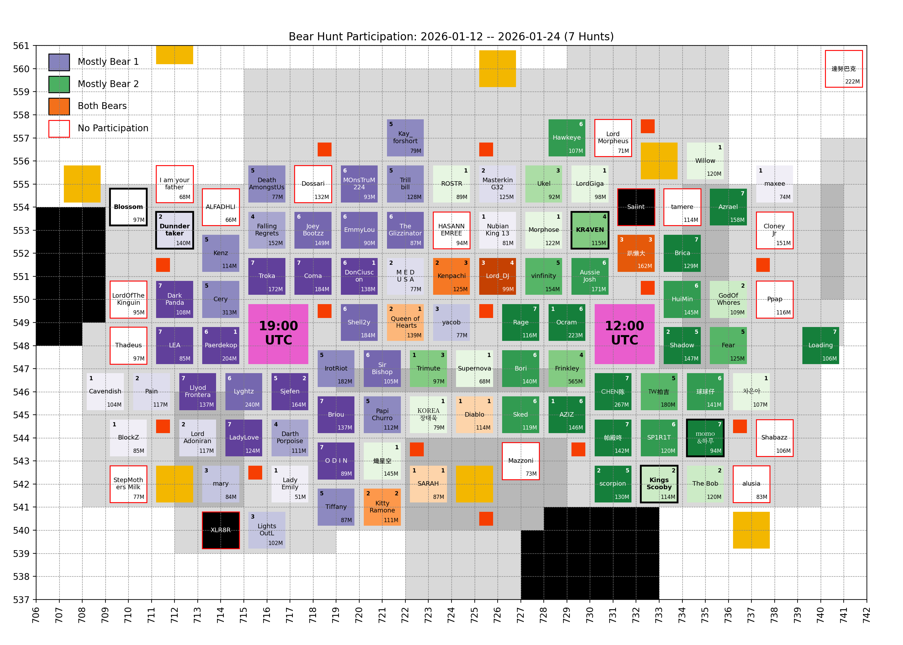
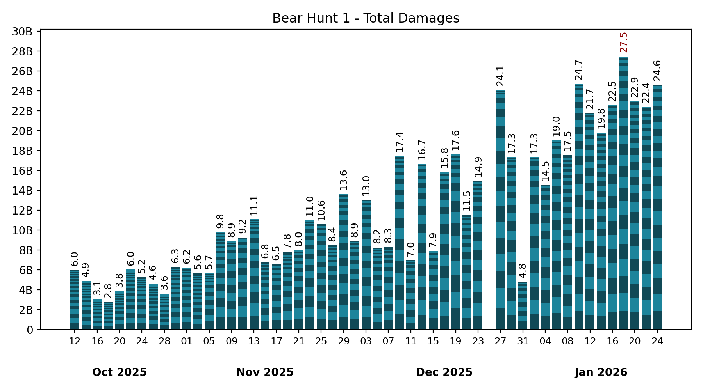
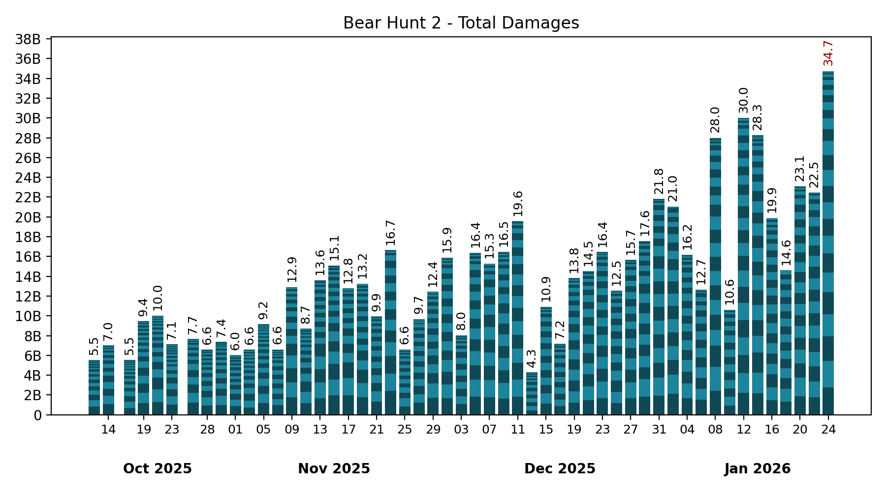

# 🐻 Bear Hunt

Keeping only the last 7 records, which is the number of bear hunts in between two Castle Battles.

## Participation

<!-- [[[cog
# Display the latest hive participation map
import re
from pathlib import Path
pattern = re.compile(r"(\d{4}-\d{2}-\d{2})_hive_participation\.png")
imgs_dir = Path("bear_hunt", "images")
map_fpath = sorted(
  [fpath for fpath in imgs_dir.iterdir() if pattern.match(fpath.name)]
)[-1]
print(f" / map_fpath.name})")
]]] -->

<!-- [[[end]]] -->

<!-- [[[cog
# Display the future hive participation map once cities start moving
import re
from pathlib import Path
import yaml

MOVING = yaml.safe_load(Path("hive", "locations_moving.yml").read_text())
if MOVING["bear_1"] or MOVING["bear_2"]: # Else, no moving cities, skip
  pattern = re.compile(r"(\d{4}-\d{2}-\d{2})_hive_participation_moving\.png")
  imgs_dir = Path("bear_hunt", "images")
  map_fpath = sorted(
    [fpath for fpath in imgs_dir.iterdir() if pattern.match(fpath.name)]
  )[-1]

  print("\n## Future hive\n")
  print(f" / map_fpath.name})")
  print()
]]] -->

## Future hive

<!-- [[[end]]] -->

## Bear 1

<!-- [[[cog
# Display the latest bear damages bar graph
import re
from pathlib import Path
pattern = re.compile(r"(\d{4}-\d{2}-\d{2})_bear1_damages\.png")
imgs_dir = Path("bear_hunt", "images")
map_fpath = sorted(
  [fpath for fpath in imgs_dir.iterdir() if pattern.match(fpath.name)]
)[-1]
print(f" / map_fpath.name})")
]]] -->

<!-- [[[end]]] -->

Table

<!-- [[[cog
from analysis import summary, as_markdown_table
print()
print(
  as_markdown_table(
    summary(bear=1),
    columns=["Date", "# Players", "Total score"],
    justifys=["left", "right", "right"],
  )
)
]]] -->

| Date       | # Players | Total score |
| :--------- | --------: | ----------: |
| 2025-10-12 |        30 |       5.97B |
| 2025-10-14 |        27 |       4.86B |
| 2025-10-16 |        24 |       3.05B |
| 2025-10-18 |        20 |       2.75B |
| 2025-10-20 |        23 |       3.82B |
| 2025-10-22 |        28 |       6.03B |
| 2025-10-24 |        23 |       5.23B |
| 2025-10-26 |        27 |       4.62B |
| 2025-10-28 |        23 |       3.59B |
| 2025-10-30 |        25 |       6.28B |
| 2025-11-01 |        23 |       6.21B |
| 2025-11-03 |        29 |       5.64B |
| 2025-11-05 |        19 |       5.65B |
| 2025-11-07 |        25 |       9.76B |
| 2025-11-09 |        17 |       8.88B |
| 2025-11-11 |        16 |       9.25B |
| 2025-11-13 |        25 |      11.07B |
| 2025-11-15 |        21 |       6.76B |
| 2025-11-17 |        15 |       6.54B |
| 2025-11-19 |        23 |       7.79B |
| 2025-11-21 |        19 |       7.99B |
| 2025-11-23 |        21 |      10.99B |
| 2025-11-25 |        19 |      10.57B |
| 2025-11-27 |        21 |       8.44B |
| 2025-11-29 |        22 |      13.60B |
| 2025-12-01 |        19 |       8.85B |
| 2025-12-03 |        22 |      13.01B |
| 2025-12-05 |        23 |       8.24B |
| 2025-12-07 |        21 |       8.31B |
| 2025-12-09 |        25 |      17.45B |
| 2025-12-11 |        19 |       6.97B |
| 2025-12-13 |        23 |      16.67B |
| 2025-12-15 |        14 |       7.89B |
| 2025-12-17 |        22 |      15.84B |
| 2025-12-19 |        22 |      17.60B |
| 2025-12-21 |        25 |      11.54B |
| 2025-12-23 |        26 |      14.94B |
| 2025-12-25 |         1 |           0 |
| 2025-12-27 |        24 |      24.08B |
| 2025-12-29 |        27 |      17.31B |
| 2025-12-31 |        15 |       4.81B |
| 2026-01-02 |        20 |      17.32B |
| 2026-01-04 |        19 |      14.51B |
| 2026-01-06 |        25 |      19.03B |
| 2026-01-08 |        32 |      17.52B |
| 2026-01-10 |        29 |      24.69B |
| 2026-01-12 |        29 |      21.75B |
| 2026-01-14 |        34 |      19.80B |
| 2026-01-16 |        24 |      22.52B |
| 2026-01-18 |        30 |      27.45B |
| 2026-01-20 |        33 |      22.92B |
| 2026-01-22 |        30 |      22.36B |
| 2026-01-24 |        28 |      24.59B |

<!-- [[[end]]] -->

Top Players over last 7 hunts

<!-- [[[cog
from analysis import players_records, as_markdown_table
print()
print(
  as_markdown_table(
    players_records(bear=1, n_lasts=7),
    columns=["#", "Player", "Score", "# Hunts"],
    justifys=["right", "left", "right", "right"],
  )
)
]]] -->

|   # | Player          |   Score | # Hunts |
| --: | :-------------- | ------: | ------: |
|   1 | Troka           |  10.10B |       7 |
|   2 | Coma            |   9.66B |       7 |
|   3 | Paerdekop       |   9.58B |       6 |
|   4 | Lyghtz          |   9.27B |       6 |
|   5 | Briou           |   8.28B |       7 |
|   6 | LadyLove        |   8.00B |       7 |
|   7 | Llyod Frontera  |   7.95B |       7 |
|   8 | Shell2y         |   6.62B |       6 |
|   9 | Sjefen          |   6.33B |       5 |
|  10 | Kenz            |   5.36B |       5 |
|  11 | LEA             |   5.32B |       7 |
|  12 | DarkPanda       |   5.15B |       7 |
|  13 | Cery            |   4.81B |       5 |
|  14 | EmmyLou         |   4.58B |       6 |
|  15 | IrotRiot        |   4.34B |       5 |
|  16 | JoeyBootzz      |   4.32B |       6 |
|  17 | FallingRegrets  |   4.14B |       4 |
|  18 | DonCiuscon      |   4.10B |       6 |
|  19 | PapiChurro      |   3.94B |       5 |
|  20 | TheGlizzinator  |   3.94B |       6 |
|  21 | O D I N         |   3.66B |       7 |
|  22 | Tiffany         |   2.55B |       5 |
|  23 | DeathAmongstUs  |   2.25B |       5 |
|  24 | MOnsTruM224     |   2.23B |       6 |
|  25 | Darth Porpoise  |   1.95B |       4 |
|  26 | Sir Bishop      |   1.92B |       6 |
|  27 | Trillbill       |   1.87B |       5 |
|  28 | Kay_forshort    |   1.75B |       5 |
|  29 | Kenpachi        |   1.66B |       2 |
|  30 | M E D U S A     |   1.54B |       2 |
|  31 | LightsOutL      |   1.48B |       3 |
|  32 | Queen of Hearts |   1.44B |       2 |
|  33 | Pain            |   1.37B |       2 |
|  34 | Lord_DJ         |   1.29B |       3 |
|  35 | mary            |   1.14B |       3 |
|  36 | Lord Adoniran   |   1.13B |       2 |
|  37 | Shadow          | 987.46M |       2 |
|  38 | MasterkinG32    | 940.27M |       2 |
|  39 | 趴懶大          | 727.31M |       3 |
|  40 | Dunndertaker    | 612.20M |       2 |
|  41 | scorpion        | 563.20M |       2 |
|  42 | KittyRamone     | 485.88M |       2 |
|  43 | BlockZ          | 477.75M |       1 |
|  44 | Ocram           | 343.38M |       1 |
|  45 | yacob           | 340.06M |       3 |
|  46 | Cavendish       | 276.54M |       1 |
|  47 | AZIZ            | 243.18M |       1 |
|  48 | Trimute         | 149.85M |       1 |
|  49 | SARAH           |  88.52M |       1 |
|  50 | Lady Emily      |  70.83M |       1 |
|  51 | Diablo          |  48.86M |       1 |
|  52 | Nubian King 13  |   3.73M |       1 |
|  53 | maxee           |   2.78M |       1 |

<!-- [[[end]]] -->

## Bear 2

<!-- [[[cog
# Display the latest bear damages bar graph
import re
from pathlib import Path
pattern = re.compile(r"(\d{4}-\d{2}-\d{2})_bear2_damages\.png")
imgs_dir = Path("bear_hunt", "images")
graph_fpath = sorted(
  [fpath for fpath in imgs_dir.iterdir() if pattern.match(fpath.name)]
)[-1]
print(f" / graph_fpath.name})")
]]] -->

<!-- [[[end]]] -->

Table

<!-- [[[cog
from analysis import summary, as_markdown_table
print()
print(
  as_markdown_table(
    summary(bear=2),
    columns=["Date", "# Players", "Total score"],
    justifys=["left", "right", "right"],
  )
)
]]] -->

| Date       | # Players | Total score |
| :--------- | --------: | ----------: |
| 2025-10-12 |        22 |       5.53B |
| 2025-10-14 |        24 |       7.03B |
| 2025-10-17 |        25 |       5.54B |
| 2025-10-19 |        23 |       9.44B |
| 2025-10-21 |        28 |      10.03B |
| 2025-10-23 |        28 |       7.12B |
| 2025-10-26 |        18 |       7.66B |
| 2025-10-28 |        24 |       6.57B |
| 2025-10-30 |        24 |       7.36B |
| 2025-11-01 |        22 |       6.04B |
| 2025-11-03 |        23 |       6.58B |
| 2025-11-05 |        32 |       9.16B |
| 2025-11-07 |        21 |       6.61B |
| 2025-11-09 |        20 |      12.90B |
| 2025-11-11 |        25 |       8.72B |
| 2025-11-13 |        27 |      13.60B |
| 2025-11-15 |        28 |      15.08B |
| 2025-11-17 |        21 |      12.78B |
| 2025-11-19 |        24 |      13.25B |
| 2025-11-21 |        22 |       9.94B |
| 2025-11-23 |        20 |      16.66B |
| 2025-11-25 |        21 |       6.60B |
| 2025-11-27 |        23 |       9.68B |
| 2025-11-29 |        21 |      12.44B |
| 2025-12-01 |        23 |      15.88B |
| 2025-12-03 |        20 |       8.04B |
| 2025-12-05 |        21 |      16.37B |
| 2025-12-07 |        16 |      15.28B |
| 2025-12-09 |        24 |      16.47B |
| 2025-12-11 |        20 |      19.59B |
| 2025-12-13 |        19 |       4.30B |
| 2025-12-15 |        21 |      10.91B |
| 2025-12-17 |        18 |       7.20B |
| 2025-12-19 |        23 |      13.82B |
| 2025-12-21 |        20 |      14.52B |
| 2025-12-23 |        25 |      16.45B |
| 2025-12-25 |        22 |      12.54B |
| 2025-12-27 |        22 |      15.66B |
| 2025-12-29 |        22 |      17.56B |
| 2025-12-31 |        23 |      21.80B |
| 2026-01-02 |        21 |      21.05B |
| 2026-01-04 |        26 |      16.19B |
| 2026-01-06 |        19 |      12.66B |
| 2026-01-08 |        27 |      27.98B |
| 2026-01-10 |        18 |      10.61B |
| 2026-01-12 |        28 |      30.00B |
| 2026-01-14 |        29 |      28.27B |
| 2026-01-16 |        26 |      19.90B |
| 2026-01-18 |        18 |      14.61B |
| 2026-01-20 |        26 |      23.10B |
| 2026-01-22 |        23 |      22.47B |
| 2026-01-24 |        26 |      34.74B |

<!-- [[[end]]] -->

Top Players over last 7 hunts

<!-- [[[cog
from analysis import players_records, as_markdown_table
print()
print(
  as_markdown_table(
    players_records(bear=2, n_lasts=7),
    columns=["#", "Player", "Score", "# Hunts"],
    justifys=["right", "left", "right", "right"],
  )
)
]]] -->

|   # | Player          |   Score | # Hunts |
| --: | :-------------- | ------: | ------: |
|   1 | Ocram           |  12.03B |       6 |
|   2 | CHEN陈          |  11.87B |       7 |
|   3 | AZIZ            |   9.39B |       6 |
|   4 | Brica           |   8.90B |       7 |
|   5 | AussieJosh      |   8.86B |       6 |
|   6 | Azrael          |   8.28B |       7 |
|   7 | Rage            |   7.80B |       7 |
|   8 | Bori            |   7.41B |       6 |
|   9 | HuiMin          |   7.29B |       6 |
|  10 | Shadow          |   6.89B |       5 |
|  11 | Frinkley        |   6.77B |       4 |
|  12 | 帕殿咚          |   6.62B |       7 |
|  13 | Fear            |   6.24B |       5 |
|  14 | SP1R1T          |   5.98B |       6 |
|  15 | Loading         |   5.66B |       7 |
|  16 | KR4VEN          |   5.12B |       4 |
|  17 | 球球仔          |   5.00B |       6 |
|  18 | vinfinity       |   4.31B |       5 |
|  19 | Sked            |   4.29B |       6 |
|  20 | Kenpachi        |   3.88B |       3 |
|  21 | Hawkeye         |   3.55B |       6 |
|  22 | Lord_DJ         |   3.25B |       4 |
|  23 | Sjefen          |   3.05B |       2 |
|  24 | TW拍吉          |   3.04B |       5 |
|  25 | GodOfWhores     |   2.73B |       2 |
|  26 | momo&하루       |   2.23B |       7 |
|  27 | scorpion        |   2.22B |       5 |
|  28 | The Bob         |   1.90B |       2 |
|  29 | Paerdekop       |   1.58B |       1 |
|  30 | Ukel            | 975.51M |       3 |
|  31 | 趴懶大          | 862.59M |       3 |
|  32 | Queen of Hearts | 805.72M |       1 |
|  33 | KittyRamone     | 628.86M |       2 |
|  34 | Trimute         | 587.37M |       3 |
|  35 | LordGiga        | 505.87M |       1 |
|  36 | Diablo          | 498.70M |       1 |
|  37 | Morphose        | 485.63M |       1 |
|  38 | DonCiuscon      | 485.52M |       1 |
|  39 | SARAH           | 228.09M |       1 |
|  40 | 차은아          | 193.40M |       1 |
|  41 | 熾星空          | 164.59M |       1 |
|  42 | HASANNEMREE     | 133.83M |       1 |
|  43 | Kings Scooby    | 122.54M |       2 |
|  44 | Willow          | 115.86M |       1 |
|  45 | KOREA장태욱     |  72.29M |       1 |
|  46 | ROSTR           |  54.22M |       1 |
|  47 | Supernova       |  45.67M |       1 |

<!-- [[[end]]] -->

