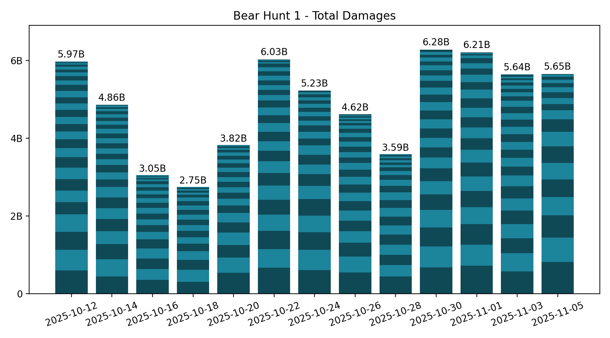
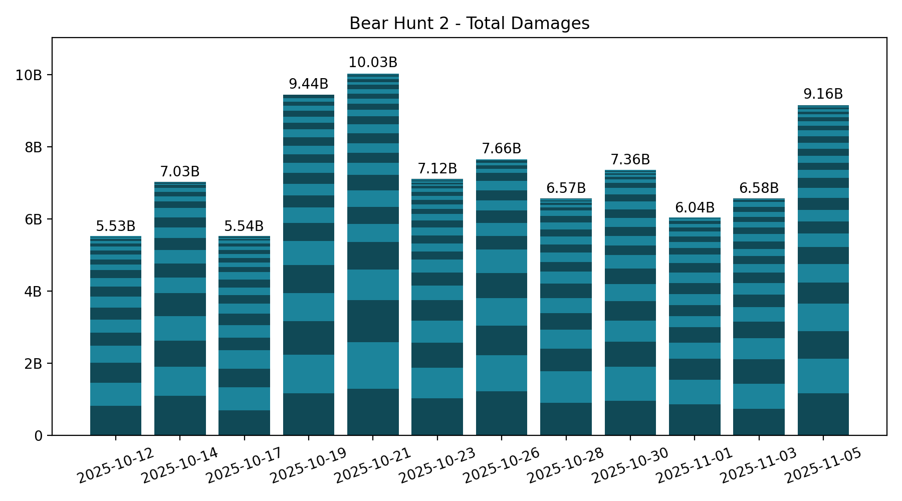

# 🐻 Bear Hunt

Keeping only the last 7 records, which is the number of bear hunts in between two Castle Battles.

## Summary

**Bear 1:**

<!-- [[[cog
from analysis import summary, as_markdown_table
print(
  as_markdown_table(
    summary(bear=1),
    columns=["Date", "# Players", "Total score"],
    justifys=["left", "right", "right"],
  )
)
]]] -->

| Date       | # Players | Total score |
| :--------- | --------: | ----------: |
| 2025-10-12 |        30 |       5.97B |
| 2025-10-14 |        27 |       4.86B |
| 2025-10-16 |        24 |       3.05B |
| 2025-10-18 |        20 |       2.75B |
| 2025-10-20 |        23 |       3.82B |
| 2025-10-22 |        28 |       6.03B |
| 2025-10-24 |        23 |       5.23B |
| 2025-10-26 |        27 |       4.62B |
| 2025-10-28 |        23 |       3.59B |
| 2025-10-30 |        25 |       6.28B |
| 2025-11-01 |        23 |       6.21B |
| 2025-11-03 |        29 |       5.64B |
| 2025-11-05 |        19 |       5.65B |

<!-- [[[end]]] -->

<!-- [[[cog
# Display the latest bear damages bar graph
import re
from pathlib import Path
pattern = re.compile(r"(\d{4}-\d{2}-\d{2})_bear1_damages\.png")
imgs_dir = Path("bear_hunt", "images")
graph_fpath = sorted(
  [fpath for fpath in imgs_dir.iterdir() if pattern.match(fpath.name)]
)[-1]
print(f" / graph_fpath.name})")
]]] -->

<!-- [[[end]]] -->

**Bear 2:**

<!-- [[[cog
from analysis import summary, as_markdown_table
print(
  as_markdown_table(
    summary(bear=2),
    columns=["Date", "# Players", "Total score"],
    justifys=["left", "right", "right"],
  )
)
]]] -->

| Date       | # Players | Total score |
| :--------- | --------: | ----------: |
| 2025-10-12 |        22 |       5.53B |
| 2025-10-14 |        24 |       7.03B |
| 2025-10-17 |        25 |       5.54B |
| 2025-10-19 |        23 |       9.44B |
| 2025-10-21 |        28 |      10.03B |
| 2025-10-23 |        28 |       7.12B |
| 2025-10-26 |        18 |       7.66B |
| 2025-10-28 |        24 |       6.57B |
| 2025-10-30 |        24 |       7.36B |
| 2025-11-01 |        22 |       6.04B |
| 2025-11-03 |        23 |       6.58B |
| 2025-11-05 |        32 |       9.16B |

<!-- [[[end]]] -->

<!-- [[[cog
# Display the latest bear damages bar graph
import re
from pathlib import Path
pattern = re.compile(r"(\d{4}-\d{2}-\d{2})_bear2_damages\.png")
imgs_dir = Path("bear_hunt", "images")
graph_fpath = sorted(
  [fpath for fpath in imgs_dir.iterdir() if pattern.match(fpath.name)]
)[-1]
print(f" / graph_fpath.name})")
]]] -->

<!-- [[[end]]] -->

## Bear 1 - Top Players over last 7 hunts

<!-- [[[cog
from analysis import players_records, as_markdown_table
print(
  as_markdown_table(
    players_records(bear=1, n_lasts=7),
    columns=["#", "Player", "Score", "# Hunts"],
    justifys=["right", "left", "right", "right"],
  )
)
]]] -->

|   # | Player           |   Score | # Hunts |
| --: | :--------------- | ------: | ------: |
|   1 | Lyghtz           |   3.60B |       7 |
|   2 | IrotRiot         |   2.47B |       7 |
|   3 | 達努巴克         |   2.38B |       5 |
|   4 | Troka            |   2.35B |       7 |
|   5 | Coma             |   2.13B |       6 |
|   6 | FallingRegrets   |   2.12B |       7 |
|   7 | LadyLove         |   1.94B |       7 |
|   8 | Cery             |   1.57B |       3 |
|   9 | Briou            |   1.56B |       7 |
|  10 | 違勢巴克         |   1.39B |       2 |
|  11 | Lloyd Frontera   |   1.37B |       5 |
|  12 | BlackBebe        |   1.35B |       5 |
|  13 | Sjefen           |   1.34B |       6 |
|  14 | CiusconUnchained |   1.09B |       7 |
|  15 | DarkPanda        | 856.68M |       7 |
|  16 | DarthPorpoise    | 826.04M |       5 |
|  17 | Brett Sinclair   | 812.08M |       5 |
|  18 | Queen of Cats    | 706.49M |       4 |
|  19 | Lord_DJ          | 679.10M |       4 |
|  20 | Llyod Frontera   | 657.67M |       2 |
|  21 | Sir Bishop       | 643.62M |       6 |
|  22 | MOnsTruM224      | 639.25M |       7 |
|  23 | Lord Adoniran    | 553.01M |       3 |
|  24 | Mill2y           | 529.54M |       1 |
|  25 | Professor        | 456.47M |       2 |
|  26 | LEA              | 359.08M |       7 |
|  27 | Darth Porpoise   | 321.27M |       1 |
|  28 | Dossari          | 296.95M |       2 |
|  29 | Trimute          | 294.32M |       3 |
|  30 | King of Dogs     | 223.89M |       3 |
|  31 | ROSTR            | 206.10M |       3 |
|  32 | 熾星空           | 165.92M |       1 |
|  33 | HasannEmree      | 163.34M |       1 |
|  34 | Queen of Hearts  | 141.31M |       2 |
|  35 | SARAH            | 130.93M |       1 |
|  36 | Morphose         | 128.51M |       2 |
|  37 | Diablo           | 118.18M |       1 |
|  38 | Kings Scooby     | 116.87M |       1 |
|  39 | Thadeus          | 104.13M |       1 |
|  40 | 趴懶大           |  99.74M |       3 |
|  41 | XLR8R            |  69.74M |       1 |
|  42 | sin6969          |  55.62M |       1 |
|  43 | MAKO             |  55.11M |       2 |
|  44 | BelalShash       |  38.00M |       1 |
|  45 | rice baby        |  29.13M |       1 |
|  46 | Teddix           |  27.49M |       1 |
|  47 | Ukel             |  15.41M |       1 |
|  48 | Dumbliđore       |  13.95M |       1 |
|  49 | sin666           |   2.93M |       1 |

<!-- [[[end]]] -->

## Bear 2 - Top Players over last 7 hunts

<!-- [[[cog
from analysis import players_records, as_markdown_table
print(
  as_markdown_table(
    players_records(bear=2, n_lasts=7),
    columns=["#", "Player", "Score", "# Hunts"],
    justifys=["right", "left", "right", "right"],
  )
)
]]] -->

|   # | Player          |   Score | # Hunts |
| --: | :-------------- | ------: | ------: |
|   1 | CHEN            |   6.46B |       7 |
|   2 | Frinkley        |   5.38B |       6 |
|   3 | Ocram           |   4.36B |       7 |
|   4 | Aziz            |   4.12B |       7 |
|   5 | Yaaak           |   3.93B |       6 |
|   6 | TW              |   3.19B |       7 |
|   7 | Fear            |   2.15B |       6 |
|   8 | brfc            |   1.72B |       6 |
|   9 | 少量課金者      |   1.66B |       7 |
|  10 | HuiMin          |   1.50B |       7 |
|  11 | DoRaeMi         |   1.49B |       5 |
|  12 | Rage            |   1.47B |       6 |
|  13 | Shell           |   1.45B |       6 |
|  14 | Azrael          |   1.33B |       7 |
|  15 | TIBBI           |   1.21B |       3 |
|  16 | Professor       | 884.40M |       2 |
|  17 | SP1R1T          | 868.34M |       5 |
|  18 | TheGuardiaN     | 767.91M |       5 |
|  19 | Kings Scooby    | 711.73M |       3 |
|  20 | 屁屁俠          | 555.38M |       5 |
|  21 | Cery            | 459.69M |       1 |
|  22 | Lord_DJ         | 451.65M |       2 |
|  23 | Sked            | 400.18M |       3 |
|  24 | BlackBebe       | 399.54M |       1 |
|  25 | scorpion        | 370.90M |       6 |
|  26 | King Scooby     | 333.51M |       1 |
|  27 | 球球仔          | 329.65M |       5 |
|  28 | Queen of Hearts | 323.54M |       2 |
|  29 | Cloney Jr       | 307.09M |       2 |
|  30 | 趴懶大          | 266.89M |       2 |
|  31 | Shabazz         | 244.81M |       2 |
|  32 | Diablo          | 211.77M |       2 |
|  33 | LordGiga        | 187.41M |       4 |
|  34 | Lady Emily      | 106.11M |       2 |
|  35 | HasannEmree     |  96.55M |       1 |
|  36 | Mazzoni         |  94.73M |       3 |
|  37 | Trimute         |  81.55M |       1 |
|  38 | Nightmare Lune  |  81.40M |       2 |
|  39 | Monyahcat       |  80.21M |       1 |
|  40 | ROSTR           |  69.43M |       1 |
|  41 | EL MACHO        |  66.83M |       1 |
|  42 | Kenpachi        |  48.37M |       1 |
|  43 | King Koopa      |  38.93M |       1 |
|  44 | KW              |  37.38M |       1 |
|  45 | supernova       |  37.08M |       1 |
|  46 | The KING TUT    |  34.95M |       2 |
|  47 | Ukel            |  24.52M |       1 |
|  48 | MAKO            |  21.65M |       1 |
|  49 | PangolaPapi     |  17.99M |       1 |
|  50 | Willow          |  16.92M |       1 |
|  51 | tamere          |  14.77M |       1 |
|  52 | 차은아          |   7.63M |       1 |
|  53 | ALFADHLI        |   4.22M |       1 |

<!-- [[[end]]] -->
