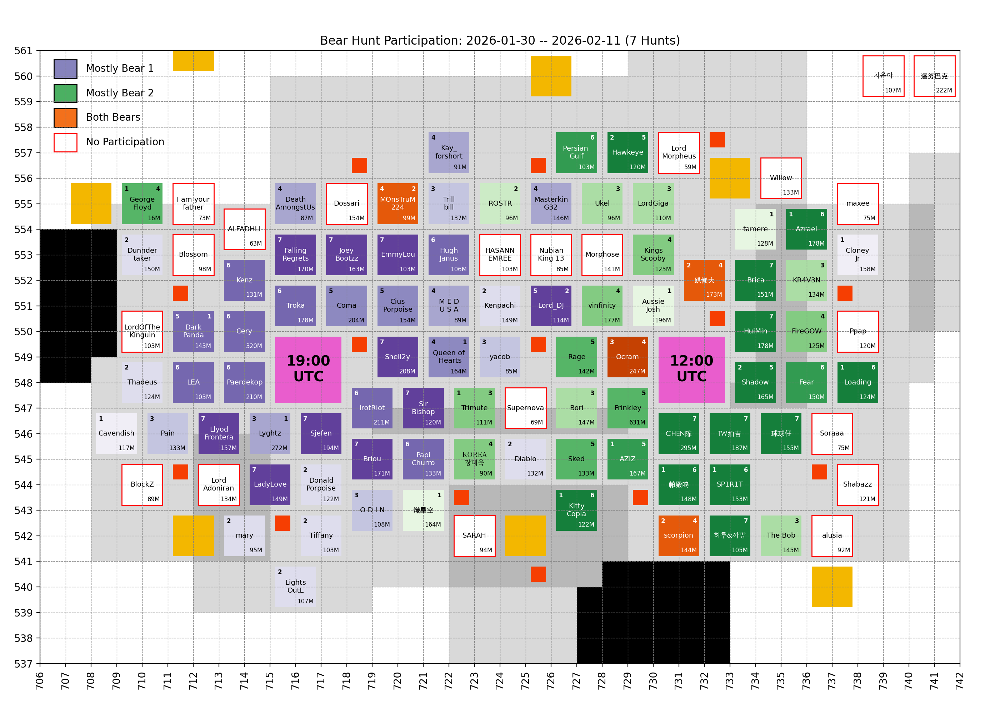
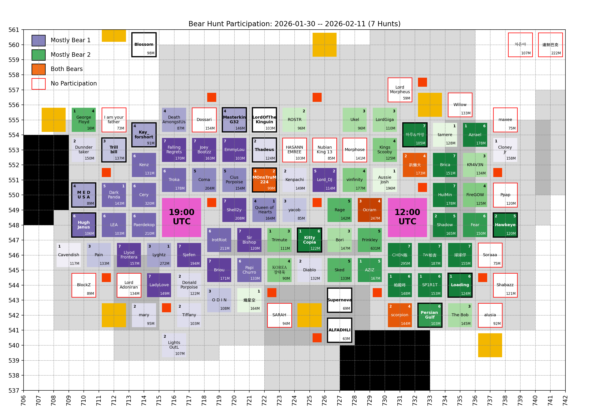
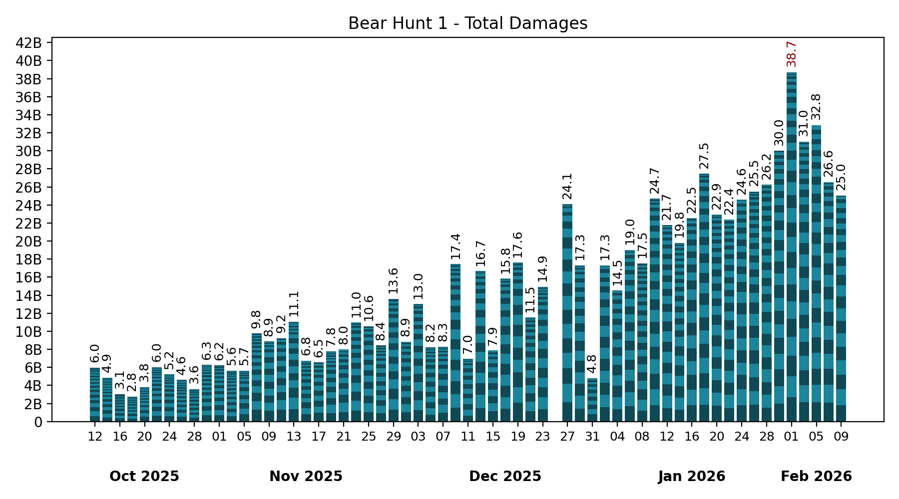
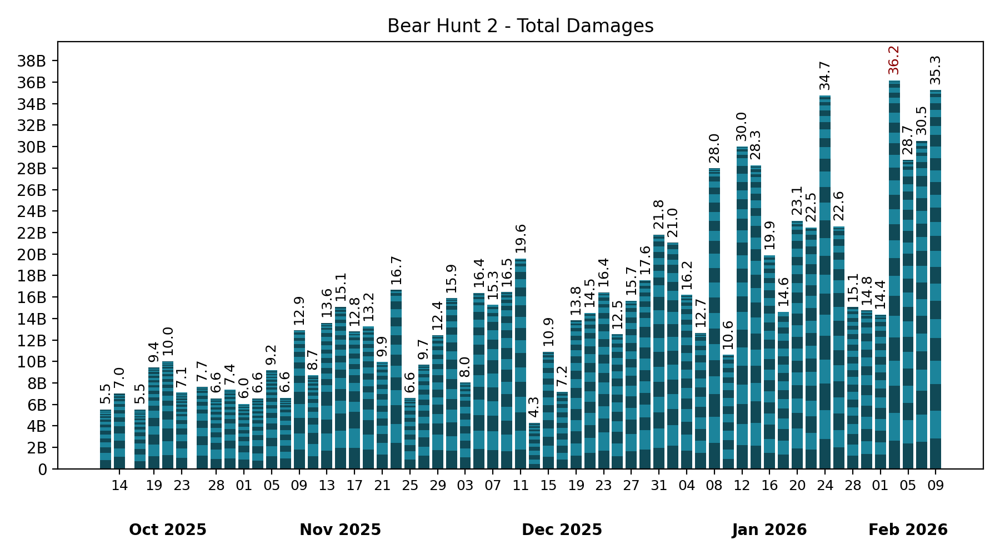

# 🐻 Bear Hunt

Keeping only the last 7 records, which is the number of bear hunts in between two Castle Battles.

## Participation

<!-- [[[cog
# Display the latest hive participation map
import re
from pathlib import Path
pattern = re.compile(r"(\d{4}-\d{2}-\d{2})_hive_participation\.png")
imgs_dir = Path("bear_hunt", "images")
map_fpath = sorted(
  [fpath for fpath in imgs_dir.iterdir() if pattern.match(fpath.name)]
)[-1]
print(f" / map_fpath.name})")
]]] -->

<!-- [[[end]]] -->

<!-- [[[cog
# Display the future hive participation map once cities start moving
import re
from pathlib import Path
import yaml

MOVING = yaml.safe_load(Path("hive", "locations_moving.yml").read_text())
if MOVING["bear_1"] or MOVING["bear_2"]: # Else, no moving cities, skip
  pattern = re.compile(r"(\d{4}-\d{2}-\d{2})_hive_participation_moving\.png")
  imgs_dir = Path("bear_hunt", "images")
  map_fpath = sorted(
    [fpath for fpath in imgs_dir.iterdir() if pattern.match(fpath.name)]
  )[-1]

  print("\n## Future hive\n")
  print(f" / map_fpath.name})")
  print()
]]] -->

## Future hive

<!-- [[[end]]] -->

## Bear 1

<!-- [[[cog
# Display the latest bear damages bar graph
import re
from pathlib import Path
pattern = re.compile(r"(\d{4}-\d{2}-\d{2})_bear1_damages\.png")
imgs_dir = Path("bear_hunt", "images")
map_fpath = sorted(
  [fpath for fpath in imgs_dir.iterdir() if pattern.match(fpath.name)]
)[-1]
print(f" / map_fpath.name})")
]]] -->

<!-- [[[end]]] -->

Table

<!-- [[[cog
from analysis import summary, as_markdown_table
print()
print(
  as_markdown_table(
    summary(bear=1),
    columns=["Date", "# Players", "Total score"],
    justifys=["left", "right", "right"],
  )
)
]]] -->

| Date       | # Players | Total score |
| :--------- | --------: | ----------: |
| 2025-10-12 |        30 |       5.97B |
| 2025-10-14 |        27 |       4.86B |
| 2025-10-16 |        24 |       3.05B |
| 2025-10-18 |        20 |       2.75B |
| 2025-10-20 |        23 |       3.82B |
| 2025-10-22 |        28 |       6.03B |
| 2025-10-24 |        23 |       5.23B |
| 2025-10-26 |        27 |       4.62B |
| 2025-10-28 |        23 |       3.59B |
| 2025-10-30 |        25 |       6.28B |
| 2025-11-01 |        23 |       6.21B |
| 2025-11-03 |        29 |       5.64B |
| 2025-11-05 |        19 |       5.65B |
| 2025-11-07 |        25 |       9.76B |
| 2025-11-09 |        17 |       8.88B |
| 2025-11-11 |        16 |       9.25B |
| 2025-11-13 |        25 |      11.07B |
| 2025-11-15 |        21 |       6.76B |
| 2025-11-17 |        15 |       6.54B |
| 2025-11-19 |        23 |       7.79B |
| 2025-11-21 |        19 |       7.99B |
| 2025-11-23 |        21 |      10.99B |
| 2025-11-25 |        19 |      10.57B |
| 2025-11-27 |        21 |       8.44B |
| 2025-11-29 |        22 |      13.60B |
| 2025-12-01 |        19 |       8.85B |
| 2025-12-03 |        22 |      13.01B |
| 2025-12-05 |        23 |       8.24B |
| 2025-12-07 |        21 |       8.31B |
| 2025-12-09 |        25 |      17.45B |
| 2025-12-11 |        19 |       6.97B |
| 2025-12-13 |        23 |      16.67B |
| 2025-12-15 |        14 |       7.89B |
| 2025-12-17 |        22 |      15.84B |
| 2025-12-19 |        22 |      17.60B |
| 2025-12-21 |        25 |      11.54B |
| 2025-12-23 |        26 |      14.94B |
| 2025-12-25 |         1 |           0 |
| 2025-12-27 |        24 |      24.08B |
| 2025-12-29 |        27 |      17.31B |
| 2025-12-31 |        15 |       4.81B |
| 2026-01-02 |        20 |      17.32B |
| 2026-01-04 |        19 |      14.51B |
| 2026-01-06 |        25 |      19.03B |
| 2026-01-08 |        32 |      17.52B |
| 2026-01-10 |        29 |      24.69B |
| 2026-01-12 |        29 |      21.75B |
| 2026-01-14 |        34 |      19.80B |
| 2026-01-16 |        24 |      22.52B |
| 2026-01-18 |        30 |      27.45B |
| 2026-01-20 |        33 |      22.92B |
| 2026-01-22 |        30 |      22.36B |
| 2026-01-24 |        28 |      24.59B |
| 2026-01-26 |        34 |      25.50B |
| 2026-01-28 |        35 |      26.25B |
| 2026-01-30 |        29 |      30.00B |
| 2026-02-01 |        35 |      38.71B |
| 2026-02-03 |        32 |      31.02B |
| 2026-02-05 |        29 |      32.84B |
| 2026-02-07 |        26 |      26.56B |
| 2026-02-09 |        26 |      25.05B |

<!-- [[[end]]] -->

Top Players over last 7 hunts

<!-- [[[cog
from analysis import players_records, as_markdown_table
print()
print(
  as_markdown_table(
    players_records(bear=1, n_lasts=7),
    columns=["#", "Player", "Score", "# Hunts"],
    justifys=["right", "left", "right", "right"],
  )
)
]]] -->

|   # | Player          |   Score | # Hunts |
| --: | :-------------- | ------: | ------: |
|   1 | Sjefen          |  12.01B |       7 |
|   2 | Paerdekop       |  11.92B |       6 |
|   3 | Llyod Frontera  |  11.63B |       7 |
|   4 | Shell2y         |  10.24B |       7 |
|   5 | Briou           |  10.09B |       7 |
|   6 | LadyLove        |   9.89B |       7 |
|   7 | JoeyBootzz      |   9.45B |       7 |
|   8 | Troka           |   9.10B |       6 |
|   9 | Kenz            |   8.92B |       6 |
|  10 | IrotRiot        |   8.64B |       6 |
|  11 | FallingRegrets  |   8.33B |       7 |
|  12 | Coma            |   7.36B |       5 |
|  13 | PapiChurro      |   6.88B |       6 |
|  14 | LEA             |   6.63B |       6 |
|  15 | EmmyLou         |   6.20B |       7 |
|  16 | Cery            |   5.94B |       6 |
|  17 | Ocram           |   5.07B |       3 |
|  18 | DarkPanda       |   4.88B |       5 |
|  19 | Lyghtz          |   4.81B |       3 |
|  20 | Queen of Hearts |   4.36B |       5 |
|  21 | Hugh_Janus      |   4.12B |       6 |
|  22 | Sir Bishop      |   3.58B |       7 |
|  23 | M E D U S A     |   3.46B |       4 |
|  24 | DeathAmongstUs  |   3.30B |       5 |
|  25 | Kay_forshort    |   2.70B |       5 |
|  26 | O D I N         |   2.45B |       4 |
|  27 | Lord_DJ         |   2.28B |       4 |
|  28 | MasterkinG32    |   2.18B |       3 |
|  29 | MOnsTruM224     |   2.08B |       5 |
|  30 | Pain            |   1.99B |       4 |
|  31 | Shadow          |   1.91B |       2 |
|  32 | Tiffany         |   1.82B |       3 |
|  33 | Trillbill       |   1.74B |       4 |
|  34 | CiusPorpoise    |   1.55B |       5 |
|  35 | LightsOutL      |   1.55B |       3 |
|  36 | AZIZ            |   1.31B |       2 |
|  37 | mary            |   1.13B |       2 |
|  38 | Kenpachi        |   1.00B |       1 |
|  39 | scorpion        | 856.82M |       1 |
|  40 | Diablo          | 803.91M |       2 |
|  41 | yacob           | 782.09M |       3 |
|  42 | Dunndertaker    | 755.95M |       2 |
|  43 | 帕殿咚          | 714.23M |       1 |
|  44 | Donald Porpoise | 648.78M |       1 |
|  45 | Lord Adoniran   | 644.01M |       1 |
|  46 | Hawkeye         | 614.81M |       1 |
|  47 | SP1R1T          | 427.84M |       1 |
|  48 | 趴懶大          | 365.25M |       3 |
|  49 | Cavendish       | 353.92M |       1 |
|  50 | KittyCopia      | 341.07M |       1 |
|  51 | Trimute         | 244.34M |       1 |
|  52 | Thadeus         | 223.49M |       2 |
|  53 | Cloney Jr       | 144.56M |       1 |
|  54 | George Floyd    |   7.23M |       1 |
|  55 | Ukel            |   2.22M |       1 |

<!-- [[[end]]] -->

## Bear 2

<!-- [[[cog
# Display the latest bear damages bar graph
import re
from pathlib import Path
pattern = re.compile(r"(\d{4}-\d{2}-\d{2})_bear2_damages\.png")
imgs_dir = Path("bear_hunt", "images")
graph_fpath = sorted(
  [fpath for fpath in imgs_dir.iterdir() if pattern.match(fpath.name)]
)[-1]
print(f" / graph_fpath.name})")
]]] -->

<!-- [[[end]]] -->

Table

<!-- [[[cog
from analysis import summary, as_markdown_table
print()
print(
  as_markdown_table(
    summary(bear=2),
    columns=["Date", "# Players", "Total score"],
    justifys=["left", "right", "right"],
  )
)
]]] -->

| Date       | # Players | Total score |
| :--------- | --------: | ----------: |
| 2025-10-12 |        22 |       5.53B |
| 2025-10-14 |        24 |       7.03B |
| 2025-10-17 |        25 |       5.54B |
| 2025-10-19 |        23 |       9.44B |
| 2025-10-21 |        28 |      10.03B |
| 2025-10-23 |        28 |       7.12B |
| 2025-10-26 |        18 |       7.66B |
| 2025-10-28 |        24 |       6.57B |
| 2025-10-30 |        24 |       7.36B |
| 2025-11-01 |        22 |       6.04B |
| 2025-11-03 |        23 |       6.58B |
| 2025-11-05 |        32 |       9.16B |
| 2025-11-07 |        21 |       6.61B |
| 2025-11-09 |        20 |      12.90B |
| 2025-11-11 |        25 |       8.72B |
| 2025-11-13 |        27 |      13.60B |
| 2025-11-15 |        28 |      15.08B |
| 2025-11-17 |        21 |      12.78B |
| 2025-11-19 |        24 |      13.25B |
| 2025-11-21 |        22 |       9.94B |
| 2025-11-23 |        20 |      16.66B |
| 2025-11-25 |        21 |       6.60B |
| 2025-11-27 |        23 |       9.68B |
| 2025-11-29 |        21 |      12.44B |
| 2025-12-01 |        23 |      15.88B |
| 2025-12-03 |        20 |       8.04B |
| 2025-12-05 |        21 |      16.37B |
| 2025-12-07 |        16 |      15.28B |
| 2025-12-09 |        24 |      16.47B |
| 2025-12-11 |        20 |      19.59B |
| 2025-12-13 |        19 |       4.30B |
| 2025-12-15 |        21 |      10.91B |
| 2025-12-17 |        18 |       7.20B |
| 2025-12-19 |        23 |      13.82B |
| 2025-12-21 |        20 |      14.52B |
| 2025-12-23 |        25 |      16.45B |
| 2025-12-25 |        22 |      12.54B |
| 2025-12-27 |        22 |      15.66B |
| 2025-12-29 |        22 |      17.56B |
| 2025-12-31 |        23 |      21.80B |
| 2026-01-02 |        21 |      21.05B |
| 2026-01-04 |        26 |      16.19B |
| 2026-01-06 |        19 |      12.66B |
| 2026-01-08 |        27 |      27.98B |
| 2026-01-10 |        18 |      10.61B |
| 2026-01-12 |        28 |      30.00B |
| 2026-01-14 |        29 |      28.27B |
| 2026-01-16 |        26 |      19.90B |
| 2026-01-18 |        18 |      14.61B |
| 2026-01-20 |        26 |      23.10B |
| 2026-01-22 |        23 |      22.47B |
| 2026-01-24 |        26 |      34.74B |
| 2026-01-26 |        23 |      22.59B |
| 2026-01-28 |        26 |      15.07B |
| 2026-01-30 |        22 |      14.76B |
| 2026-02-01 |        24 |      14.37B |
| 2026-02-03 |        29 |      36.18B |
| 2026-02-05 |        27 |      28.75B |
| 2026-02-07 |        25 |      30.53B |
| 2026-02-09 |        28 |      35.26B |

<!-- [[[end]]] -->

Top Players over last 7 hunts

<!-- [[[cog
from analysis import players_records, as_markdown_table
print()
print(
  as_markdown_table(
    players_records(bear=2, n_lasts=7),
    columns=["#", "Player", "Score", "# Hunts"],
    justifys=["right", "left", "right", "right"],
  )
)
]]] -->

|   # | Player          |   Score | # Hunts |
| --: | :-------------- | ------: | ------: |
|   1 | CHEN陈          |  12.57B |       6 |
|   2 | Frinkley        |  10.24B |       4 |
|   3 | Azrael          |   9.95B |       7 |
|   4 | Fear            |   9.33B |       6 |
|   5 | HuiMin          |   8.72B |       7 |
|   6 | Brica           |   8.42B |       7 |
|   7 | 球球仔          |   8.16B |       7 |
|   8 | AZIZ            |   7.23B |       5 |
|   9 | Shadow          |   7.19B |       5 |
|  10 | Ocram           |   7.11B |       4 |
|  11 | SP1R1T          |   7.01B |       6 |
|  12 | Loading         |   6.59B |       7 |
|  13 | Rage            |   5.75B |       5 |
|  14 | Hawkeye         |   5.40B |       6 |
|  15 | 帕殿咚          |   5.21B |       6 |
|  16 | KR4V3N          |   4.83B |       4 |
|  17 | scorpion        |   4.71B |       5 |
|  18 | KittyCopia      |   4.65B |       6 |
|  19 | The Bob         |   4.36B |       4 |
|  20 | Persian Gulf    |   4.12B |       5 |
|  21 | FireGOW         |   3.97B |       4 |
|  22 | vinfinity       |   3.76B |       3 |
|  23 | 하루&까망       |   3.31B |       7 |
|  24 | Sked            |   3.26B |       5 |
|  25 | Lord_DJ         |   2.63B |       3 |
|  26 | Lyghtz          |   2.21B |       1 |
|  27 | Bori            |   2.06B |       4 |
|  28 | TW拍吉          |   1.47B |       7 |
|  29 | LordGiga        |   1.17B |       3 |
|  30 | DarkPanda       |   1.08B |       1 |
|  31 | Queen of Hearts |   1.06B |       1 |
|  32 | AussieJosh      |   1.00B |       1 |
|  33 | Ukel            | 998.13M |       3 |
|  34 | tamere          | 928.47M |       1 |
|  35 | KOREA장태욱     | 856.61M |       5 |
|  36 | MOnsTruM224     | 687.88M |       1 |
|  37 | 趴懶大          | 687.64M |       3 |
|  38 | Trimute         | 686.65M |       2 |
|  39 | Kings Scooby    | 571.53M |       5 |
|  40 | MasterkinG32    | 375.67M |       1 |
|  41 | yacob           | 343.73M |       1 |
|  42 | ROSTR           | 192.59M |       2 |
|  43 | George Floyd    |  31.57M |       4 |
|  44 | 熾星空          |  22.85M |       1 |

<!-- [[[end]]] -->

