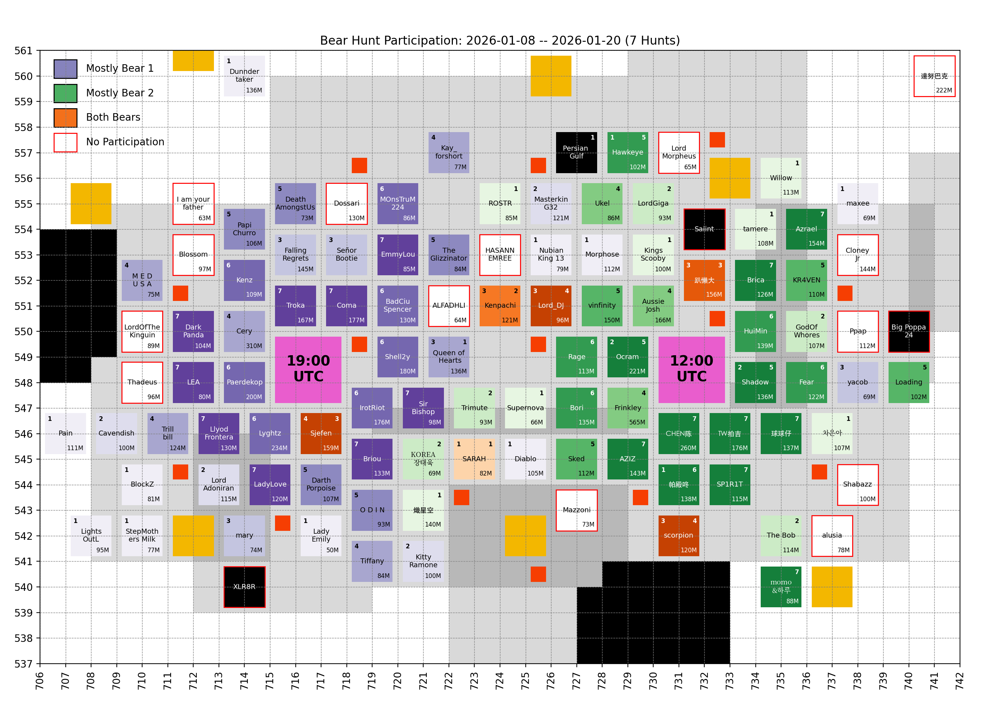
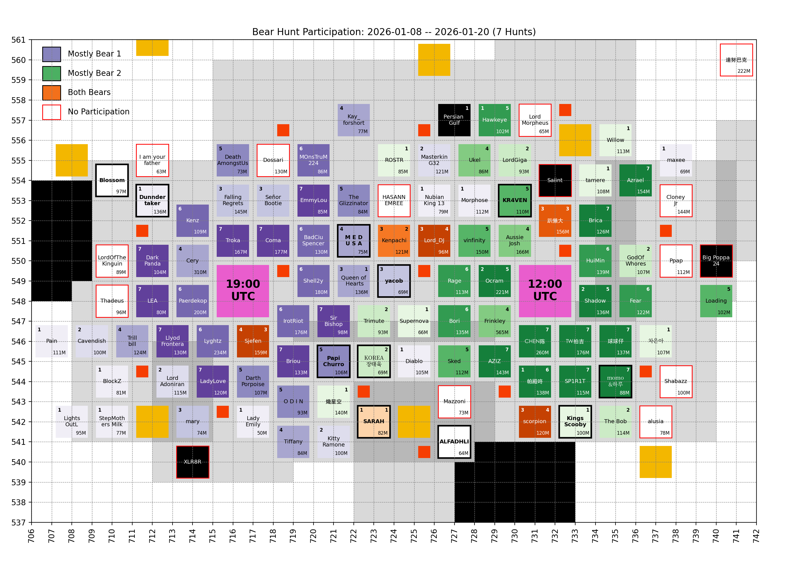
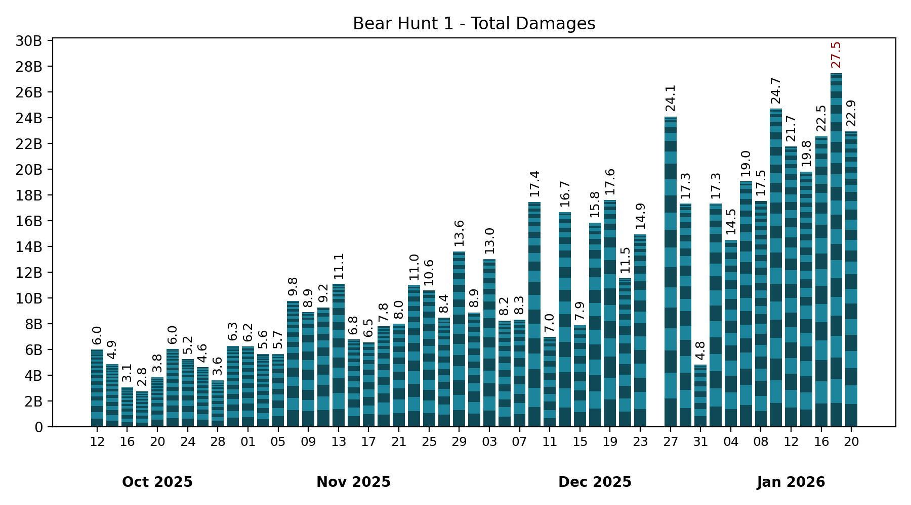
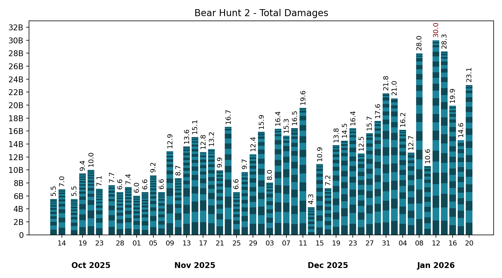

# 🐻 Bear Hunt

Keeping only the last 7 records, which is the number of bear hunts in between two Castle Battles.

## Participation

<!-- [[[cog
# Display the latest hive participation map
import re
from pathlib import Path
pattern = re.compile(r"(\d{4}-\d{2}-\d{2})_hive_participation\.png")
imgs_dir = Path("bear_hunt", "images")
map_fpath = sorted(
  [fpath for fpath in imgs_dir.iterdir() if pattern.match(fpath.name)]
)[-1]
print(f" / map_fpath.name})")
]]] -->

<!-- [[[end]]] -->

<!-- [[[cog
# Display the future hive participation map once cities start moving
import re
from pathlib import Path
import yaml

MOVING = yaml.safe_load(Path("hive", "locations_moving.yml").read_text())
if MOVING["bear_1"] or MOVING["bear_2"]: # Else, no moving cities, skip
  pattern = re.compile(r"(\d{4}-\d{2}-\d{2})_hive_participation_moving\.png")
  imgs_dir = Path("bear_hunt", "images")
  map_fpath = sorted(
    [fpath for fpath in imgs_dir.iterdir() if pattern.match(fpath.name)]
  )[-1]

  print("\n## Future hive\n")
  print(f" / map_fpath.name})")
  print()
]]] -->

## Future hive

<!-- [[[end]]] -->

## Bear 1

<!-- [[[cog
# Display the latest bear damages bar graph
import re
from pathlib import Path
pattern = re.compile(r"(\d{4}-\d{2}-\d{2})_bear1_damages\.png")
imgs_dir = Path("bear_hunt", "images")
map_fpath = sorted(
  [fpath for fpath in imgs_dir.iterdir() if pattern.match(fpath.name)]
)[-1]
print(f" / map_fpath.name})")
]]] -->

<!-- [[[end]]] -->

Table

<!-- [[[cog
from analysis import summary, as_markdown_table
print()
print(
  as_markdown_table(
    summary(bear=1),
    columns=["Date", "# Players", "Total score"],
    justifys=["left", "right", "right"],
  )
)
]]] -->

| Date       | # Players | Total score |
| :--------- | --------: | ----------: |
| 2025-10-12 |        30 |       5.97B |
| 2025-10-14 |        27 |       4.86B |
| 2025-10-16 |        24 |       3.05B |
| 2025-10-18 |        20 |       2.75B |
| 2025-10-20 |        23 |       3.82B |
| 2025-10-22 |        28 |       6.03B |
| 2025-10-24 |        23 |       5.23B |
| 2025-10-26 |        27 |       4.62B |
| 2025-10-28 |        23 |       3.59B |
| 2025-10-30 |        25 |       6.28B |
| 2025-11-01 |        23 |       6.21B |
| 2025-11-03 |        29 |       5.64B |
| 2025-11-05 |        19 |       5.65B |
| 2025-11-07 |        25 |       9.76B |
| 2025-11-09 |        17 |       8.88B |
| 2025-11-11 |        16 |       9.25B |
| 2025-11-13 |        25 |      11.07B |
| 2025-11-15 |        21 |       6.76B |
| 2025-11-17 |        15 |       6.54B |
| 2025-11-19 |        23 |       7.79B |
| 2025-11-21 |        19 |       7.99B |
| 2025-11-23 |        21 |      10.99B |
| 2025-11-25 |        19 |      10.57B |
| 2025-11-27 |        21 |       8.44B |
| 2025-11-29 |        22 |      13.60B |
| 2025-12-01 |        19 |       8.85B |
| 2025-12-03 |        22 |      13.01B |
| 2025-12-05 |        23 |       8.24B |
| 2025-12-07 |        21 |       8.31B |
| 2025-12-09 |        25 |      17.45B |
| 2025-12-11 |        19 |       6.97B |
| 2025-12-13 |        23 |      16.67B |
| 2025-12-15 |        14 |       7.89B |
| 2025-12-17 |        22 |      15.84B |
| 2025-12-19 |        22 |      17.60B |
| 2025-12-21 |        25 |      11.54B |
| 2025-12-23 |        26 |      14.94B |
| 2025-12-25 |         1 |           0 |
| 2025-12-27 |        24 |      24.08B |
| 2025-12-29 |        27 |      17.31B |
| 2025-12-31 |        15 |       4.81B |
| 2026-01-02 |        20 |      17.32B |
| 2026-01-04 |        19 |      14.51B |
| 2026-01-06 |        25 |      19.03B |
| 2026-01-08 |        32 |      17.52B |
| 2026-01-10 |        29 |      24.69B |
| 2026-01-12 |        29 |      21.75B |
| 2026-01-14 |        34 |      19.80B |
| 2026-01-16 |        24 |      22.52B |
| 2026-01-18 |        30 |      27.45B |
| 2026-01-20 |        33 |      22.92B |

<!-- [[[end]]] -->

Top Players over last 7 hunts

<!-- [[[cog
from analysis import players_records, as_markdown_table
print()
print(
  as_markdown_table(
    players_records(bear=1, n_lasts=7),
    columns=["#", "Player", "Score", "# Hunts"],
    justifys=["right", "left", "right", "right"],
  )
)
]]] -->

|   # | Player           |   Score | # Hunts |
| --: | :--------------- | ------: | ------: |
|   1 | Coma             |   9.63B |       7 |
|   2 | Paerdekop        |   9.59B |       6 |
|   3 | Troka            |   9.54B |       7 |
|   4 | Lyghtz           |   9.21B |       6 |
|   5 | Briou            |   7.98B |       7 |
|   6 | LadyLove         |   7.82B |       7 |
|   7 | Llyod Frontera   |   7.75B |       7 |
|   8 | Shell2y          |   6.06B |       6 |
|   9 | Kenz             |   5.94B |       6 |
|  10 | EmmyLou          |   5.22B |       7 |
|  11 | Sjefen           |   5.11B |       4 |
|  12 | LEA              |   5.10B |       7 |
|  13 | DarkPanda        |   4.99B |       7 |
|  14 | Cery             |   4.67B |       4 |
|  15 | BadCiuSpencer    |   4.53B |       6 |
|  16 | IrotRiot         |   3.79B |       6 |
|  17 | TheGlizzinator   |   3.18B |       5 |
|  18 | Darth Porpoise   |   2.91B |       5 |
|  19 | PapiChurro       |   2.86B |       5 |
|  20 | FallingRegrets   |   2.71B |       3 |
|  21 | M E D U S A      |   2.65B |       4 |
|  22 | Queen of Hearts  |   2.41B |       3 |
|  23 | Kenpachi         |   2.33B |       3 |
|  24 | MOnsTruM224      |   2.23B |       6 |
|  25 | DeathAmongstUs   |   2.21B |       5 |
|  26 | Señor Bootie     |   2.20B |       3 |
|  27 | Sir Bishop       |   2.19B |       7 |
|  28 | O D I N          |   2.16B |       5 |
|  29 | Ocram            |   2.10B |       2 |
|  30 | JoeyBootzz       |   2.06B |       3 |
|  31 | Tiffany          |   1.85B |       4 |
|  32 | Trillbill        |   1.40B |       4 |
|  33 | Lord_DJ          |   1.31B |       3 |
|  34 | Kay_forshort     |   1.29B |       4 |
|  35 | Shadow           | 987.46M |       2 |
|  36 | mary             | 980.19M |       3 |
|  37 | MasterkinG32     | 775.03M |       2 |
|  38 | 帕殿咚           | 744.35M |       1 |
|  39 | 趴懶大           | 727.31M |       3 |
|  40 | Pain             | 681.72M |       1 |
|  41 | Lord Adoniran    | 658.55M |       2 |
|  42 | scorpion         | 570.77M |       3 |
|  43 | yacob            | 519.62M |       3 |
|  44 | Cavendish        | 514.91M |       2 |
|  45 | KittyRamone      | 485.88M |       2 |
|  46 | BlockZ           | 477.75M |       1 |
|  47 | Hawkeye          | 350.31M |       1 |
|  48 | LightsOutL       | 335.58M |       1 |
|  49 | Dunndertaker     | 301.96M |       1 |
|  50 | StepMothers Milk | 222.71M |       1 |
|  51 | SARAH            |  88.52M |       1 |
|  52 | Lady Emily       |  70.83M |       1 |
|  53 | MyNameIsEarl     |  69.92M |       1 |
|  54 | Diablo           |  48.86M |       1 |
|  55 | Morphose         |  29.90M |       1 |
|  56 | BlackBebe        |  20.25M |       1 |
|  57 | Nubian King 13   |   3.73M |       1 |
|  58 | maxee            |   2.78M |       1 |

<!-- [[[end]]] -->

## Bear 2

<!-- [[[cog
# Display the latest bear damages bar graph
import re
from pathlib import Path
pattern = re.compile(r"(\d{4}-\d{2}-\d{2})_bear2_damages\.png")
imgs_dir = Path("bear_hunt", "images")
graph_fpath = sorted(
  [fpath for fpath in imgs_dir.iterdir() if pattern.match(fpath.name)]
)[-1]
print(f" / graph_fpath.name})")
]]] -->

<!-- [[[end]]] -->

Table

<!-- [[[cog
from analysis import summary, as_markdown_table
print()
print(
  as_markdown_table(
    summary(bear=2),
    columns=["Date", "# Players", "Total score"],
    justifys=["left", "right", "right"],
  )
)
]]] -->

| Date       | # Players | Total score |
| :--------- | --------: | ----------: |
| 2025-10-12 |        22 |       5.53B |
| 2025-10-14 |        24 |       7.03B |
| 2025-10-17 |        25 |       5.54B |
| 2025-10-19 |        23 |       9.44B |
| 2025-10-21 |        28 |      10.03B |
| 2025-10-23 |        28 |       7.12B |
| 2025-10-26 |        18 |       7.66B |
| 2025-10-28 |        24 |       6.57B |
| 2025-10-30 |        24 |       7.36B |
| 2025-11-01 |        22 |       6.04B |
| 2025-11-03 |        23 |       6.58B |
| 2025-11-05 |        32 |       9.16B |
| 2025-11-07 |        21 |       6.61B |
| 2025-11-09 |        20 |      12.90B |
| 2025-11-11 |        25 |       8.72B |
| 2025-11-13 |        27 |      13.60B |
| 2025-11-15 |        28 |      15.08B |
| 2025-11-17 |        21 |      12.78B |
| 2025-11-19 |        24 |      13.25B |
| 2025-11-21 |        22 |       9.94B |
| 2025-11-23 |        20 |      16.66B |
| 2025-11-25 |        21 |       6.60B |
| 2025-11-27 |        23 |       9.68B |
| 2025-11-29 |        21 |      12.44B |
| 2025-12-01 |        23 |      15.88B |
| 2025-12-03 |        20 |       8.04B |
| 2025-12-05 |        21 |      16.37B |
| 2025-12-07 |        16 |      15.28B |
| 2025-12-09 |        24 |      16.47B |
| 2025-12-11 |        20 |      19.59B |
| 2025-12-13 |        19 |       4.30B |
| 2025-12-15 |        21 |      10.91B |
| 2025-12-17 |        18 |       7.20B |
| 2025-12-19 |        23 |      13.82B |
| 2025-12-21 |        20 |      14.52B |
| 2025-12-23 |        25 |      16.45B |
| 2025-12-25 |        22 |      12.54B |
| 2025-12-27 |        22 |      15.66B |
| 2025-12-29 |        22 |      17.56B |
| 2025-12-31 |        23 |      21.80B |
| 2026-01-02 |        21 |      21.05B |
| 2026-01-04 |        26 |      16.19B |
| 2026-01-06 |        19 |      12.66B |
| 2026-01-08 |        27 |      27.98B |
| 2026-01-10 |        18 |      10.61B |
| 2026-01-12 |        28 |      30.00B |
| 2026-01-14 |        29 |      28.27B |
| 2026-01-16 |        26 |      19.90B |
| 2026-01-18 |        18 |      14.61B |
| 2026-01-20 |        26 |      23.10B |

<!-- [[[end]]] -->

Top Players over last 7 hunts

<!-- [[[cog
from analysis import players_records, as_markdown_table
print()
print(
  as_markdown_table(
    players_records(bear=2, n_lasts=7),
    columns=["#", "Player", "Score", "# Hunts"],
    justifys=["right", "left", "right", "right"],
  )
)
]]] -->

|   # | Player          |   Score | # Hunts |
| --: | :-------------- | ------: | ------: |
|   1 | CHEN陈          |  11.54B |       7 |
|   2 | Ocram           |  10.01B |       5 |
|   3 | AZIZ            |   9.58B |       7 |
|   4 | Azrael          |   7.86B |       7 |
|   5 | Brica           |   7.62B |       7 |
|   6 | Fear            |   7.12B |       6 |
|   7 | Bori            |   6.84B |       6 |
|   8 | Frinkley        |   6.68B |       4 |
|   9 | KR4VEN          |   6.35B |       5 |
|  10 | SP1R1T          |   6.35B |       7 |
|  11 | HuiMin          |   6.32B |       6 |
|  12 | Rage            |   6.20B |       6 |
|  13 | Shadow          |   6.17B |       5 |
|  14 | 球球仔          |   5.54B |       7 |
|  15 | 帕殿咚          |   5.23B |       6 |
|  16 | AussieJosh      |   5.20B |       4 |
|  17 | TW拍吉          |   4.16B |       7 |
|  18 | Loading         |   3.91B |       5 |
|  19 | vinfinity       |   3.59B |       5 |
|  20 | Sjefen          |   3.45B |       3 |
|  21 | Hawkeye         |   3.37B |       5 |
|  22 | Sked            |   2.98B |       5 |
|  23 | Lord_DJ         |   2.53B |       4 |
|  24 | Kenpachi        |   2.21B |       2 |
|  25 | momo&하루       |   2.20B |       7 |
|  26 | scorpion        |   2.00B |       4 |
|  27 | GodOfWhores     |   1.72B |       2 |
|  28 | The Bob         |   1.64B |       2 |
|  29 | Ukel            |   1.20B |       4 |
|  30 | Persian Gulf    | 854.43M |       1 |
|  31 | 趴懶大          | 845.44M |       3 |
|  32 | Queen of Hearts | 805.72M |       1 |
|  33 | LordGiga        | 572.09M |       2 |
|  34 | Trimute         | 283.12M |       2 |
|  35 | HASANNEMREE     | 250.60M |       2 |
|  36 | SARAH           | 228.09M |       1 |
|  37 | tamere          | 197.06M |       1 |
|  38 | 차은아          | 193.40M |       1 |
|  39 | 熾星空          | 164.59M |       1 |
|  40 | KOREA장태욱     | 155.64M |       2 |
|  41 | Willow          | 115.86M |       1 |
|  42 | Kings Scooby    | 100.88M |       1 |
|  43 | Lord Keith      |  58.87M |       1 |
|  44 | ROSTR           |  54.22M |       1 |
|  45 | Supernova       |  45.67M |       1 |

<!-- [[[end]]] -->

