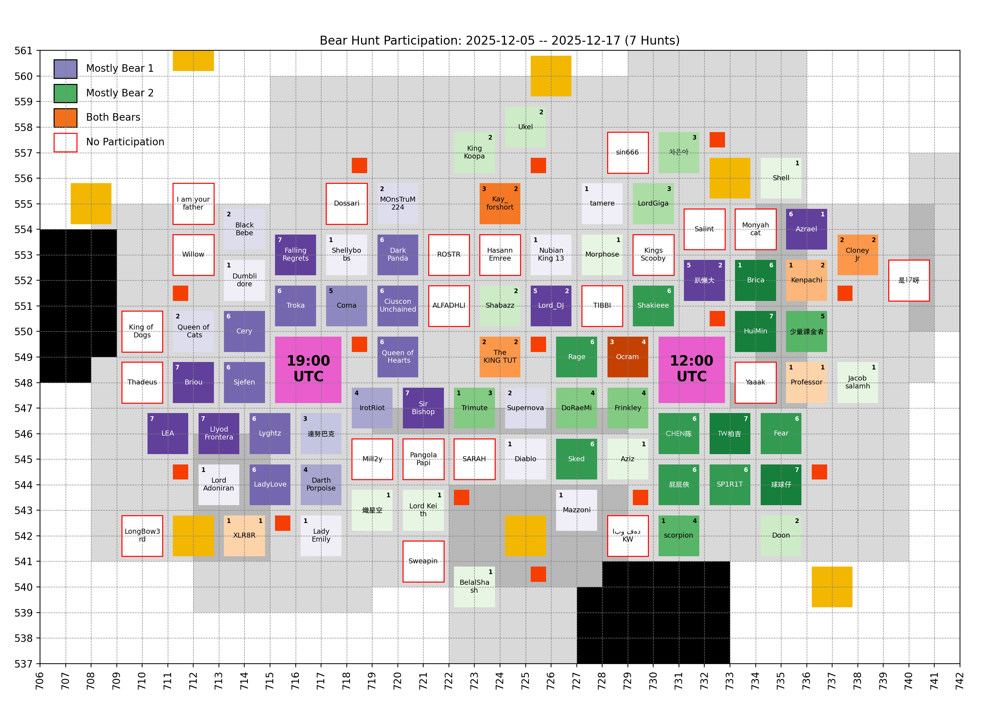
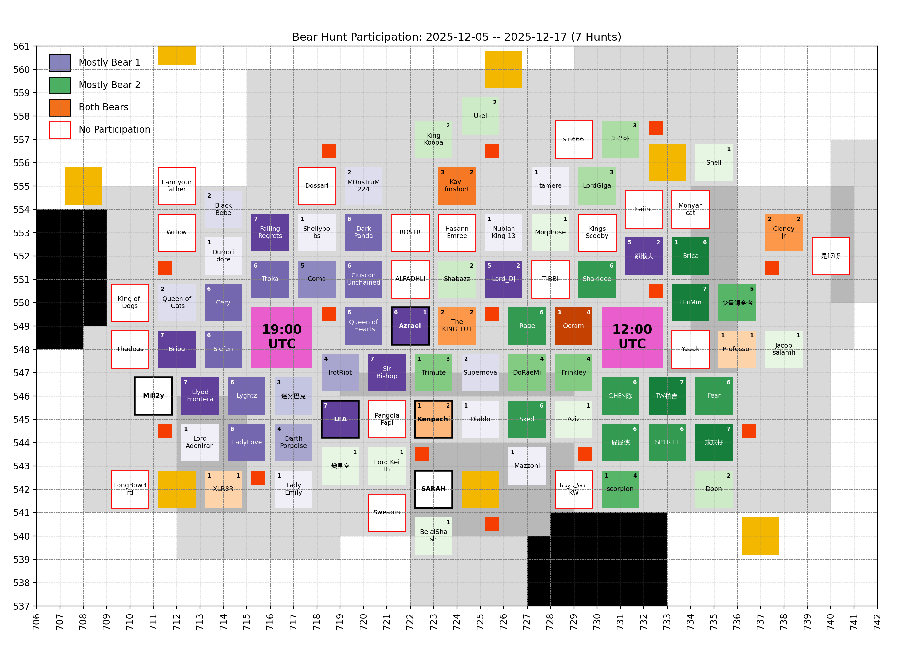

# 🐻 Bear Hunt

Keeping only the last 7 records, which is the number of bear hunts in between two Castle Battles.

## Participation

<!-- [[[cog
# Display the latest hive participation map
import re
from pathlib import Path
pattern = re.compile(r"(\d{4}-\d{2}-\d{2})_hive_participation\.png")
imgs_dir = Path("bear_hunt", "images")
map_fpath = sorted(
  [fpath for fpath in imgs_dir.iterdir() if pattern.match(fpath.name)]
)[-1]
print(f" / map_fpath.name})")
]]] -->

<!-- [[[end]]] -->

<!-- [[[cog
# Display the future hive participation map once cities start moving
import re
from pathlib import Path
import yaml

MOVING = yaml.safe_load(Path("hive", "locations_moving.yml").open("r"))
if MOVING["bear_1"] or MOVING["bear_2"]: # Else, no moving cities, skip
  pattern = re.compile(r"(\d{4}-\d{2}-\d{2})_hive_participation_moving\.png")
  imgs_dir = Path("bear_hunt", "images")
  map_fpath = sorted(
    [fpath for fpath in imgs_dir.iterdir() if pattern.match(fpath.name)]
  )[-1]

  print("\n## Future hive\n")
  print(f" / map_fpath.name})")
  print()
]]] -->

## Future hive

<!-- [[[end]]] -->

## Bear 1

<!-- [[[cog
# Display the latest bear damages bar graph
import re
from pathlib import Path
pattern = re.compile(r"(\d{4}-\d{2}-\d{2})_bear1_damages\.png")
imgs_dir = Path("bear_hunt", "images")
map_fpath = sorted(
  [fpath for fpath in imgs_dir.iterdir() if pattern.match(fpath.name)]
)[-1]
print(f" / map_fpath.name})")
]]] -->

<!-- [[[end]]] -->

Table

<!-- [[[cog
from analysis import summary, as_markdown_table
print()
print(
  as_markdown_table(
    summary(bear=1),
    columns=["Date", "# Players", "Total score"],
    justifys=["left", "right", "right"],
  )
)
]]] -->

| Date       | # Players | Total score |
| :--------- | --------: | ----------: |
| 2025-10-12 |        30 |       5.97B |
| 2025-10-14 |        27 |       4.86B |
| 2025-10-16 |        24 |       3.05B |
| 2025-10-18 |        20 |       2.75B |
| 2025-10-20 |        23 |       3.82B |
| 2025-10-22 |        28 |       6.03B |
| 2025-10-24 |        23 |       5.23B |
| 2025-10-26 |        27 |       4.62B |
| 2025-10-28 |        23 |       3.59B |
| 2025-10-30 |        25 |       6.28B |
| 2025-11-01 |        23 |       6.21B |
| 2025-11-03 |        29 |       5.64B |
| 2025-11-05 |        19 |       5.65B |
| 2025-11-07 |        25 |       9.76B |
| 2025-11-09 |        17 |       8.88B |
| 2025-11-11 |        16 |       9.25B |
| 2025-11-13 |        25 |      11.07B |
| 2025-11-15 |        21 |       6.76B |
| 2025-11-17 |        15 |       6.54B |
| 2025-11-19 |        23 |       7.79B |
| 2025-11-21 |        19 |       7.99B |
| 2025-11-23 |        21 |      10.99B |
| 2025-11-25 |        19 |      10.57B |
| 2025-11-27 |        21 |       8.44B |
| 2025-11-29 |        22 |      13.60B |
| 2025-12-01 |        19 |       8.85B |
| 2025-12-03 |        22 |      13.01B |
| 2025-12-05 |        23 |       8.24B |
| 2025-12-07 |        21 |       8.31B |
| 2025-12-09 |        25 |      17.45B |
| 2025-12-11 |        19 |       6.97B |
| 2025-12-13 |        23 |      16.67B |
| 2025-12-15 |        14 |       7.89B |
| 2025-12-17 |        22 |      15.84B |

<!-- [[[end]]] -->

Top Players over last 7 hunts

<!-- [[[cog
from analysis import players_records, as_markdown_table
print()
print(
  as_markdown_table(
    players_records(bear=1, n_lasts=7),
    columns=["#", "Player", "Score", "# Hunts"],
    justifys=["right", "left", "right", "right"],
  )
)
]]] -->

|   # | Player           |   Score | # Hunts |
| --: | :--------------- | ------: | ------: |
|   1 | Lyghtz           |   6.19B |       6 |
|   2 | Troka            |   5.62B |       6 |
|   3 | Llyod Frontera   |   5.58B |       7 |
|   4 | Sjefen           |   5.57B |       6 |
|   5 | Cery             |   4.99B |       6 |
|   6 | Briou            |   4.82B |       7 |
|   7 | Coma             |   4.65B |       5 |
|   8 | Ocram            |   4.41B |       3 |
|   9 | 達努巴克         |   4.24B |       3 |
|  10 | FallingRegrets   |   4.20B |       7 |
|  11 | LadyLove         |   3.99B |       6 |
|  12 | Azrael           |   3.12B |       6 |
|  13 | IrotRiot         |   2.93B |       4 |
|  14 | Darth Porpoise   |   2.42B |       4 |
|  15 | LEA              |   2.13B |       7 |
|  16 | DarkPanda        |   1.99B |       6 |
|  17 | CiusconUnchained |   1.98B |       6 |
|  18 | Queen of Hearts  |   1.96B |       6 |
|  19 | Lord_DJ          |   1.94B |       5 |
|  20 | Sir Bishop       |   1.32B |       7 |
|  21 | 趴懶大           |   1.07B |       5 |
|  22 | Queen of Cats    | 827.18M |       2 |
|  23 | Kay_forshort     | 637.59M |       3 |
|  24 | Professor        | 560.21M |       1 |
|  25 | Shellybobs       | 512.78M |       1 |
|  26 | Brica            | 417.05M |       1 |
|  27 | Diablo           | 355.20M |       1 |
|  28 | MOnsTruM224      | 342.63M |       2 |
|  29 | Cloney Jr        | 336.21M |       2 |
|  30 | Lord Adoniran    | 324.18M |       1 |
|  31 | Supernova        | 301.91M |       2 |
|  32 | XLR8R            | 288.90M |       1 |
|  33 | Kenpachi         | 284.01M |       1 |
|  34 | tamere           | 279.80M |       1 |
|  35 | Dumblidore       | 206.61M |       1 |
|  36 | The KING TUT     | 143.53M |       2 |
|  37 | scorpion         | 132.54M |       1 |
|  38 | Trimute          |  99.30M |       1 |
|  39 | Lady Emily       |  66.83M |       1 |
|  40 | BlackBebe        |  64.06M |       2 |
|  41 | Mazzoni          |  26.81M |       1 |
|  42 | Nubian King 13   |  25.27M |       1 |

<!-- [[[end]]] -->

## Bear 2

<!-- [[[cog
# Display the latest bear damages bar graph
import re
from pathlib import Path
pattern = re.compile(r"(\d{4}-\d{2}-\d{2})_bear2_damages\.png")
imgs_dir = Path("bear_hunt", "images")
graph_fpath = sorted(
  [fpath for fpath in imgs_dir.iterdir() if pattern.match(fpath.name)]
)[-1]
print(f" / graph_fpath.name})")
]]] -->

<!-- [[[end]]] -->

Table

<!-- [[[cog
from analysis import summary, as_markdown_table
print()
print(
  as_markdown_table(
    summary(bear=2),
    columns=["Date", "# Players", "Total score"],
    justifys=["left", "right", "right"],
  )
)
]]] -->

| Date       | # Players | Total score |
| :--------- | --------: | ----------: |
| 2025-10-12 |        22 |       5.53B |
| 2025-10-14 |        24 |       7.03B |
| 2025-10-17 |        25 |       5.54B |
| 2025-10-19 |        23 |       9.44B |
| 2025-10-21 |        28 |      10.03B |
| 2025-10-23 |        28 |       7.12B |
| 2025-10-26 |        18 |       7.66B |
| 2025-10-28 |        24 |       6.57B |
| 2025-10-30 |        24 |       7.36B |
| 2025-11-01 |        22 |       6.04B |
| 2025-11-03 |        23 |       6.58B |
| 2025-11-05 |        32 |       9.16B |
| 2025-11-07 |        21 |       6.61B |
| 2025-11-09 |        20 |      12.90B |
| 2025-11-11 |        25 |       8.72B |
| 2025-11-13 |        27 |      13.60B |
| 2025-11-15 |        28 |      15.08B |
| 2025-11-17 |        21 |      12.78B |
| 2025-11-19 |        24 |      13.25B |
| 2025-11-21 |        22 |       9.94B |
| 2025-11-23 |        20 |      16.66B |
| 2025-11-25 |        21 |       6.60B |
| 2025-11-27 |        23 |       9.68B |
| 2025-11-29 |        21 |      12.44B |
| 2025-12-01 |        23 |      15.88B |
| 2025-12-03 |        20 |       8.04B |
| 2025-12-05 |        21 |      16.37B |
| 2025-12-07 |        16 |      15.28B |
| 2025-12-09 |        24 |      16.47B |
| 2025-12-11 |        20 |      19.59B |
| 2025-12-13 |        19 |       4.30B |
| 2025-12-15 |        21 |      10.91B |
| 2025-12-17 |        18 |       7.20B |

<!-- [[[end]]] -->

Top Players over last 7 hunts

<!-- [[[cog
from analysis import players_records, as_markdown_table
print()
print(
  as_markdown_table(
    players_records(bear=2, n_lasts=7),
    columns=["#", "Player", "Score", "# Hunts"],
    justifys=["right", "left", "right", "right"],
  )
)
]]] -->

|   # | Player       |   Score | # Hunts |
| --: | :----------- | ------: | ------: |
|   1 | CHEN陈       |   8.11B |       6 |
|   2 | Frinkley     |   6.47B |       4 |
|   3 | AZIZ         |   6.08B |       6 |
|   4 | Ocram        |   5.95B |       4 |
|   5 | HuiMin       |   5.76B |       7 |
|   6 | Fear         |   5.61B |       6 |
|   7 | TW拍吉       |   5.50B |       7 |
|   8 | 球球仔       |   5.28B |       7 |
|   9 | Rage         |   4.70B |       6 |
|  10 | Brica        |   4.19B |       6 |
|  11 | SP1R1T       |   3.80B |       6 |
|  12 | 屁屁俠       |   3.69B |       6 |
|  13 | DoRaeMi      |   2.98B |       4 |
|  14 | 少量課金者   |   2.95B |       5 |
|  15 | Sked         |   2.76B |       6 |
|  16 | Shakieee     |   2.54B |       6 |
|  17 | Aziz         |   1.42B |       1 |
|  18 | Lord_DJ      |   1.41B |       2 |
|  19 | scorpion     |   1.31B |       4 |
|  20 | DoraeMi      |   1.10B |       1 |
|  21 | Kenpachi     | 900.32M |       2 |
|  22 | CHEN         | 861.03M |       1 |
|  23 | Cloney Jr    | 786.98M |       2 |
|  24 | 趴懶大       | 753.84M |       2 |
|  25 | Azrael       | 607.42M |       1 |
|  26 | LordGiga     | 579.99M |       3 |
|  27 | Pikachu      | 472.67M |       2 |
|  28 | Kay_forshort | 403.62M |       2 |
|  29 | Trimute      | 401.58M |       3 |
|  30 | Ukel         | 377.78M |       2 |
|  31 | Morphose     | 359.04M |       1 |
|  32 | Shabazz      | 351.52M |       2 |
|  33 | Professor    | 282.96M |       1 |
|  34 | Jacob salamh | 267.22M |       1 |
|  35 | King Koopa   | 223.74M |       2 |
|  36 | Lord Keith   | 200.80M |       1 |
|  37 | 차은아       | 187.32M |       3 |
|  38 | The KING TUT | 164.43M |       2 |
|  39 | XLR8R        | 115.52M |       1 |
|  40 | Doon         |  84.96M |       2 |
|  41 | Shell        |  78.88M |       1 |
|  42 | BelalShash   |  29.15M |       1 |
|  43 | 熾星空       |  14.12M |       1 |

<!-- [[[end]]] -->

