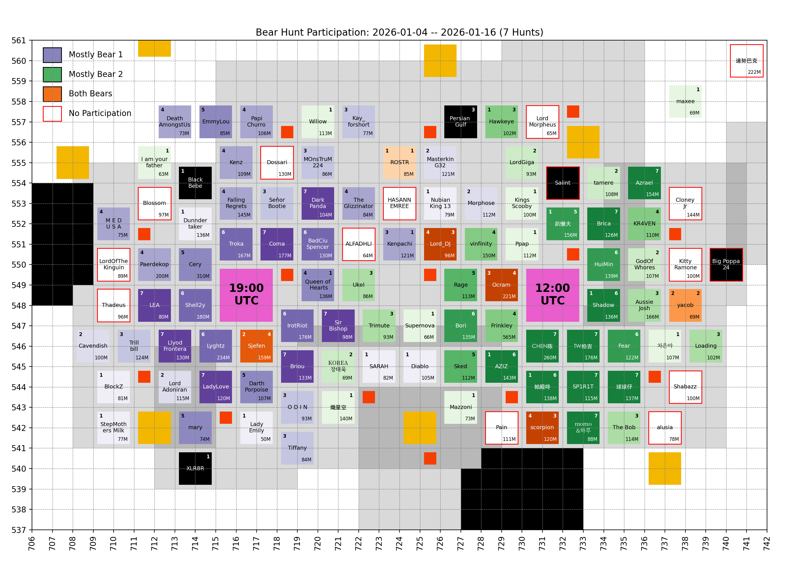
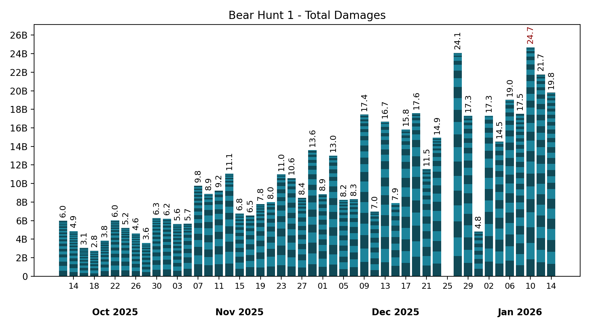
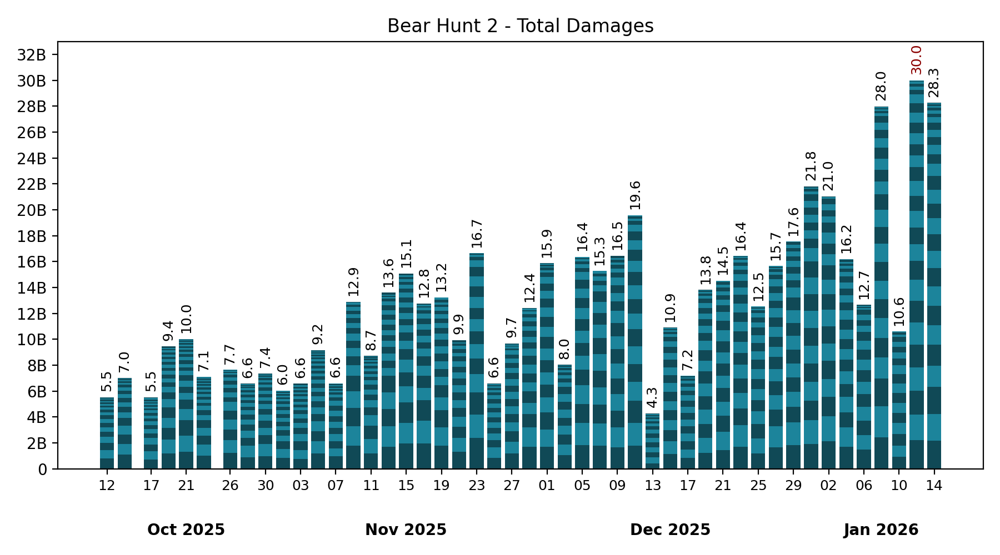

# 🐻 Bear Hunt

Keeping only the last 7 records, which is the number of bear hunts in between two Castle Battles.

## Participation

<!-- [[[cog
# Display the latest hive participation map
import re
from pathlib import Path
pattern = re.compile(r"(\d{4}-\d{2}-\d{2})_hive_participation\.png")
imgs_dir = Path("bear_hunt", "images")
map_fpath = sorted(
  [fpath for fpath in imgs_dir.iterdir() if pattern.match(fpath.name)]
)[-1]
print(f" / map_fpath.name})")
]]] -->

<!-- [[[end]]] -->

<!-- [[[cog
# Display the future hive participation map once cities start moving
import re
from pathlib import Path
import yaml

MOVING = yaml.safe_load(Path("hive", "locations_moving.yml").read_text())
if MOVING["bear_1"] or MOVING["bear_2"]: # Else, no moving cities, skip
  pattern = re.compile(r"(\d{4}-\d{2}-\d{2})_hive_participation_moving\.png")
  imgs_dir = Path("bear_hunt", "images")
  map_fpath = sorted(
    [fpath for fpath in imgs_dir.iterdir() if pattern.match(fpath.name)]
  )[-1]

  print("\n## Future hive\n")
  print(f" / map_fpath.name})")
  print()
]]] -->

<!-- [[[end]]] -->

## Bear 1

<!-- [[[cog
# Display the latest bear damages bar graph
import re
from pathlib import Path
pattern = re.compile(r"(\d{4}-\d{2}-\d{2})_bear1_damages\.png")
imgs_dir = Path("bear_hunt", "images")
map_fpath = sorted(
  [fpath for fpath in imgs_dir.iterdir() if pattern.match(fpath.name)]
)[-1]
print(f" / map_fpath.name})")
]]] -->

<!-- [[[end]]] -->

Table

<!-- [[[cog
from analysis import summary, as_markdown_table
print()
print(
  as_markdown_table(
    summary(bear=1),
    columns=["Date", "# Players", "Total score"],
    justifys=["left", "right", "right"],
  )
)
]]] -->

| Date       | # Players | Total score |
| :--------- | --------: | ----------: |
| 2025-10-12 |        30 |       5.97B |
| 2025-10-14 |        27 |       4.86B |
| 2025-10-16 |        24 |       3.05B |
| 2025-10-18 |        20 |       2.75B |
| 2025-10-20 |        23 |       3.82B |
| 2025-10-22 |        28 |       6.03B |
| 2025-10-24 |        23 |       5.23B |
| 2025-10-26 |        27 |       4.62B |
| 2025-10-28 |        23 |       3.59B |
| 2025-10-30 |        25 |       6.28B |
| 2025-11-01 |        23 |       6.21B |
| 2025-11-03 |        29 |       5.64B |
| 2025-11-05 |        19 |       5.65B |
| 2025-11-07 |        25 |       9.76B |
| 2025-11-09 |        17 |       8.88B |
| 2025-11-11 |        16 |       9.25B |
| 2025-11-13 |        25 |      11.07B |
| 2025-11-15 |        21 |       6.76B |
| 2025-11-17 |        15 |       6.54B |
| 2025-11-19 |        23 |       7.79B |
| 2025-11-21 |        19 |       7.99B |
| 2025-11-23 |        21 |      10.99B |
| 2025-11-25 |        19 |      10.57B |
| 2025-11-27 |        21 |       8.44B |
| 2025-11-29 |        22 |      13.60B |
| 2025-12-01 |        19 |       8.85B |
| 2025-12-03 |        22 |      13.01B |
| 2025-12-05 |        23 |       8.24B |
| 2025-12-07 |        21 |       8.31B |
| 2025-12-09 |        25 |      17.45B |
| 2025-12-11 |        19 |       6.97B |
| 2025-12-13 |        23 |      16.67B |
| 2025-12-15 |        14 |       7.89B |
| 2025-12-17 |        22 |      15.84B |
| 2025-12-19 |        22 |      17.60B |
| 2025-12-21 |        25 |      11.54B |
| 2025-12-23 |        26 |      14.94B |
| 2025-12-25 |         1 |           0 |
| 2025-12-27 |        24 |      24.08B |
| 2025-12-29 |        27 |      17.31B |
| 2025-12-31 |        15 |       4.81B |
| 2026-01-02 |        20 |      17.32B |
| 2026-01-04 |        19 |      14.51B |
| 2026-01-06 |        25 |      19.03B |
| 2026-01-08 |        32 |      17.52B |
| 2026-01-10 |        29 |      24.69B |
| 2026-01-12 |        29 |      21.75B |
| 2026-01-14 |        34 |      19.80B |

<!-- [[[end]]] -->

Top Players over last 7 hunts

<!-- [[[cog
from analysis import players_records, as_markdown_table
print()
print(
  as_markdown_table(
    players_records(bear=1, n_lasts=7),
    columns=["#", "Player", "Score", "# Hunts"],
    justifys=["right", "left", "right", "right"],
  )
)
]]] -->

|   # | Player           |   Score | # Hunts |
| --: | :--------------- | ------: | ------: |
|   1 | Coma             |   9.06B |       7 |
|   2 | Lyghtz           |   8.01B |       6 |
|   3 | Troka            |   7.53B |       6 |
|   4 | LadyLove         |   7.38B |       7 |
|   5 | Llyod Frontera   |   6.93B |       7 |
|   6 | Briou            |   6.68B |       7 |
|   7 | Cery             |   5.46B |       5 |
|   8 | Shell2y          |   5.00B |       6 |
|   9 | FallingRegrets   |   4.97B |       5 |
|  10 | DarkPanda        |   4.77B |       7 |
|  11 | Paerdekop        |   4.45B |       3 |
|  12 | LEA              |   4.38B |       7 |
|  13 | BadCiuSpencer    |   4.23B |       6 |
|  14 | IrotRiot         |   4.01B |       6 |
|  15 | Darth Porpoise   |   3.71B |       6 |
|  16 | Ocram            |   3.44B |       2 |
|  17 | Sir Bishop       |   3.00B |       7 |
|  18 | Queen of Hearts  |   2.95B |       4 |
|  19 | Kenz             |   2.86B |       3 |
|  20 | EmmyLou          |   2.68B |       4 |
|  21 | M E D U S A      |   2.65B |       4 |
|  22 | Sjefen           |   2.39B |       2 |
|  23 | Lord_DJ          |   2.33B |       5 |
|  24 | Kenpachi         |   2.24B |       3 |
|  25 | Señor Bootie     |   2.20B |       3 |
|  26 | mary             |   1.87B |       5 |
|  27 | TheGlizzinator   |   1.48B |       3 |
|  28 | Kay_forshort     |   1.44B |       3 |
|  29 | Shadow           |   1.42B |       2 |
|  30 | Trillbill        |   1.42B |       3 |
|  31 | scorpion         |   1.35B |       4 |
|  32 | PapiChurro       |   1.23B |       3 |
|  33 | AZIZ             |   1.10B |       1 |
|  34 | DeathAmongstUs   | 922.63M |       3 |
|  35 | MasterkinG32     | 794.07M |       2 |
|  36 | O D I N          | 756.91M |       2 |
|  37 | MOnsTruM224      | 754.32M |       2 |
|  38 | 帕殿咚           | 744.35M |       1 |
|  39 | Tiffany          | 623.85M |       2 |
|  40 | JoeyBootzz       | 576.84M |       1 |
|  41 | Morphose         | 564.59M |       2 |
|  42 | 趴懶大           | 538.82M |       1 |
|  43 | Cavendish        | 514.91M |       2 |
|  44 | BlockZ           | 477.75M |       1 |
|  45 | yacob            | 414.01M |       3 |
|  46 | Hawkeye          | 350.31M |       1 |
|  47 | Lord Adoniran    | 337.91M |       2 |
|  48 | Dunndertaker     | 301.96M |       1 |
|  49 | Supernova        | 273.93M |       1 |
|  50 | MOnSTruM224      | 273.41M |       1 |
|  51 | Lady Emily       | 261.85M |       2 |
|  52 | StepMothers Milk | 222.71M |       1 |
|  53 | ROSTR            | 153.07M |       1 |
|  54 | Diablo           |  48.86M |       1 |
|  55 | BelalShash       |  47.41M |       1 |
|  56 | BlackBebe        |  20.25M |       1 |
|  57 | Nubian King 13   |   3.73M |       1 |

<!-- [[[end]]] -->

## Bear 2

<!-- [[[cog
# Display the latest bear damages bar graph
import re
from pathlib import Path
pattern = re.compile(r"(\d{4}-\d{2}-\d{2})_bear2_damages\.png")
imgs_dir = Path("bear_hunt", "images")
graph_fpath = sorted(
  [fpath for fpath in imgs_dir.iterdir() if pattern.match(fpath.name)]
)[-1]
print(f" / graph_fpath.name})")
]]] -->

<!-- [[[end]]] -->

Table

<!-- [[[cog
from analysis import summary, as_markdown_table
print()
print(
  as_markdown_table(
    summary(bear=2),
    columns=["Date", "# Players", "Total score"],
    justifys=["left", "right", "right"],
  )
)
]]] -->

| Date       | # Players | Total score |
| :--------- | --------: | ----------: |
| 2025-10-12 |        22 |       5.53B |
| 2025-10-14 |        24 |       7.03B |
| 2025-10-17 |        25 |       5.54B |
| 2025-10-19 |        23 |       9.44B |
| 2025-10-21 |        28 |      10.03B |
| 2025-10-23 |        28 |       7.12B |
| 2025-10-26 |        18 |       7.66B |
| 2025-10-28 |        24 |       6.57B |
| 2025-10-30 |        24 |       7.36B |
| 2025-11-01 |        22 |       6.04B |
| 2025-11-03 |        23 |       6.58B |
| 2025-11-05 |        32 |       9.16B |
| 2025-11-07 |        21 |       6.61B |
| 2025-11-09 |        20 |      12.90B |
| 2025-11-11 |        25 |       8.72B |
| 2025-11-13 |        27 |      13.60B |
| 2025-11-15 |        28 |      15.08B |
| 2025-11-17 |        21 |      12.78B |
| 2025-11-19 |        24 |      13.25B |
| 2025-11-21 |        22 |       9.94B |
| 2025-11-23 |        20 |      16.66B |
| 2025-11-25 |        21 |       6.60B |
| 2025-11-27 |        23 |       9.68B |
| 2025-11-29 |        21 |      12.44B |
| 2025-12-01 |        23 |      15.88B |
| 2025-12-03 |        20 |       8.04B |
| 2025-12-05 |        21 |      16.37B |
| 2025-12-07 |        16 |      15.28B |
| 2025-12-09 |        24 |      16.47B |
| 2025-12-11 |        20 |      19.59B |
| 2025-12-13 |        19 |       4.30B |
| 2025-12-15 |        21 |      10.91B |
| 2025-12-17 |        18 |       7.20B |
| 2025-12-19 |        23 |      13.82B |
| 2025-12-21 |        20 |      14.52B |
| 2025-12-23 |        25 |      16.45B |
| 2025-12-25 |        22 |      12.54B |
| 2025-12-27 |        22 |      15.66B |
| 2025-12-29 |        22 |      17.56B |
| 2025-12-31 |        23 |      21.80B |
| 2026-01-02 |        21 |      21.05B |
| 2026-01-04 |        26 |      16.19B |
| 2026-01-06 |        19 |      12.66B |
| 2026-01-08 |        27 |      27.98B |
| 2026-01-10 |        18 |      10.61B |
| 2026-01-12 |        28 |      30.00B |
| 2026-01-14 |        29 |      28.27B |

<!-- [[[end]]] -->

Top Players over last 7 hunts

<!-- [[[cog
from analysis import players_records, as_markdown_table
print()
print(
  as_markdown_table(
    players_records(bear=2, n_lasts=7),
    columns=["#", "Player", "Score", "# Hunts"],
    justifys=["right", "left", "right", "right"],
  )
)
]]] -->

|   # | Player           |   Score | # Hunts |
| --: | :--------------- | ------: | ------: |
|   1 | CHEN陈           |  12.22B |       7 |
|   2 | Ocram            |  10.25B |       5 |
|   3 | Frinkley         |   7.83B |       4 |
|   4 | AZIZ             |   7.59B |       6 |
|   5 | HuiMin           |   7.42B |       7 |
|   6 | Azrael           |   7.12B |       6 |
|   7 | Bori             |   6.98B |       6 |
|   8 | SP1R1T           |   6.83B |       7 |
|   9 | 球球仔           |   6.18B |       7 |
|  10 | Brica            |   6.14B |       7 |
|  11 | KR4VEN           |   5.60B |       4 |
|  12 | 帕殿咚           |   5.47B |       6 |
|  13 | Shadow           |   5.46B |       5 |
|  14 | Fear             |   5.36B |       5 |
|  15 | Sjefen           |   4.56B |       4 |
|  16 | TW拍吉           |   4.33B |       6 |
|  17 | Rage             |   4.03B |       4 |
|  18 | AussieJosh       |   3.12B |       2 |
|  19 | Sked             |   2.41B |       4 |
|  20 | momo&하루        |   2.39B |       7 |
|  21 | Persian Gulf     |   2.38B |       4 |
|  22 | Hawkeye          |   2.14B |       3 |
|  23 | scorpion         |   2.09B |       3 |
|  24 | vinfinity        |   1.90B |       3 |
|  25 | GodOfWhores      |   1.72B |       2 |
|  26 | Loading          |   1.52B |       2 |
|  27 | The Bob          |   1.46B |       2 |
|  28 | Kai              |   1.46B |       1 |
|  29 | Queen of Hearts  |   1.39B |       1 |
|  30 | Lord_DJ          |   1.25B |       2 |
|  31 | Kenpachi         |   1.11B |       1 |
|  32 | 趴懶大           | 869.75M |       4 |
|  33 | Kay_forshort     | 834.99M |       1 |
|  34 | MasterkinG32     | 831.17M |       1 |
|  35 | Trimute          | 720.55M |       3 |
|  36 | tamere           | 684.72M |       2 |
|  37 | 차은아           | 616.55M |       2 |
|  38 | Ppap             | 498.42M |       1 |
|  39 | KOREA장태욱      | 281.76M |       3 |
|  40 | Ukel             | 246.14M |       2 |
|  41 | yacob            | 245.41M |       2 |
|  42 | LordGiga         | 201.98M |       2 |
|  43 | XLR8R            | 196.05M |       1 |
|  44 | 熾星空           | 164.59M |       1 |
|  45 | HASANNEMREE      | 116.77M |       1 |
|  46 | Willow           | 115.86M |       1 |
|  47 | Kings Scooby     | 100.88M |       1 |
|  48 | The KING TUT     |  97.11M |       1 |
|  49 | Lord Keith       |  58.87M |       1 |
|  50 | ROSTR            |  54.22M |       1 |
|  51 | Mazzoni          |  51.90M |       1 |
|  52 | Supernova        |  45.67M |       1 |
|  53 | maxee            |   4.35M |       1 |
|  54 | I am your father |   3.69M |       1 |

<!-- [[[end]]] -->

