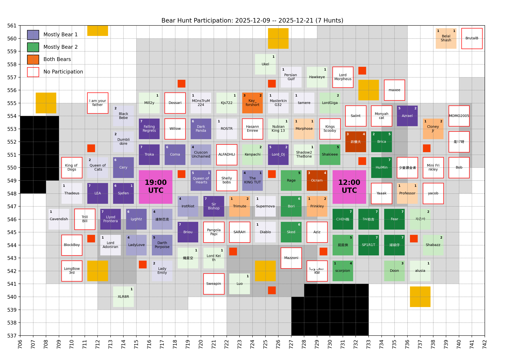

# 🐻 Bear Hunt

Keeping only the last 7 records, which is the number of bear hunts in between two Castle Battles.

## Participation

<!-- [[[cog
# Display the latest hive participation map
import re
from pathlib import Path
pattern = re.compile(r"(\d{4}-\d{2}-\d{2})_hive_participation\.png")
imgs_dir = Path("bear_hunt", "images")
map_fpath = sorted(
  [fpath for fpath in imgs_dir.iterdir() if pattern.match(fpath.name)]
)[-1]
print(f" / map_fpath.name})")
]]] -->

<!-- [[[end]]] -->

<!-- [[[cog
# Display the future hive participation map once cities start moving
import re
from pathlib import Path
import yaml

MOVING = yaml.safe_load(Path("hive", "locations_moving.yml").open("r"))
if MOVING["bear_1"] or MOVING["bear_2"]: # Else, no moving cities, skip
  pattern = re.compile(r"(\d{4}-\d{2}-\d{2})_hive_participation_moving\.png")
  imgs_dir = Path("bear_hunt", "images")
  map_fpath = sorted(
    [fpath for fpath in imgs_dir.iterdir() if pattern.match(fpath.name)]
  )[-1]

  print("\n## Future hive\n")
  print(f" / map_fpath.name})")
  print()
]]] -->

<!-- [[[end]]] -->

## Bear 1

<!-- [[[cog
# Display the latest bear damages bar graph
import re
from pathlib import Path
pattern = re.compile(r"(\d{4}-\d{2}-\d{2})_bear1_damages\.png")
imgs_dir = Path("bear_hunt", "images")
map_fpath = sorted(
  [fpath for fpath in imgs_dir.iterdir() if pattern.match(fpath.name)]
)[-1]
print(f" / map_fpath.name})")
]]] -->

<!-- [[[end]]] -->

Table

<!-- [[[cog
from analysis import summary, as_markdown_table
print()
print(
  as_markdown_table(
    summary(bear=1),
    columns=["Date", "# Players", "Total score"],
    justifys=["left", "right", "right"],
  )
)
]]] -->

| Date       | # Players | Total score |
| :--------- | --------: | ----------: |
| 2025-10-12 |        30 |       5.97B |
| 2025-10-14 |        27 |       4.86B |
| 2025-10-16 |        24 |       3.05B |
| 2025-10-18 |        20 |       2.75B |
| 2025-10-20 |        23 |       3.82B |
| 2025-10-22 |        28 |       6.03B |
| 2025-10-24 |        23 |       5.23B |
| 2025-10-26 |        27 |       4.62B |
| 2025-10-28 |        23 |       3.59B |
| 2025-10-30 |        25 |       6.28B |
| 2025-11-01 |        23 |       6.21B |
| 2025-11-03 |        29 |       5.64B |
| 2025-11-05 |        19 |       5.65B |
| 2025-11-07 |        25 |       9.76B |
| 2025-11-09 |        17 |       8.88B |
| 2025-11-11 |        16 |       9.25B |
| 2025-11-13 |        25 |      11.07B |
| 2025-11-15 |        21 |       6.76B |
| 2025-11-17 |        15 |       6.54B |
| 2025-11-19 |        23 |       7.79B |
| 2025-11-21 |        19 |       7.99B |
| 2025-11-23 |        21 |      10.99B |
| 2025-11-25 |        19 |      10.57B |
| 2025-11-27 |        21 |       8.44B |
| 2025-11-29 |        22 |      13.60B |
| 2025-12-01 |        19 |       8.85B |
| 2025-12-03 |        22 |      13.01B |
| 2025-12-05 |        23 |       8.24B |
| 2025-12-07 |        21 |       8.31B |
| 2025-12-09 |        25 |      17.45B |
| 2025-12-11 |        19 |       6.97B |
| 2025-12-13 |        23 |      16.67B |
| 2025-12-15 |        14 |       7.89B |
| 2025-12-17 |        22 |      15.84B |
| 2025-12-19 |        22 |      17.60B |
| 2025-12-21 |        25 |      11.54B |

<!-- [[[end]]] -->

Top Players over last 7 hunts

<!-- [[[cog
from analysis import players_records, as_markdown_table
print()
print(
  as_markdown_table(
    players_records(bear=1, n_lasts=7),
    columns=["#", "Player", "Score", "# Hunts"],
    justifys=["right", "left", "right", "right"],
  )
)
]]] -->

|   # | Player           |   Score | # Hunts |
| --: | :--------------- | ------: | ------: |
|   1 | Troka            |   7.07B |       7 |
|   2 | Llyod Frontera   |   6.42B |       7 |
|   3 | Cery             |   6.33B |       6 |
|   4 | Coma             |   6.26B |       6 |
|   5 | 達努巴克         |   5.91B |       4 |
|   6 | Sjefen           |   5.88B |       6 |
|   7 | Lyghtz           |   5.83B |       6 |
|   8 | Briou            |   5.58B |       7 |
|   9 | FallingRegrets   |   4.79B |       7 |
|  10 | Ocram            |   4.41B |       3 |
|  11 | Darth Porpoise   |   3.38B |       5 |
|  12 | Azrael           |   3.25B |       5 |
|  13 | IrotRiot         |   3.24B |       4 |
|  14 | LadyLove         |   2.72B |       4 |
|  15 | LEA              |   2.63B |       7 |
|  16 | Queen of Hearts  |   2.42B |       5 |
|  17 | Frinkley         |   2.09B |       1 |
|  18 | Lord_DJ          |   1.91B |       5 |
|  19 | DarkPanda        |   1.83B |       6 |
|  20 | CiusconUnchained |   1.70B |       4 |
|  21 | Sir Bishop       |   1.48B |       7 |
|  22 | Queen of Cats    |   1.17B |       2 |
|  23 | 趴懶大           | 873.55M |       3 |
|  24 | Kay_forshort     | 807.91M |       3 |
|  25 | Brica            | 681.39M |       2 |
|  26 | Professor        | 560.21M |       1 |
|  27 | ROSTR            | 444.13M |       1 |
|  28 | Trillbill        | 422.35M |       1 |
|  29 | The KING TUT     | 392.66M |       4 |
|  30 | scorpion         | 391.00M |       1 |
|  31 | MasterkinG32     | 369.72M |       1 |
|  32 | Diablo           | 355.20M |       1 |
|  33 | Lord Adoniran    | 324.18M |       1 |
|  34 | Cloney Jr        | 322.14M |       1 |
|  35 | Supernova        | 297.04M |       1 |
|  36 | tamere           | 279.80M |       1 |
|  37 | Dumblidore       | 226.95M |       2 |
|  38 | BelalShash       | 158.42M |       1 |
|  39 | Cavendish        | 125.44M |       1 |
|  40 | MOnsTruM224      | 119.50M |       1 |
|  41 | Trimute          |  99.30M |       1 |
|  42 | Lady Emily       |  86.59M |       2 |
|  43 | BoneToDaBlock    |  76.64M |       1 |
|  44 | Persian Gulf     |  73.77M |       1 |
|  45 | BlackBebe        |  64.06M |       2 |
|  46 | Morphose         |  43.90M |       1 |
|  47 | Thadeus          |  38.04M |       1 |

<!-- [[[end]]] -->

## Bear 2

<!-- [[[cog
# Display the latest bear damages bar graph
import re
from pathlib import Path
pattern = re.compile(r"(\d{4}-\d{2}-\d{2})_bear2_damages\.png")
imgs_dir = Path("bear_hunt", "images")
graph_fpath = sorted(
  [fpath for fpath in imgs_dir.iterdir() if pattern.match(fpath.name)]
)[-1]
print(f" / graph_fpath.name})")
]]] -->

<!-- [[[end]]] -->

Table

<!-- [[[cog
from analysis import summary, as_markdown_table
print()
print(
  as_markdown_table(
    summary(bear=2),
    columns=["Date", "# Players", "Total score"],
    justifys=["left", "right", "right"],
  )
)
]]] -->

| Date       | # Players | Total score |
| :--------- | --------: | ----------: |
| 2025-10-12 |        22 |       5.53B |
| 2025-10-14 |        24 |       7.03B |
| 2025-10-17 |        25 |       5.54B |
| 2025-10-19 |        23 |       9.44B |
| 2025-10-21 |        28 |      10.03B |
| 2025-10-23 |        28 |       7.12B |
| 2025-10-26 |        18 |       7.66B |
| 2025-10-28 |        24 |       6.57B |
| 2025-10-30 |        24 |       7.36B |
| 2025-11-01 |        22 |       6.04B |
| 2025-11-03 |        23 |       6.58B |
| 2025-11-05 |        32 |       9.16B |
| 2025-11-07 |        21 |       6.61B |
| 2025-11-09 |        20 |      12.90B |
| 2025-11-11 |        25 |       8.72B |
| 2025-11-13 |        27 |      13.60B |
| 2025-11-15 |        28 |      15.08B |
| 2025-11-17 |        21 |      12.78B |
| 2025-11-19 |        24 |      13.25B |
| 2025-11-21 |        22 |       9.94B |
| 2025-11-23 |        20 |      16.66B |
| 2025-11-25 |        21 |       6.60B |
| 2025-11-27 |        23 |       9.68B |
| 2025-11-29 |        21 |      12.44B |
| 2025-12-01 |        23 |      15.88B |
| 2025-12-03 |        20 |       8.04B |
| 2025-12-05 |        21 |      16.37B |
| 2025-12-07 |        16 |      15.28B |
| 2025-12-09 |        24 |      16.47B |
| 2025-12-11 |        20 |      19.59B |
| 2025-12-13 |        19 |       4.30B |
| 2025-12-15 |        21 |      10.91B |
| 2025-12-17 |        18 |       7.20B |
| 2025-12-19 |        23 |      13.82B |
| 2025-12-21 |        20 |      14.52B |

<!-- [[[end]]] -->

Top Players over last 7 hunts

<!-- [[[cog
from analysis import players_records, as_markdown_table
print()
print(
  as_markdown_table(
    players_records(bear=2, n_lasts=7),
    columns=["#", "Player", "Score", "# Hunts"],
    justifys=["right", "left", "right", "right"],
  )
)
]]] -->

|   # | Player          |   Score | # Hunts |
| --: | :-------------- | ------: | ------: |
|   1 | CHEN陈          |   8.17B |       7 |
|   2 | AZIZ            |   6.94B |       7 |
|   3 | Fear            |   6.48B |       7 |
|   4 | HuiMin          |   5.51B |       7 |
|   5 | Ocram           |   5.30B |       4 |
|   6 | 球球仔          |   4.86B |       7 |
|   7 | Bori            |   4.28B |       6 |
|   8 | TW拍吉          |   4.28B |       7 |
|   9 | Rage            |   3.83B |       5 |
|  10 | SP1R1T          |   3.63B |       7 |
|  11 | Frinkley        |   3.34B |       2 |
|  12 | Brica           |   2.74B |       5 |
|  13 | Sked            |   2.69B |       6 |
|  14 | 屁屁俠          |   2.54B |       5 |
|  15 | Ken Wai         |   2.54B |       5 |
|  16 | Shakieee        |   2.12B |       5 |
|  17 | Azrael          |   1.52B |       2 |
|  18 | scorpion        |   1.40B |       4 |
|  19 | 趴懶大          |   1.35B |       4 |
|  20 | Shadow2TheBone  |   1.10B |       1 |
|  21 | Sjefen          |   1.09B |       1 |
|  22 | Lord_DJ         |   1.02B |       2 |
|  23 | Bad2TheBone     | 992.94M |       1 |
|  24 | Kenpachi        | 900.32M |       2 |
|  25 | 帕殿咚          | 880.54M |       1 |
|  26 | Queen of Hearts | 816.53M |       1 |
|  27 | Cloney Jr       | 786.98M |       2 |
|  28 | Mill2y          | 687.68M |       1 |
|  29 | Professor       | 610.99M |       1 |
|  30 | Pikachu         | 472.67M |       2 |
|  31 | Kay_forshort    | 403.62M |       2 |
|  32 | Hawkeye         | 395.18M |       1 |
|  33 | alusia          | 381.60M |       1 |
|  34 | Morphose        | 359.04M |       1 |
|  35 | Shabazz         | 351.52M |       2 |
|  36 | Jacob salamh    | 267.22M |       1 |
|  37 | LordGiga        | 205.50M |       2 |
|  38 | Doon            | 205.06M |       3 |
|  39 | Lord Keith      | 200.80M |       1 |
|  40 | King Koopa      | 190.13M |       1 |
|  41 | Nubian King 13  | 164.49M |       1 |
|  42 | Ukel            | 153.51M |       1 |
|  43 | 차은아          | 124.79M |       2 |
|  44 | XLR8R           | 115.52M |       1 |
|  45 | Trimute         | 114.47M |       2 |
|  46 | Kjs722          |  94.99M |       1 |
|  47 | Shell           |  78.88M |       1 |
|  48 | The KING TUT    |  56.30M |       1 |
|  49 | BelalShash      |  29.15M |       1 |
|  50 | 熾星空          |  14.12M |       1 |
|  51 | Luo             |   4.83M |       1 |

<!-- [[[end]]] -->

