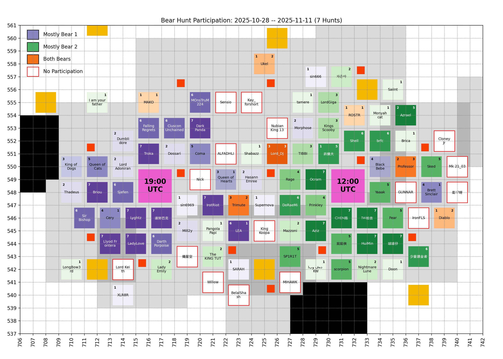
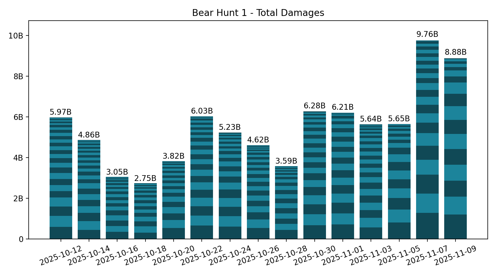
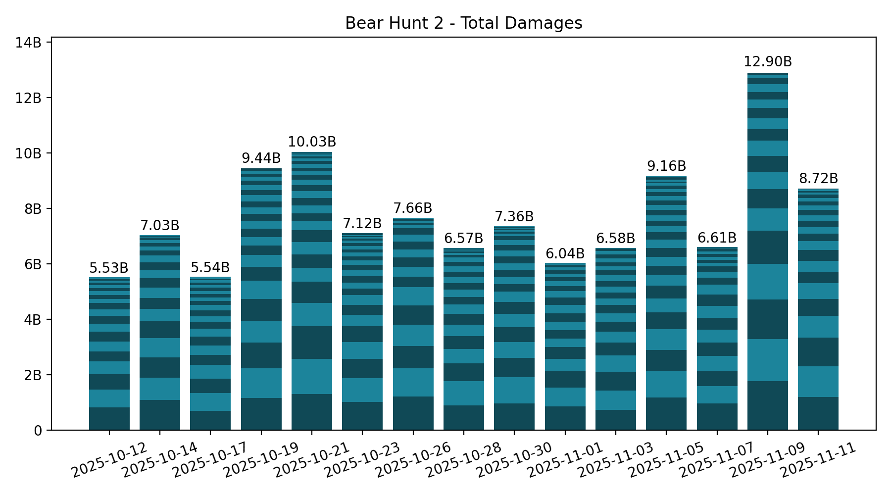

# 🐻 Bear Hunt

Keeping only the last 7 records, which is the number of bear hunts in between two Castle Battles.

## Participation

<!-- [[[cog
# Display the latest bear damages bar graph
import re
from pathlib import Path
pattern = re.compile(r"(\d{4}-\d{2}-\d{2})_hive_participation\.png")
imgs_dir = Path("bear_hunt", "images")
graph_fpath = sorted(
  [fpath for fpath in imgs_dir.iterdir() if pattern.match(fpath.name)]
)[-1]
print(f" / graph_fpath.name})")
]]] -->

<!-- [[[end]]] -->

## Bear 1

<!-- [[[cog
# Display the latest bear damages bar graph
import re
from pathlib import Path
pattern = re.compile(r"(\d{4}-\d{2}-\d{2})_bear1_damages\.png")
imgs_dir = Path("bear_hunt", "images")
map_fpath = sorted(
  [fpath for fpath in imgs_dir.iterdir() if pattern.match(fpath.name)]
)[-1]
print(f" / map_fpath.name})")
]]] -->

<!-- [[[end]]] -->

Table

<!-- [[[cog
from analysis import summary, as_markdown_table
print()
print(
  as_markdown_table(
    summary(bear=1),
    columns=["Date", "# Players", "Total score"],
    justifys=["left", "right", "right"],
  )
)
]]] -->

| Date       | # Players | Total score |
| :--------- | --------: | ----------: |
| 2025-10-12 |        30 |       5.97B |
| 2025-10-14 |        27 |       4.86B |
| 2025-10-16 |        24 |       3.05B |
| 2025-10-18 |        20 |       2.75B |
| 2025-10-20 |        23 |       3.82B |
| 2025-10-22 |        28 |       6.03B |
| 2025-10-24 |        23 |       5.23B |
| 2025-10-26 |        27 |       4.62B |
| 2025-10-28 |        23 |       3.59B |
| 2025-10-30 |        25 |       6.28B |
| 2025-11-01 |        23 |       6.21B |
| 2025-11-03 |        29 |       5.64B |
| 2025-11-05 |        19 |       5.65B |
| 2025-11-07 |        25 |       9.76B |
| 2025-11-09 |        17 |       8.88B |

<!-- [[[end]]] -->

Top Players over last 7 hunts

<!-- [[[cog
from analysis import players_records, as_markdown_table
print()
print(
  as_markdown_table(
    players_records(bear=1, n_lasts=7),
    columns=["#", "Player", "Score", "# Hunts"],
    justifys=["right", "left", "right", "right"],
  )
)
]]] -->

|   # | Player           |   Score | # Hunts |
| --: | :--------------- | ------: | ------: |
|   1 | 達努巴克         |   5.11B |       7 |
|   2 | Lyghtz           |   4.49B |       7 |
|   3 | Troka            |   3.16B |       7 |
|   4 | Llyod Frontera   |   2.94B |       7 |
|   5 | Cery             |   2.93B |       4 |
|   6 | IrotRiot         |   2.75B |       7 |
|   7 | LadyLove         |   2.58B |       7 |
|   8 | Briou            |   2.26B |       7 |
|   9 | FallingRegrets   |   2.07B |       6 |
|  10 | Coma             |   2.07B |       5 |
|  11 | Sjefen           |   1.93B |       6 |
|  12 | Darth Porpoise   |   1.54B |       6 |
|  13 | BlackBebe        |   1.15B |       4 |
|  14 | Mill2y           |   1.08B |       2 |
|  15 | CiusconUnchained |   1.08B |       6 |
|  16 | DarkPanda        | 905.49M |       7 |
|  17 | Queen of Cats    | 852.06M |       5 |
|  18 | Sir Bishop       | 604.80M |       6 |
|  19 | Lord_DJ          | 587.78M |       3 |
|  20 | Brett Sinclair   | 526.84M |       4 |
|  21 | MOnsTruM224      | 506.25M |       6 |
|  22 | Queen of Hearts  | 488.04M |       3 |
|  23 | Professor        | 456.47M |       2 |
|  24 | LEA              | 451.07M |       6 |
|  25 | Lord Adoniran    | 440.15M |       2 |
|  26 | Thadeus          | 434.55M |       2 |
|  27 | Azrael           | 411.80M |       2 |
|  28 | HasannEmree      | 352.14M |       2 |
|  29 | Trimute          | 344.32M |       3 |
|  30 | Dossari          | 296.95M |       2 |
|  31 | King of Dogs     | 223.89M |       3 |
|  32 | Dumblidore       | 206.77M |       2 |
|  33 | Supernova        | 158.14M |       1 |
|  34 | SARAH            | 130.93M |       1 |
|  35 | Morphose         | 128.51M |       2 |
|  36 | Diablo           | 118.18M |       1 |
|  37 | XLR8R            |  69.74M |       1 |
|  38 | sin6969          |  55.62M |       1 |
|  39 | ROSTR            |  41.95M |       1 |
|  40 | Teddix           |  27.49M |       1 |
|  41 | 趴懶大           |  26.74M |       1 |
|  42 | Ukel             |  15.41M |       1 |
|  43 | MAKO             |   3.38M |       1 |
|  44 | sin666           |   2.93M |       1 |

<!-- [[[end]]] -->

## Bear 2

<!-- [[[cog
# Display the latest bear damages bar graph
import re
from pathlib import Path
pattern = re.compile(r"(\d{4}-\d{2}-\d{2})_bear2_damages\.png")
imgs_dir = Path("bear_hunt", "images")
graph_fpath = sorted(
  [fpath for fpath in imgs_dir.iterdir() if pattern.match(fpath.name)]
)[-1]
print(f" / graph_fpath.name})")
]]] -->

<!-- [[[end]]] -->

Table

<!-- [[[cog
from analysis import summary, as_markdown_table
print()
print(
  as_markdown_table(
    summary(bear=2),
    columns=["Date", "# Players", "Total score"],
    justifys=["left", "right", "right"],
  )
)
]]] -->

| Date       | # Players | Total score |
| :--------- | --------: | ----------: |
| 2025-10-12 |        22 |       5.53B |
| 2025-10-14 |        24 |       7.03B |
| 2025-10-17 |        25 |       5.54B |
| 2025-10-19 |        23 |       9.44B |
| 2025-10-21 |        28 |      10.03B |
| 2025-10-23 |        28 |       7.12B |
| 2025-10-26 |        18 |       7.66B |
| 2025-10-28 |        24 |       6.57B |
| 2025-10-30 |        24 |       7.36B |
| 2025-11-01 |        22 |       6.04B |
| 2025-11-03 |        23 |       6.58B |
| 2025-11-05 |        32 |       9.16B |
| 2025-11-07 |        21 |       6.61B |
| 2025-11-09 |        20 |      12.90B |
| 2025-11-11 |        25 |       8.72B |

<!-- [[[end]]] -->

Top Players over last 7 hunts

<!-- [[[cog
from analysis import players_records, as_markdown_table
print()
print(
  as_markdown_table(
    players_records(bear=2, n_lasts=7),
    columns=["#", "Player", "Score", "# Hunts"],
    justifys=["right", "left", "right", "right"],
  )
)
]]] -->

|   # | Player           |   Score | # Hunts |
| --: | :--------------- | ------: | ------: |
|   1 | CHEN陈           |   7.39B |       7 |
|   2 | Aziz             |   4.98B |       7 |
|   3 | Yaaak            |   4.37B |       5 |
|   4 | Ocram            |   4.32B |       7 |
|   5 | TW拍吉           |   4.30B |       7 |
|   6 | Frinkley         |   4.01B |       4 |
|   7 | DoRaeMi          |   2.41B |       6 |
|   8 | brfc             |   2.22B |       6 |
|   9 | Shell            |   1.93B |       6 |
|  10 | HuiMin           |   1.91B |       7 |
|  11 | Fear             |   1.79B |       5 |
|  12 | Professor        |   1.69B |       3 |
|  13 | 少量課金者       |   1.66B |       6 |
|  14 | TIBBI            |   1.42B |       3 |
|  15 | Sked             |   1.20B |       5 |
|  16 | 球球仔           |   1.14B |       7 |
|  17 | Rage             |   1.14B |       4 |
|  18 | Azrael           |   1.06B |       5 |
|  19 | Lord_DJ          | 867.46M |       3 |
|  20 | SP1R1T           | 865.36M |       5 |
|  21 | 趴懶大           | 790.14M |       5 |
|  22 | 屁屁俠           | 752.83M |       5 |
|  23 | Kings Scooby     | 692.81M |       3 |
|  24 | scorpion         | 658.25M |       5 |
|  25 | TheGuardiaN      | 594.23M |       4 |
|  26 | Cery             | 459.69M |       1 |
|  27 | King Scooby      | 333.51M |       1 |
|  28 | 차은아           | 213.43M |       2 |
|  29 | Diablo           | 211.77M |       2 |
|  30 | Brica            | 211.06M |       1 |
|  31 | Ukel             | 197.49M |       2 |
|  32 | Queen of Hearts  | 184.53M |       1 |
|  33 | Trimute          | 177.14M |       2 |
|  34 | Shabazz          | 140.53M |       1 |
|  35 | LEA              | 138.28M |       1 |
|  36 | LordGiga         | 133.57M |       3 |
|  37 | Brett Sinclair   | 127.87M |       1 |
|  38 | Saiint           | 126.63M |       1 |
|  39 | Monyahcat        |  80.21M |       1 |
|  40 | Lady Emily       |  70.74M |       2 |
|  41 | ROSTR            |  69.43M |       1 |
|  42 | EL MACHO         |  66.83M |       1 |
|  43 | Mazzoni          |  55.34M |       2 |
|  44 | LongBow3rd       |  39.02M |       1 |
|  45 | ابو فهد KW       |  37.38M |       1 |
|  46 | The KING TUT     |  34.95M |       2 |
|  47 | Nightmare Lune   |  31.86M |       2 |
|  48 | MAKO             |  21.65M |       1 |
|  49 | PangolaPapi      |  17.99M |       1 |
|  50 | I am your father |  15.81M |       1 |
|  51 | tamere           |  14.77M |       1 |
|  52 | Doon             |  13.90M |       1 |

<!-- [[[end]]] -->

