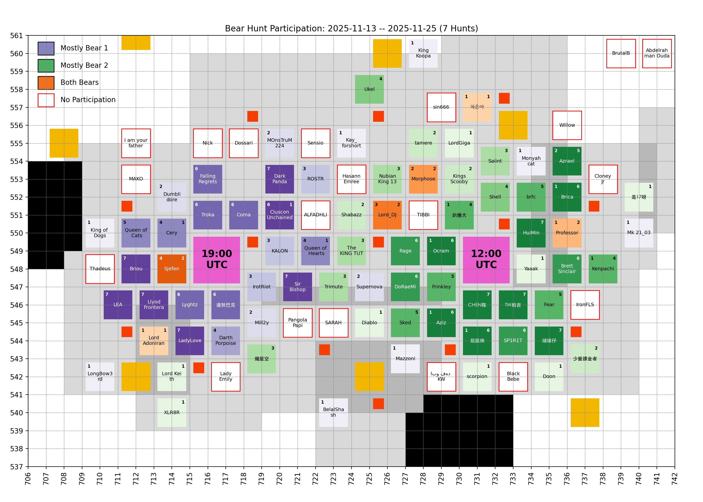
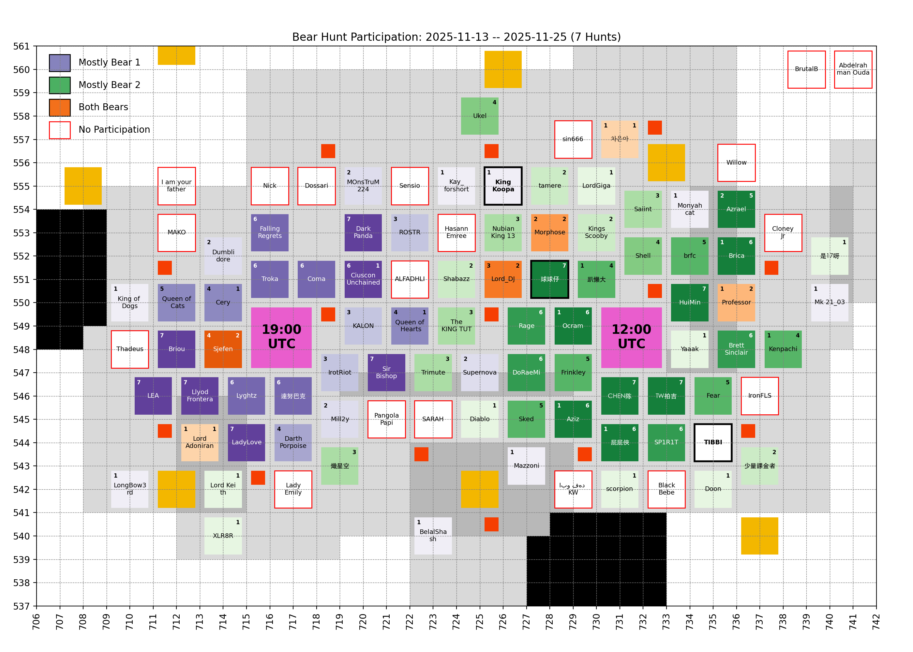
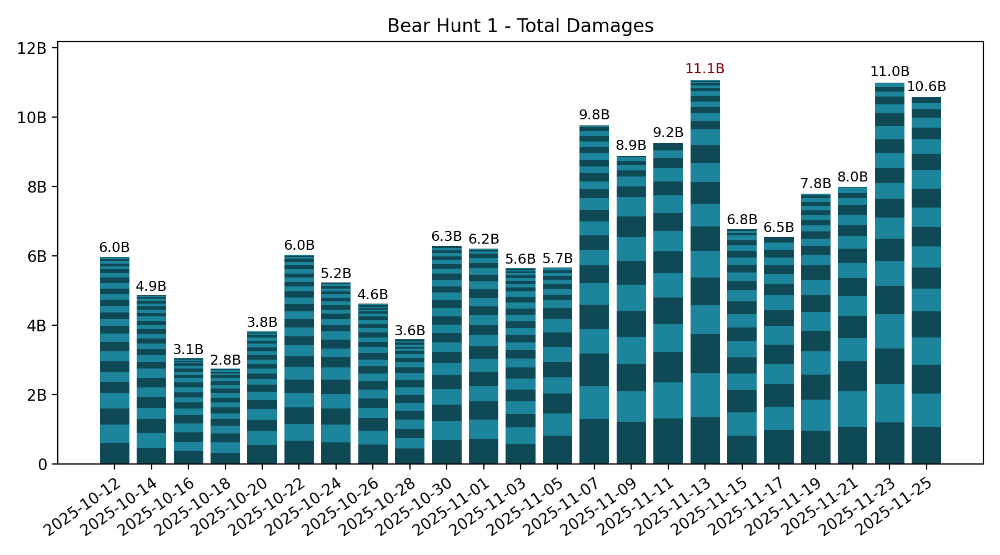
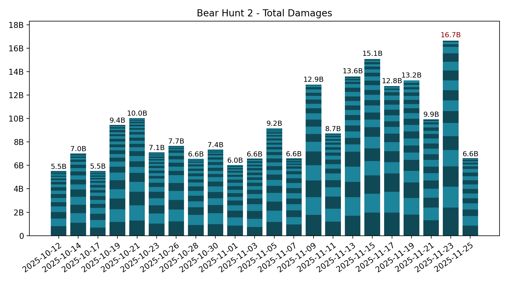

# 🐻 Bear Hunt

Keeping only the last 7 records, which is the number of bear hunts in between two Castle Battles.

## Participation

<!-- [[[cog
# Display the latest hive participation map
import re
from pathlib import Path
pattern = re.compile(r"(\d{4}-\d{2}-\d{2})_hive_participation\.png")
imgs_dir = Path("bear_hunt", "images")
map_fpath = sorted(
  [fpath for fpath in imgs_dir.iterdir() if pattern.match(fpath.name)]
)[-1]
print(f" / map_fpath.name})")
]]] -->

<!-- [[[end]]] -->

<!-- [[[cog
# Display the future hive participation map once cities start moving
import re
from pathlib import Path
import yaml

MOVING = yaml.safe_load(Path("hive", "locations_moving.yml").open("r"))
if MOVING["bear_1"] or MOVING["bear_2"]: # Else, no moving cities, skip
  pattern = re.compile(r"(\d{4}-\d{2}-\d{2})_hive_participation_moving\.png")
  imgs_dir = Path("bear_hunt", "images")
  map_fpath = sorted(
    [fpath for fpath in imgs_dir.iterdir() if pattern.match(fpath.name)]
  )[-1]

  print("\n## Future hive\n")
  print(f" / map_fpath.name})")
  print()
]]] -->

## Future hive

<!-- [[[end]]] -->

## Bear 1

<!-- [[[cog
# Display the latest bear damages bar graph
import re
from pathlib import Path
pattern = re.compile(r"(\d{4}-\d{2}-\d{2})_bear1_damages\.png")
imgs_dir = Path("bear_hunt", "images")
map_fpath = sorted(
  [fpath for fpath in imgs_dir.iterdir() if pattern.match(fpath.name)]
)[-1]
print(f" / map_fpath.name})")
]]] -->

<!-- [[[end]]] -->

Table

<!-- [[[cog
from analysis import summary, as_markdown_table
print()
print(
  as_markdown_table(
    summary(bear=1),
    columns=["Date", "# Players", "Total score"],
    justifys=["left", "right", "right"],
  )
)
]]] -->

| Date       | # Players | Total score |
| :--------- | --------: | ----------: |
| 2025-10-12 |        30 |       5.97B |
| 2025-10-14 |        27 |       4.86B |
| 2025-10-16 |        24 |       3.05B |
| 2025-10-18 |        20 |       2.75B |
| 2025-10-20 |        23 |       3.82B |
| 2025-10-22 |        28 |       6.03B |
| 2025-10-24 |        23 |       5.23B |
| 2025-10-26 |        27 |       4.62B |
| 2025-10-28 |        23 |       3.59B |
| 2025-10-30 |        25 |       6.28B |
| 2025-11-01 |        23 |       6.21B |
| 2025-11-03 |        29 |       5.64B |
| 2025-11-05 |        19 |       5.65B |
| 2025-11-07 |        25 |       9.76B |
| 2025-11-09 |        17 |       8.88B |
| 2025-11-11 |        16 |       9.25B |
| 2025-11-13 |        25 |      11.07B |
| 2025-11-15 |        21 |       6.76B |
| 2025-11-17 |        15 |       6.54B |
| 2025-11-19 |        23 |       7.79B |
| 2025-11-21 |        19 |       7.99B |
| 2025-11-23 |        21 |      10.99B |
| 2025-11-25 |        19 |      10.57B |

<!-- [[[end]]] -->

Top Players over last 7 hunts

<!-- [[[cog
from analysis import players_records, as_markdown_table
print()
print(
  as_markdown_table(
    players_records(bear=1, n_lasts=7),
    columns=["#", "Player", "Score", "# Hunts"],
    justifys=["right", "left", "right", "right"],
  )
)
]]] -->

|   # | Player           |   Score | # Hunts |
| --: | :--------------- | ------: | ------: |
|   1 | Lyghtz           |   6.07B |       6 |
|   2 | 達努巴克         |   5.71B |       6 |
|   3 | Coma             |   4.72B |       6 |
|   4 | Llyod Frontera   |   4.28B |       7 |
|   5 | Cery             |   3.87B |       4 |
|   6 | Briou            |   3.81B |       7 |
|   7 | Troka            |   3.46B |       6 |
|   8 | LadyLove         |   3.40B |       7 |
|   9 | Sjefen           |   2.61B |       4 |
|  10 | FallingRegrets   |   2.60B |       6 |
|  11 | CiusconUnchained |   2.50B |       6 |
|  12 | IrotRiot         |   2.25B |       3 |
|  13 | DarkPanda        |   1.88B |       7 |
|  14 | LEA              |   1.57B |       7 |
|  15 | Queen of Cats    |   1.47B |       5 |
|  16 | Queen of Hearts  |   1.11B |       4 |
|  17 | Darth Porpoise   |   1.06B |       4 |
|  18 | Sir Bishop       |   1.05B |       7 |
|  19 | Azrael           |   1.01B |       2 |
|  20 | Lord_DJ          | 970.14M |       3 |
|  21 | Ocram            | 968.51M |       1 |
|  22 | Mill2y           | 845.46M |       2 |
|  23 | KALON            | 674.66M |       3 |
|  24 | Shellybobs       | 607.43M |       1 |
|  25 | Brica            | 435.64M |       1 |
|  26 | Aziz             | 430.38M |       1 |
|  27 | MOnsTrUM224      | 334.47M |       2 |
|  28 | MOnsTruM224      | 321.23M |       2 |
|  29 | Lord Adoniran    | 316.33M |       1 |
|  30 | Morphose         | 173.83M |       2 |
|  31 | Professor        | 158.13M |       1 |
|  32 | 屁屁俠           | 147.12M |       1 |
|  33 | Supernova        | 116.03M |       2 |
|  34 | Kay_forshort     | 115.21M |       1 |
|  35 | Kenpachi         | 113.76M |       1 |
|  36 | LongBow3rd       |  83.81M |       1 |
|  37 | Monyahcat        |  83.32M |       1 |
|  38 | ROSTR            |  79.67M |       3 |
|  39 | Dumblidore       |  64.56M |       2 |
|  40 | BelalShash       |  61.95M |       1 |
|  41 | King of Dogs     |  60.83M |       1 |
|  42 | 趴懶大           |  51.04M |       1 |
|  43 | Mazzoni          |  36.95M |       1 |
|  44 | 차은아           |  21.18M |       1 |
|  45 | King Koopa       |  21.10M |       1 |
|  46 | Mk 21_03         |   4.14M |       1 |

<!-- [[[end]]] -->

## Bear 2

<!-- [[[cog
# Display the latest bear damages bar graph
import re
from pathlib import Path
pattern = re.compile(r"(\d{4}-\d{2}-\d{2})_bear2_damages\.png")
imgs_dir = Path("bear_hunt", "images")
graph_fpath = sorted(
  [fpath for fpath in imgs_dir.iterdir() if pattern.match(fpath.name)]
)[-1]
print(f" / graph_fpath.name})")
]]] -->

<!-- [[[end]]] -->

Table

<!-- [[[cog
from analysis import summary, as_markdown_table
print()
print(
  as_markdown_table(
    summary(bear=2),
    columns=["Date", "# Players", "Total score"],
    justifys=["left", "right", "right"],
  )
)
]]] -->

| Date       | # Players | Total score |
| :--------- | --------: | ----------: |
| 2025-10-12 |        22 |       5.53B |
| 2025-10-14 |        24 |       7.03B |
| 2025-10-17 |        25 |       5.54B |
| 2025-10-19 |        23 |       9.44B |
| 2025-10-21 |        28 |      10.03B |
| 2025-10-23 |        28 |       7.12B |
| 2025-10-26 |        18 |       7.66B |
| 2025-10-28 |        24 |       6.57B |
| 2025-10-30 |        24 |       7.36B |
| 2025-11-01 |        22 |       6.04B |
| 2025-11-03 |        23 |       6.58B |
| 2025-11-05 |        32 |       9.16B |
| 2025-11-07 |        21 |       6.61B |
| 2025-11-09 |        20 |      12.90B |
| 2025-11-11 |        25 |       8.72B |
| 2025-11-13 |        27 |      13.60B |
| 2025-11-15 |        28 |      15.08B |
| 2025-11-17 |        21 |      12.78B |
| 2025-11-19 |        24 |      13.25B |
| 2025-11-21 |        22 |       9.94B |
| 2025-11-23 |        20 |      16.66B |
| 2025-11-25 |        21 |       6.60B |

<!-- [[[end]]] -->

Top Players over last 7 hunts

<!-- [[[cog
from analysis import players_records, as_markdown_table
print()
print(
  as_markdown_table(
    players_records(bear=2, n_lasts=7),
    columns=["#", "Player", "Score", "# Hunts"],
    justifys=["right", "left", "right", "right"],
  )
)
]]] -->

|   # | Player           |   Score | # Hunts |
| --: | :--------------- | ------: | ------: |
|   1 | CHEN陈           |  11.03B |       7 |
|   2 | Ocram            |   9.13B |       6 |
|   3 | Frinkley         |   8.58B |       5 |
|   4 | Aziz             |   5.90B |       6 |
|   5 | TW拍吉           |   5.25B |       7 |
|   6 | Brett Sinclair   |   4.29B |       6 |
|   7 | DoRaeMi          |   4.02B |       6 |
|   8 | Fear             |   3.78B |       5 |
|   9 | Rage             |   3.44B |       6 |
|  10 | HuiMin           |   3.35B |       7 |
|  11 | brfc             |   3.22B |       5 |
|  12 | Brica            |   2.39B |       6 |
|  13 | 球球仔           |   2.39B |       7 |
|  14 | SP1R1T           |   2.21B |       6 |
|  15 | Azrael           |   1.78B |       5 |
|  16 | 屁屁俠           |   1.58B |       6 |
|  17 | Sked             |   1.48B |       5 |
|  18 | Yaaak            |   1.29B |       1 |
|  19 | Shell            |   1.20B |       4 |
|  20 | Professor        |   1.18B |       2 |
|  21 | Cery             |   1.09B |       1 |
|  22 | 少量課金者       |   1.00B |       2 |
|  23 | Kenpachi         | 958.31M |       4 |
|  24 | 趴懶大           | 907.69M |       4 |
|  25 | Scorpion         | 842.18M |       1 |
|  26 | Kings Scooby     | 810.12M |       2 |
|  27 | Lord_DJ          | 748.44M |       2 |
|  28 | Sjefen           | 624.50M |       2 |
|  29 | tamere           | 622.31M |       2 |
|  30 | Saiint           | 375.99M |       3 |
|  31 | Shabazz          | 314.42M |       2 |
|  32 | scorpion         | 288.64M |       1 |
|  33 | Diablo           | 287.11M |       1 |
|  34 | Morphose         | 278.56M |       2 |
|  35 | Trimute          | 254.86M |       3 |
|  36 | Ukel             | 234.31M |       4 |
|  37 | Nubian King 13   | 209.58M |       3 |
|  38 | CiusconUnchained | 178.42M |       1 |
|  39 | Queen of Hearts  | 176.24M |       1 |
|  40 | The KING TUT     |  57.35M |       3 |
|  41 | 熾星空           |  43.19M |       3 |
|  42 | Doon             |  26.66M |       1 |
|  43 | Lord Adoniran    |  21.39M |       1 |
|  44 | 是17呀           |  17.06M |       1 |
|  45 | Lord Keith       |  11.59M |       1 |
|  46 | HASANNEMREE      |   8.67M |       1 |
|  47 | XLR8R            |   7.05M |       1 |
|  48 | 차은아           |   2.24M |       1 |
|  49 | LordGiga         |   2.21M |       1 |

<!-- [[[end]]] -->

