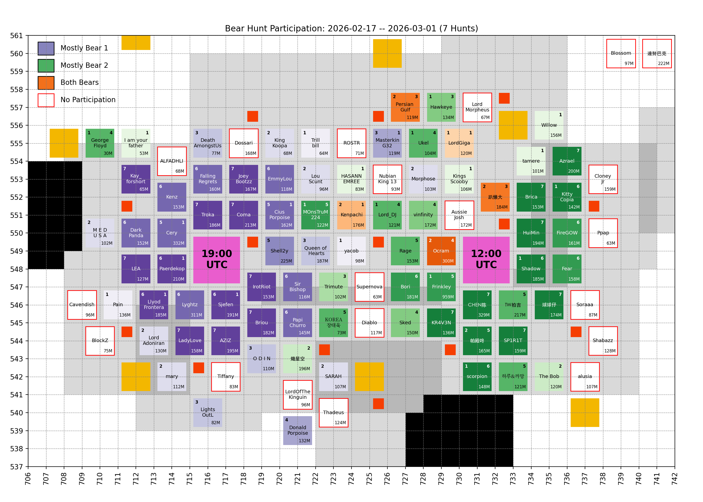
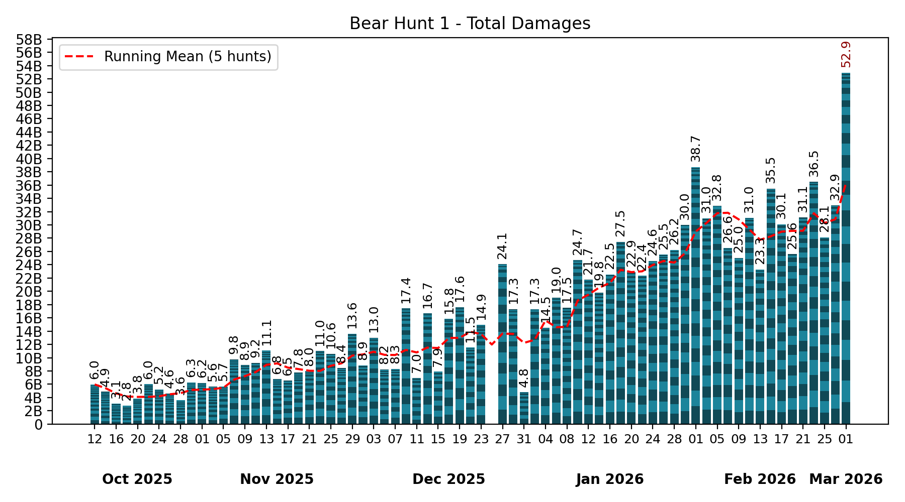
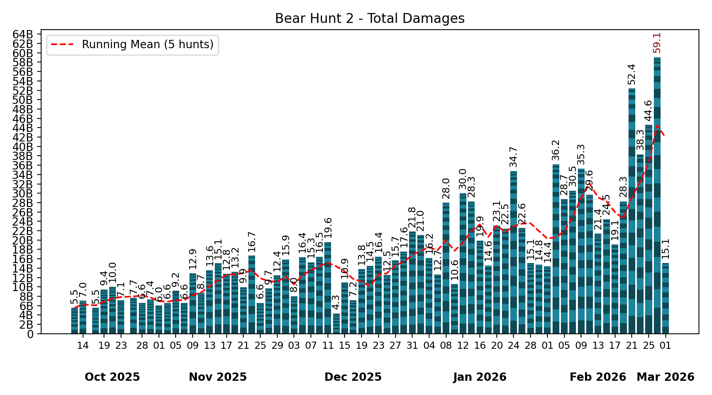

# 🐻 Bear Hunt

Keeping only the last 7 records, which is the number of bear hunts in between two Castle Battles.

## Participation

<!-- [[[cog
# Display the latest hive participation map
import re
from pathlib import Path
pattern = re.compile(r"(\d{4}-\d{2}-\d{2})_hive_participation\.png")
imgs_dir = Path("bear_hunt", "images")
map_fpath = sorted(
  [fpath for fpath in imgs_dir.iterdir() if pattern.match(fpath.name)]
)[-1]
print(f" / map_fpath.name})")
]]] -->

<!-- [[[end]]] -->

<!-- [[[cog
# Display the future hive participation map once cities start moving
import re
from pathlib import Path
import yaml

MOVING = yaml.safe_load(Path("hive", "locations_moving.yml").read_text())
if MOVING["bear_1"] or MOVING["bear_2"]: # Else, no moving cities, skip
  pattern = re.compile(r"(\d{4}-\d{2}-\d{2})_hive_participation_moving\.png")
  imgs_dir = Path("bear_hunt", "images")
  map_fpath = sorted(
    [fpath for fpath in imgs_dir.iterdir() if pattern.match(fpath.name)]
  )[-1]

  print("\n## Future hive\n")
  print(f" / map_fpath.name})")
  print()
]]] -->

<!-- [[[end]]] -->

## Bear 1

<!-- [[[cog
# Display the latest bear damages bar graph
import re
from pathlib import Path
pattern = re.compile(r"(\d{4}-\d{2}-\d{2})_bear1_damages\.png")
imgs_dir = Path("bear_hunt", "images")
map_fpath = sorted(
  [fpath for fpath in imgs_dir.iterdir() if pattern.match(fpath.name)]
)[-1]
print(f" / map_fpath.name})")
]]] -->

<!-- [[[end]]] -->

Table

<!-- [[[cog
from analysis import summary, as_markdown_table
print()
print(
  as_markdown_table(
    summary(bear=1),
    columns=["Date", "# Players", "Total score"],
    justifys=["left", "right", "right"],
  )
)
]]] -->

| Date       | # Players | Total score |
| :--------- | --------: | ----------: |
| 2025-10-12 |        30 |       5.97B |
| 2025-10-14 |        27 |       4.86B |
| 2025-10-16 |        24 |       3.05B |
| 2025-10-18 |        20 |       2.75B |
| 2025-10-20 |        23 |       3.82B |
| 2025-10-22 |        28 |       6.03B |
| 2025-10-24 |        23 |       5.23B |
| 2025-10-26 |        27 |       4.62B |
| 2025-10-28 |        23 |       3.59B |
| 2025-10-30 |        25 |       6.28B |
| 2025-11-01 |        23 |       6.21B |
| 2025-11-03 |        29 |       5.64B |
| 2025-11-05 |        19 |       5.65B |
| 2025-11-07 |        25 |       9.76B |
| 2025-11-09 |        17 |       8.88B |
| 2025-11-11 |        16 |       9.25B |
| 2025-11-13 |        25 |      11.07B |
| 2025-11-15 |        21 |       6.76B |
| 2025-11-17 |        15 |       6.54B |
| 2025-11-19 |        23 |       7.79B |
| 2025-11-21 |        19 |       7.99B |
| 2025-11-23 |        21 |      10.99B |
| 2025-11-25 |        19 |      10.57B |
| 2025-11-27 |        21 |       8.44B |
| 2025-11-29 |        22 |      13.60B |
| 2025-12-01 |        19 |       8.85B |
| 2025-12-03 |        22 |      13.01B |
| 2025-12-05 |        23 |       8.24B |
| 2025-12-07 |        21 |       8.31B |
| 2025-12-09 |        25 |      17.45B |
| 2025-12-11 |        19 |       6.97B |
| 2025-12-13 |        23 |      16.67B |
| 2025-12-15 |        14 |       7.89B |
| 2025-12-17 |        22 |      15.84B |
| 2025-12-19 |        22 |      17.60B |
| 2025-12-21 |        25 |      11.54B |
| 2025-12-23 |        26 |      14.94B |
| 2025-12-25 |         1 |           0 |
| 2025-12-27 |        24 |      24.08B |
| 2025-12-29 |        27 |      17.31B |
| 2025-12-31 |        15 |       4.81B |
| 2026-01-02 |        20 |      17.32B |
| 2026-01-04 |        19 |      14.51B |
| 2026-01-06 |        25 |      19.03B |
| 2026-01-08 |        32 |      17.52B |
| 2026-01-10 |        29 |      24.69B |
| 2026-01-12 |        29 |      21.75B |
| 2026-01-14 |        34 |      19.80B |
| 2026-01-16 |        24 |      22.52B |
| 2026-01-18 |        30 |      27.45B |
| 2026-01-20 |        33 |      22.92B |
| 2026-01-22 |        30 |      22.36B |
| 2026-01-24 |        28 |      24.59B |
| 2026-01-26 |        34 |      25.50B |
| 2026-01-28 |        35 |      26.25B |
| 2026-01-30 |        29 |      30.00B |
| 2026-02-01 |        35 |      38.71B |
| 2026-02-03 |        32 |      31.02B |
| 2026-02-05 |        29 |      32.84B |
| 2026-02-07 |        26 |      26.56B |
| 2026-02-09 |        26 |      25.05B |
| 2026-02-11 |        30 |      31.04B |
| 2026-02-13 |        23 |      23.31B |
| 2026-02-15 |        34 |      35.47B |
| 2026-02-17 |        30 |      30.10B |
| 2026-02-19 |        21 |      25.60B |
| 2026-02-21 |        29 |      31.13B |
| 2026-02-23 |        29 |      36.50B |
| 2026-02-25 |        29 |      28.13B |
| 2026-02-27 |        27 |      32.93B |
| 2026-03-01 |        31 |      52.94B |

<!-- [[[end]]] -->

Top Players over last 7 hunts

<!-- [[[cog
from analysis import players_records, as_markdown_table
print()
print(
  as_markdown_table(
    players_records(bear=1, n_lasts=7),
    columns=["#", "Player", "Score", "# Hunts"],
    justifys=["right", "left", "right", "right"],
  )
)
]]] -->

|   # | Player          |   Score | # Hunts |
| --: | :-------------- | ------: | ------: |
|   1 | Paerdekop       |  13.15B |       6 |
|   2 | Coma            |  12.42B |       7 |
|   3 | Kenz            |  11.81B |       6 |
|   4 | Lyghtz          |  11.81B |       6 |
|   5 | AZIZ            |  11.42B |       7 |
|   6 | LadyLove        |  11.40B |       7 |
|   7 | Sjefen          |  10.77B |       6 |
|   8 | JoeyBootzz      |  10.60B |       7 |
|   9 | Briou           |  10.49B |       7 |
|  10 | Llyod Frontera  |  10.43B |       6 |
|  11 | Shell2y         |  10.29B |       5 |
|  12 | LEA             |  10.04B |       7 |
|  13 | Troka           |   9.53B |       7 |
|  14 | FallingRegrets  |   9.53B |       6 |
|  15 | DarkPanda       |   9.12B |       6 |
|  16 | IrotRiot        |   7.64B |       7 |
|  17 | Cery            |   6.87B |       5 |
|  18 | PapiChurro      |   6.75B |       6 |
|  19 | EmmyLou         |   5.75B |       6 |
|  20 | Sir Bishop      |   4.88B |       6 |
|  21 | Kay_forshort    |   4.81B |       7 |
|  22 | Frinkley        |   2.96B |       1 |
|  23 | DeathAmongstUs  |   2.61B |       3 |
|  24 | MasterkinG32    |   2.50B |       3 |
|  25 | Kenpachi        |   1.99B |       2 |
|  26 | mary            |   1.79B |       2 |
|  27 | Lord Adoniran   |   1.71B |       2 |
|  28 | Donald Porpoise |   1.67B |       4 |
|  29 | Persian Gulf    |   1.56B |       2 |
|  30 | Shadow          |   1.53B |       1 |
|  31 | O D I N         |   1.49B |       3 |
|  32 | LightsOutL      |   1.46B |       3 |
|  33 | CiusPorpoise    |   1.39B |       5 |
|  34 | Morphose        |   1.38B |       2 |
|  35 | Lou_Scunt       |   1.34B |       2 |
|  36 | Ocram           |   1.26B |       2 |
|  37 | Queen of Hearts |   1.09B |       3 |
|  38 | M E D U S A     |   1.08B |       2 |
|  39 | ODIN            | 951.66M |       1 |
|  40 | 帕殿咚          | 937.03M |       2 |
|  41 | Loading         | 856.10M |       1 |
|  42 | MOnsTruM224     | 849.71M |       1 |
|  43 | Hawkeye         | 843.84M |       1 |
|  44 | scorpion        | 742.87M |       1 |
|  45 | Trillbill       | 702.26M |       1 |
|  46 | SARAH           | 680.97M |       2 |
|  47 | KittyCopia      | 525.24M |       1 |
|  48 | Lord_DJ         | 447.58M |       1 |
|  49 | Pain            | 346.73M |       1 |
|  50 | 趴懶大          | 278.04M |       2 |
|  51 | yacob           | 254.48M |       1 |
|  52 | Ukel            | 228.60M |       1 |
|  53 | King Koopa      | 209.50M |       2 |
|  54 | LordGiga        | 141.01M |       1 |
|  55 | George Floyd    |  21.48M |       1 |

<!-- [[[end]]] -->

## Bear 2

<!-- [[[cog
# Display the latest bear damages bar graph
import re
from pathlib import Path
pattern = re.compile(r"(\d{4}-\d{2}-\d{2})_bear2_damages\.png")
imgs_dir = Path("bear_hunt", "images")
graph_fpath = sorted(
  [fpath for fpath in imgs_dir.iterdir() if pattern.match(fpath.name)]
)[-1]
print(f" / graph_fpath.name})")
]]] -->

<!-- [[[end]]] -->

Table

<!-- [[[cog
from analysis import summary, as_markdown_table
print()
print(
  as_markdown_table(
    summary(bear=2),
    columns=["Date", "# Players", "Total score"],
    justifys=["left", "right", "right"],
  )
)
]]] -->

| Date       | # Players | Total score |
| :--------- | --------: | ----------: |
| 2025-10-12 |        22 |       5.53B |
| 2025-10-14 |        24 |       7.03B |
| 2025-10-17 |        25 |       5.54B |
| 2025-10-19 |        23 |       9.44B |
| 2025-10-21 |        28 |      10.03B |
| 2025-10-23 |        28 |       7.12B |
| 2025-10-26 |        18 |       7.66B |
| 2025-10-28 |        24 |       6.57B |
| 2025-10-30 |        24 |       7.36B |
| 2025-11-01 |        22 |       6.04B |
| 2025-11-03 |        23 |       6.58B |
| 2025-11-05 |        32 |       9.16B |
| 2025-11-07 |        21 |       6.61B |
| 2025-11-09 |        20 |      12.90B |
| 2025-11-11 |        25 |       8.72B |
| 2025-11-13 |        27 |      13.60B |
| 2025-11-15 |        28 |      15.08B |
| 2025-11-17 |        21 |      12.78B |
| 2025-11-19 |        24 |      13.25B |
| 2025-11-21 |        22 |       9.94B |
| 2025-11-23 |        20 |      16.66B |
| 2025-11-25 |        21 |       6.60B |
| 2025-11-27 |        23 |       9.68B |
| 2025-11-29 |        21 |      12.44B |
| 2025-12-01 |        23 |      15.88B |
| 2025-12-03 |        20 |       8.04B |
| 2025-12-05 |        21 |      16.37B |
| 2025-12-07 |        16 |      15.28B |
| 2025-12-09 |        24 |      16.47B |
| 2025-12-11 |        20 |      19.59B |
| 2025-12-13 |        19 |       4.30B |
| 2025-12-15 |        21 |      10.91B |
| 2025-12-17 |        18 |       7.20B |
| 2025-12-19 |        23 |      13.82B |
| 2025-12-21 |        20 |      14.52B |
| 2025-12-23 |        25 |      16.45B |
| 2025-12-25 |        22 |      12.54B |
| 2025-12-27 |        22 |      15.66B |
| 2025-12-29 |        22 |      17.56B |
| 2025-12-31 |        23 |      21.80B |
| 2026-01-02 |        21 |      21.05B |
| 2026-01-04 |        26 |      16.19B |
| 2026-01-06 |        19 |      12.66B |
| 2026-01-08 |        27 |      27.98B |
| 2026-01-10 |        18 |      10.61B |
| 2026-01-12 |        28 |      30.00B |
| 2026-01-14 |        29 |      28.27B |
| 2026-01-16 |        26 |      19.90B |
| 2026-01-18 |        18 |      14.61B |
| 2026-01-20 |        26 |      23.10B |
| 2026-01-22 |        23 |      22.47B |
| 2026-01-24 |        26 |      34.74B |
| 2026-01-26 |        23 |      22.59B |
| 2026-01-28 |        26 |      15.07B |
| 2026-01-30 |        22 |      14.76B |
| 2026-02-01 |        24 |      14.37B |
| 2026-02-03 |        29 |      36.18B |
| 2026-02-05 |        27 |      28.75B |
| 2026-02-07 |        25 |      30.53B |
| 2026-02-09 |        28 |      35.26B |
| 2026-02-11 |        21 |      29.65B |
| 2026-02-13 |        29 |      21.41B |
| 2026-02-15 |        21 |      24.49B |
| 2026-02-17 |        24 |      19.08B |
| 2026-02-19 |        27 |      28.28B |
| 2026-02-21 |        27 |      52.37B |
| 2026-02-23 |        26 |      38.30B |
| 2026-02-25 |        29 |      44.58B |
| 2026-02-27 |        29 |      59.08B |
| 2026-03-01 |        16 |      15.13B |

<!-- [[[end]]] -->

Top Players over last 7 hunts

<!-- [[[cog
from analysis import players_records, as_markdown_table
print()
print(
  as_markdown_table(
    players_records(bear=2, n_lasts=7),
    columns=["#", "Player", "Score", "# Hunts"],
    justifys=["right", "left", "right", "right"],
  )
)
]]] -->

|   # | Player           |   Score | # Hunts |
| --: | :--------------- | ------: | ------: |
|   1 | Frinkley         |  19.03B |       5 |
|   2 | CHEN陈           |  16.87B |       7 |
|   3 | Azrael           |  14.78B |       7 |
|   4 | Shadow           |  14.06B |       6 |
|   5 | Ocram            |  13.97B |       4 |
|   6 | Fear             |  13.26B |       6 |
|   7 | HuiMin           |  13.23B |       7 |
|   8 | Brica            |  13.00B |       7 |
|   9 | Rage             |  10.88B |       5 |
|  10 | KR4V3N           |  10.44B |       7 |
|  11 | Bori             |  10.09B |       6 |
|  12 | 球球仔           |   9.42B |       7 |
|  13 | SP1R1T           |   8.94B |       7 |
|  14 | scorpion         |   8.52B |       6 |
|  15 | vinfinity        |   8.09B |       4 |
|  16 | FireGOW          |   6.89B |       6 |
|  17 | KittyCopia       |   6.79B |       6 |
|  18 | Loading          |   5.76B |       5 |
|  19 | Persian Gulf     |   5.47B |       3 |
|  20 | MOnsTruM224      |   5.44B |       5 |
|  21 | Lord_DJ          |   5.22B |       4 |
|  22 | Sked             |   4.01B |       4 |
|  23 | Hawkeye          |   3.58B |       3 |
|  24 | 帕殿咚           |   3.54B |       5 |
|  25 | Paerdekop        |   3.26B |       1 |
|  26 | 하루&까망        |   2.73B |       5 |
|  27 | Llyod Frontera   |   2.71B |       1 |
|  28 | Sjefen           |   2.30B |       1 |
|  29 | Cery             |   2.10B |       1 |
|  30 | TW拍吉           |   1.93B |       5 |
|  31 | The Bob          |   1.45B |       2 |
|  32 | Kenpachi         |   1.31B |       1 |
|  33 | MasterkinG32     |   1.26B |       1 |
|  34 | Willow           |   1.13B |       1 |
|  35 | KOREA장태욱      | 964.09M |       5 |
|  36 | Ukel             | 812.10M |       4 |
|  37 | tamere           | 742.69M |       1 |
|  38 | Trimute          | 683.35M |       3 |
|  39 | 熾星空           | 683.33M |       2 |
|  40 | 趴懶大           | 566.59M |       3 |
|  41 | LordGiga         | 379.98M |       1 |
|  42 | Kings Scooby     | 249.13M |       1 |
|  43 | HASANNEMREE      | 212.77M |       1 |
|  44 | George Floyd     |  46.19M |       4 |
|  45 | CiusPorpoise     |  31.87M |       1 |
|  46 | I am your father |   2.45M |       1 |

<!-- [[[end]]] -->

