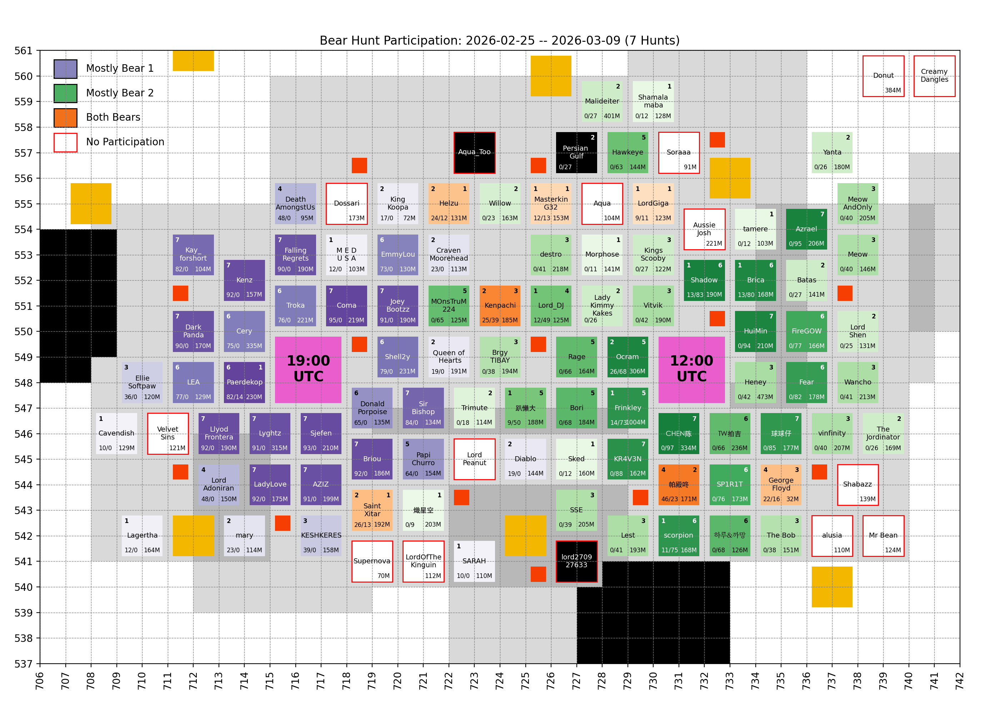
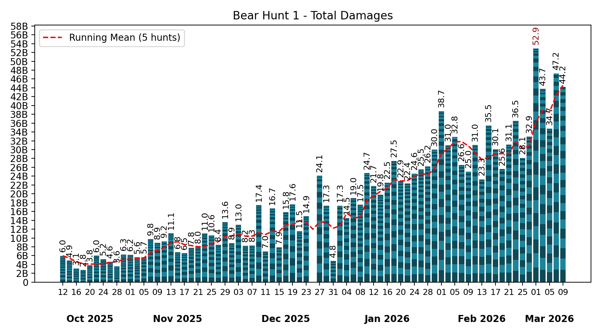
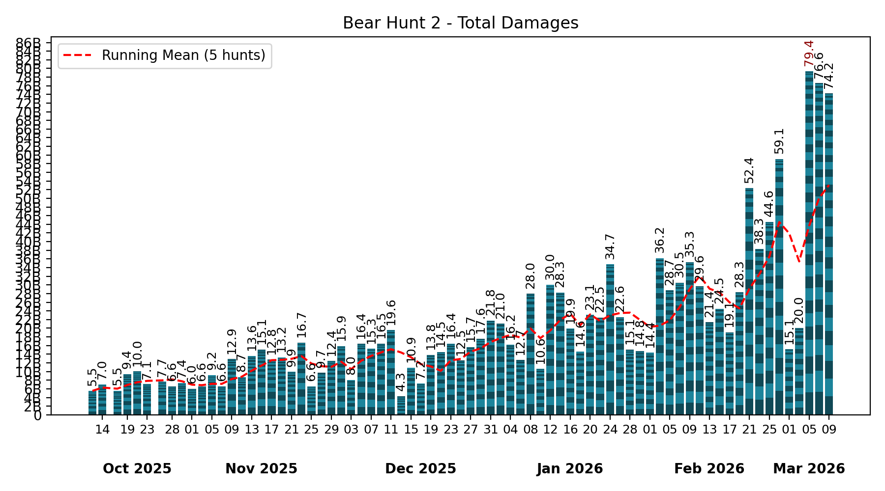

# 🐻 Bear Hunt

Keeping only the last 7 records, which is the number of bear hunts in between two Castle Battles.

## Participation

<!-- [[[cog
# Display the latest hive participation map
import re
from pathlib import Path
pattern = re.compile(r"(\d{4}-\d{2}-\d{2})_hive_participation\.png")
imgs_dir = Path("bear_hunt", "images")
map_fpath = sorted(
  [fpath for fpath in imgs_dir.iterdir() if pattern.match(fpath.name)]
)[-1]
print(f" / map_fpath.name})")
]]] -->

<!-- [[[end]]] -->

<!-- [[[cog
# Display the future hive participation map once cities start moving
import re
from pathlib import Path
import yaml

MOVING = yaml.safe_load(Path("hive", "locations_moving.yml").read_text())
if MOVING["bear_1"] or MOVING["bear_2"]: # Else, no moving cities, skip
  pattern = re.compile(r"(\d{4}-\d{2}-\d{2})_hive_participation_moving\.png")
  imgs_dir = Path("bear_hunt", "images")
  map_fpath = sorted(
    [fpath for fpath in imgs_dir.iterdir() if pattern.match(fpath.name)]
  )[-1]

  print("\n## Future hive\n")
  print(f" / map_fpath.name})")
  print()
]]] -->

<!-- [[[end]]] -->

## Bear 1

<!-- [[[cog
# Display the latest bear damages bar graph
import re
from pathlib import Path
pattern = re.compile(r"(\d{4}-\d{2}-\d{2})_bear1_damages\.png")
imgs_dir = Path("bear_hunt", "images")
map_fpath = sorted(
  [fpath for fpath in imgs_dir.iterdir() if pattern.match(fpath.name)]
)[-1]
print(f" / map_fpath.name})")
]]] -->

<!-- [[[end]]] -->

Table

<!-- [[[cog
from analysis import summary, as_markdown_table
print()
print(
  as_markdown_table(
    summary(bear=1),
    columns=["Date", "# Players", "Total score"],
    justifys=["left", "right", "right"],
  )
)
]]] -->

| Date       | # Players | Total score |
| :--------- | --------: | ----------: |
| 2025-10-12 |        30 |       5.97B |
| 2025-10-14 |        27 |       4.86B |
| 2025-10-16 |        24 |       3.05B |
| 2025-10-18 |        20 |       2.75B |
| 2025-10-20 |        23 |       3.82B |
| 2025-10-22 |        28 |       6.03B |
| 2025-10-24 |        23 |       5.23B |
| 2025-10-26 |        27 |       4.62B |
| 2025-10-28 |        23 |       3.59B |
| 2025-10-30 |        25 |       6.28B |
| 2025-11-01 |        23 |       6.21B |
| 2025-11-03 |        29 |       5.64B |
| 2025-11-05 |        19 |       5.65B |
| 2025-11-07 |        25 |       9.76B |
| 2025-11-09 |        17 |       8.88B |
| 2025-11-11 |        16 |       9.25B |
| 2025-11-13 |        25 |      11.07B |
| 2025-11-15 |        21 |       6.76B |
| 2025-11-17 |        15 |       6.54B |
| 2025-11-19 |        23 |       7.79B |
| 2025-11-21 |        19 |       7.99B |
| 2025-11-23 |        21 |      10.99B |
| 2025-11-25 |        19 |      10.57B |
| 2025-11-27 |        21 |       8.44B |
| 2025-11-29 |        22 |      13.60B |
| 2025-12-01 |        19 |       8.85B |
| 2025-12-03 |        22 |      13.01B |
| 2025-12-05 |        23 |       8.24B |
| 2025-12-07 |        21 |       8.31B |
| 2025-12-09 |        25 |      17.45B |
| 2025-12-11 |        19 |       6.97B |
| 2025-12-13 |        23 |      16.67B |
| 2025-12-15 |        14 |       7.89B |
| 2025-12-17 |        22 |      15.84B |
| 2025-12-19 |        22 |      17.60B |
| 2025-12-21 |        25 |      11.54B |
| 2025-12-23 |        26 |      14.94B |
| 2025-12-25 |         1 |           0 |
| 2025-12-27 |        24 |      24.08B |
| 2025-12-29 |        27 |      17.31B |
| 2025-12-31 |        15 |       4.81B |
| 2026-01-02 |        20 |      17.32B |
| 2026-01-04 |        19 |      14.51B |
| 2026-01-06 |        25 |      19.03B |
| 2026-01-08 |        32 |      17.52B |
| 2026-01-10 |        29 |      24.69B |
| 2026-01-12 |        29 |      21.75B |
| 2026-01-14 |        34 |      19.80B |
| 2026-01-16 |        24 |      22.52B |
| 2026-01-18 |        30 |      27.45B |
| 2026-01-20 |        33 |      22.92B |
| 2026-01-22 |        30 |      22.36B |
| 2026-01-24 |        28 |      24.59B |
| 2026-01-26 |        34 |      25.50B |
| 2026-01-28 |        35 |      26.25B |
| 2026-01-30 |        29 |      30.00B |
| 2026-02-01 |        35 |      38.71B |
| 2026-02-03 |        32 |      31.02B |
| 2026-02-05 |        29 |      32.84B |
| 2026-02-07 |        26 |      26.56B |
| 2026-02-09 |        26 |      25.05B |
| 2026-02-11 |        30 |      31.04B |
| 2026-02-13 |        23 |      23.31B |
| 2026-02-15 |        34 |      35.47B |
| 2026-02-17 |        30 |      30.10B |
| 2026-02-19 |        21 |      25.60B |
| 2026-02-21 |        29 |      31.13B |
| 2026-02-23 |        29 |      36.50B |
| 2026-02-25 |        29 |      28.13B |
| 2026-02-27 |        27 |      32.93B |
| 2026-03-01 |        31 |      52.94B |
| 2026-03-03 |        31 |      43.74B |
| 2026-03-05 |        29 |      34.73B |
| 2026-03-07 |        27 |      47.24B |
| 2026-03-09 |        30 |      44.19B |

<!-- [[[end]]] -->

Top Players over last 7 hunts

<!-- [[[cog
from analysis import players_records, as_markdown_table
print()
print(
  as_markdown_table(
    players_records(bear=1, n_lasts=7),
    columns=["#", "Player", "Score", "# Hunts"],
    justifys=["right", "left", "right", "right"],
  )
)
]]] -->

|   # | Player          |   Score | # Hunts |
| --: | :-------------- | ------: | ------: |
|   1 | Coma            |  16.20B |       7 |
|   2 | Sjefen          |  15.27B |       7 |
|   3 | Paerdekop       |  15.02B |       6 |
|   4 | Lyghtz          |  14.25B |       7 |
|   5 | Llyod Frontera  |  14.00B |       7 |
|   6 | Kenz            |  13.66B |       7 |
|   7 | JoeyBootzz      |  12.99B |       7 |
|   8 | LadyLove        |  12.71B |       7 |
|   9 | AZIZ            |  12.66B |       7 |
|  10 | Shell2y         |  12.62B |       6 |
|  11 | Briou           |  12.10B |       7 |
|  12 | FallingRegrets  |  11.74B |       7 |
|  13 | DarkPanda       |  11.26B |       7 |
|  14 | Cery            |  10.89B |       6 |
|  15 | Troka           |   9.17B |       6 |
|  16 | LEA             |   9.05B |       6 |
|  17 | PapiChurro      |   7.41B |       5 |
|  18 | Sir Bishop      |   6.49B |       7 |
|  19 | EmmyLou         |   6.09B |       6 |
|  20 | KESHKERES       |   5.34B |       3 |
|  21 | Kay_forshort    |   4.85B |       7 |
|  22 | Lord Adoniran   |   4.00B |       4 |
|  23 | IrotRiot        |   3.73B |       4 |
|  24 | DeathAmongstUs  |   3.50B |       4 |
|  25 | Ocram           |   3.38B |       2 |
|  26 | Saint Xitar     |   3.35B |       2 |
|  27 | Frinkley        |   2.96B |       1 |
|  28 | Donald Porpoise |   2.70B |       6 |
|  29 | Ellie Softpaw   |   2.63B |       3 |
|  30 | 帕殿咚          |   2.35B |       4 |
|  31 | Kenpachi        |   2.27B |       2 |
|  32 | Helzu           |   1.94B |       2 |
|  33 | Shadow          |   1.53B |       1 |
|  34 | Brica           |   1.46B |       1 |
|  35 | CravenMoorehead |   1.31B |       2 |
|  36 | mary            |   1.30B |       2 |
|  37 | Lagertha        |   1.16B |       1 |
|  38 | ODIN            | 951.66M |       1 |
|  39 | Lord_DJ         | 946.90M |       1 |
|  40 | O D I N         | 944.83M |       2 |
|  41 | Queen of Hearts | 939.70M |       2 |
|  42 | LightsOutL      | 896.36M |       2 |
|  43 | M E D U S A     | 864.95M |       1 |
|  44 | MasterkinG32    | 862.60M |       1 |
|  45 | Loading         | 856.10M |       1 |
|  46 | Trillbill       | 702.26M |       1 |
|  47 | CiusPorpoise    | 635.05M |       2 |
|  48 | scorpion        | 416.19M |       1 |
|  49 | Diablo          | 294.47M |       2 |
|  50 | Cavendish       | 273.10M |       1 |
|  51 | yacob           | 254.48M |       1 |
|  52 | SARAH           | 235.66M |       1 |
|  53 | King Koopa      | 209.50M |       2 |
|  54 | LordGiga        | 119.08M |       1 |
|  55 | George Floyd    | 109.18M |       4 |
|  56 | 趴懶大          |  92.24M |       1 |

<!-- [[[end]]] -->

## Bear 2

<!-- [[[cog
# Display the latest bear damages bar graph
import re
from pathlib import Path
pattern = re.compile(r"(\d{4}-\d{2}-\d{2})_bear2_damages\.png")
imgs_dir = Path("bear_hunt", "images")
graph_fpath = sorted(
  [fpath for fpath in imgs_dir.iterdir() if pattern.match(fpath.name)]
)[-1]
print(f" / graph_fpath.name})")
]]] -->

<!-- [[[end]]] -->

Table

<!-- [[[cog
from analysis import summary, as_markdown_table
print()
print(
  as_markdown_table(
    summary(bear=2),
    columns=["Date", "# Players", "Total score"],
    justifys=["left", "right", "right"],
  )
)
]]] -->

| Date       | # Players | Total score |
| :--------- | --------: | ----------: |
| 2025-10-12 |        22 |       5.53B |
| 2025-10-14 |        24 |       7.03B |
| 2025-10-17 |        25 |       5.54B |
| 2025-10-19 |        23 |       9.44B |
| 2025-10-21 |        28 |      10.03B |
| 2025-10-23 |        28 |       7.12B |
| 2025-10-26 |        18 |       7.66B |
| 2025-10-28 |        24 |       6.57B |
| 2025-10-30 |        24 |       7.36B |
| 2025-11-01 |        22 |       6.04B |
| 2025-11-03 |        23 |       6.58B |
| 2025-11-05 |        32 |       9.16B |
| 2025-11-07 |        21 |       6.61B |
| 2025-11-09 |        20 |      12.90B |
| 2025-11-11 |        25 |       8.72B |
| 2025-11-13 |        27 |      13.60B |
| 2025-11-15 |        28 |      15.08B |
| 2025-11-17 |        21 |      12.78B |
| 2025-11-19 |        24 |      13.25B |
| 2025-11-21 |        22 |       9.94B |
| 2025-11-23 |        20 |      16.66B |
| 2025-11-25 |        21 |       6.60B |
| 2025-11-27 |        23 |       9.68B |
| 2025-11-29 |        21 |      12.44B |
| 2025-12-01 |        23 |      15.88B |
| 2025-12-03 |        20 |       8.04B |
| 2025-12-05 |        21 |      16.37B |
| 2025-12-07 |        16 |      15.28B |
| 2025-12-09 |        24 |      16.47B |
| 2025-12-11 |        20 |      19.59B |
| 2025-12-13 |        19 |       4.30B |
| 2025-12-15 |        21 |      10.91B |
| 2025-12-17 |        18 |       7.20B |
| 2025-12-19 |        23 |      13.82B |
| 2025-12-21 |        20 |      14.52B |
| 2025-12-23 |        25 |      16.45B |
| 2025-12-25 |        22 |      12.54B |
| 2025-12-27 |        22 |      15.66B |
| 2025-12-29 |        22 |      17.56B |
| 2025-12-31 |        23 |      21.80B |
| 2026-01-02 |        21 |      21.05B |
| 2026-01-04 |        26 |      16.19B |
| 2026-01-06 |        19 |      12.66B |
| 2026-01-08 |        27 |      27.98B |
| 2026-01-10 |        18 |      10.61B |
| 2026-01-12 |        28 |      30.00B |
| 2026-01-14 |        29 |      28.27B |
| 2026-01-16 |        26 |      19.90B |
| 2026-01-18 |        18 |      14.61B |
| 2026-01-20 |        26 |      23.10B |
| 2026-01-22 |        23 |      22.47B |
| 2026-01-24 |        26 |      34.74B |
| 2026-01-26 |        23 |      22.59B |
| 2026-01-28 |        26 |      15.07B |
| 2026-01-30 |        22 |      14.76B |
| 2026-02-01 |        24 |      14.37B |
| 2026-02-03 |        29 |      36.18B |
| 2026-02-05 |        27 |      28.75B |
| 2026-02-07 |        25 |      30.53B |
| 2026-02-09 |        28 |      35.26B |
| 2026-02-11 |        21 |      29.65B |
| 2026-02-13 |        29 |      21.41B |
| 2026-02-15 |        21 |      24.49B |
| 2026-02-17 |        24 |      19.08B |
| 2026-02-19 |        27 |      28.28B |
| 2026-02-21 |        27 |      52.37B |
| 2026-02-23 |        26 |      38.30B |
| 2026-02-25 |        29 |      44.58B |
| 2026-02-27 |        29 |      59.08B |
| 2026-03-01 |        16 |      15.13B |
| 2026-03-03 |        22 |      20.05B |
| 2026-03-05 |        41 |      79.40B |
| 2026-03-07 |        37 |      76.59B |
| 2026-03-09 |        37 |      74.23B |

<!-- [[[end]]] -->

Top Players over last 7 hunts

<!-- [[[cog
from analysis import players_records, as_markdown_table
print()
print(
  as_markdown_table(
    players_records(bear=2, n_lasts=7),
    columns=["#", "Player", "Score", "# Hunts"],
    justifys=["right", "left", "right", "right"],
  )
)
]]] -->

|   # | Player          |   Score | # Hunts |
| --: | :-------------- | ------: | ------: |
|   1 | Frinkley        |  24.02B |       5 |
|   2 | CHEN陈          |  22.36B |       7 |
|   3 | Shadow          |  16.73B |       6 |
|   4 | Azrael          |  16.68B |       7 |
|   5 | Fear            |  15.76B |       6 |
|   6 | Ocram           |  15.69B |       5 |
|   7 | HuiMin          |  14.60B |       7 |
|   8 | Brica           |  13.17B |       6 |
|   9 | Bori            |  11.82B |       5 |
|  10 | Heney           |  11.21B |       3 |
|  11 | KR4V3N          |  10.50B |       7 |
|  12 | Rage            |   9.93B |       5 |
|  13 | Vitvik          |   9.88B |       3 |
|  14 | 球球仔          |   9.26B |       7 |
|  15 | FireGOW         |   8.92B |       6 |
|  16 | MOnsTruM224     |   8.57B |       5 |
|  17 | scorpion        |   8.46B |       6 |
|  18 | SP1R1T          |   8.29B |       6 |
|  19 | destro          |   7.59B |       3 |
|  20 | Meow            |   7.52B |       3 |
|  21 | Lest            |   7.11B |       3 |
|  22 | Wancho          |   7.01B |       3 |
|  23 | vinfinity       |   6.92B |       3 |
|  24 | SSE             |   6.26B |       3 |
|  25 | Hawkeye         |   6.20B |       5 |
|  26 | MeowAndOnly     |   6.09B |       3 |
|  27 | Malideiter      |   4.76B |       2 |
|  28 | Kenpachi        |   4.49B |       3 |
|  29 | Batas           |   4.32B |       2 |
|  30 | The Bob         |   4.31B |       3 |
|  31 | Lord_DJ         |   4.26B |       4 |
|  32 | Brgy TIBAY      |   4.10B |       3 |
|  33 | Persian Gulf    |   4.09B |       2 |
|  34 | Lady KimmyKakes |   3.81B |       2 |
|  35 | Yanta           |   3.61B |       2 |
|  36 | KittyCopia      |   3.51B |       3 |
|  37 | The Jordinator  |   3.39B |       2 |
|  38 | 하루&까망       |   3.29B |       6 |
|  39 | Paerdekop       |   3.26B |       1 |
|  40 | TW拍吉          |   3.25B |       6 |
|  41 | Shalamamaba     |   2.55B |       2 |
|  42 | Lord Shen       |   2.54B |       2 |
|  43 | LordPeanut      |   2.30B |       2 |
|  44 | vinfinitiy      |   1.69B |       1 |
|  45 | Loading         |   1.56B |       1 |
|  46 | Willow          |   1.54B |       2 |
|  47 | Saint Xitar     |   1.39B |       1 |
|  48 | MasterkinG32    |   1.26B |       1 |
|  49 | Sked            |   1.15B |       1 |
|  50 | 帕殿咚          |   1.11B |       2 |
|  51 | 趴懶大          |   1.02B |       5 |
|  52 | Shamalamaba     | 967.08M |       1 |
|  53 | Ukel            | 925.17M |       3 |
|  54 | Helzu           | 865.91M |       1 |
|  55 | tamere          | 742.69M |       1 |
|  56 | LordGiga        | 492.20M |       1 |
|  57 | Kings Scooby    | 479.87M |       3 |
|  58 | Morphose        | 434.78M |       1 |
|  59 | KOREA장태욱     | 371.05M |       3 |
|  60 | Trimute         | 287.17M |       2 |
|  61 | HASANNEMREE     | 212.77M |       1 |
|  62 | 熾星空          | 115.19M |       1 |
|  63 | CiusPorpoise    |  31.87M |       1 |
|  64 | George Floyd    |  21.18M |       3 |

<!-- [[[end]]] -->

